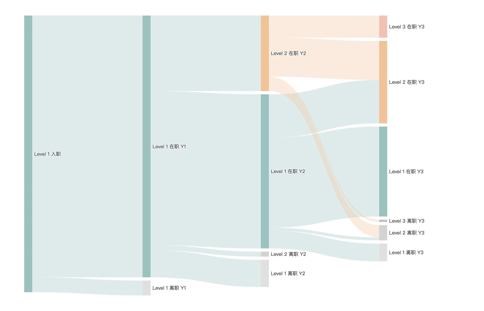

上一篇介绍了使用 Plotly 绘制桑基图，但在美观度相比 ECharts 还是略逊一筹，本文我们演示如何使用 ECharts 绘制桑基图。

这里我们虚构另一个数据集，描述员工从入职到一年后、两年后、三年后的发展与保留情况。

## 构造数据集

数据集的样本如下，每一行代表一个员工在不同年份的状态，数据集构造的过程参考笔记 [模拟员工入职三年的成长与保留](../../analysis/dataprocessing/fictional-employee-development-dataset)。

:::caution
数据集为虚构数据，依据常识模拟，请勿作为真实数据和结论参考，如有雷同，纯属巧合。
:::

| Employee ID | Year 0     | Year 1     | Year 2     | Year 3     |
|-------------|------------|------------|------------|------------|
| E0001       | Level 1 入职 | Level 1 在职 | Level 2 在职 | Level 2 在职 |
| ...         | ...        | ...        | ...        | ...        |
| E0004       | Level 1 入职 | Level 1 在职 | Level 1 在职 | Level 1 离职 |
| E0005       | Level 1 入职 | Level 1 在职 | Level 2 在职 | Level 3 在职 |
| ...         | ...        | ...        | ...        | ...        |
| E0010       | Level 1 入职 | Level 1 在职 | Level 1 离职 | 已离职        |

## 绘制桑基图

1. **统计数据转换**

    :::caution
    桑基图需要每一个节点的名称是唯一的，即便是同一个状态在不同时间点。
    :::

    ```python
    # 命名唯一节点
    employees['Year 1'] = employees['Year 1'] + ' Y1'
    employees['Year 2'] = employees['Year 2'] + ' Y2'
    employees['Year 3'] = employees['Year 3'] + ' Y3'
    
    # 通过转换方法统计人数
    transitions = pd.DataFrame({
    'source': employees['Year 0'].tolist() + employees['Year 1'].tolist() + employees['Year 2'].tolist(),
    'target': employees['Year 1'].tolist() + employees['Year 2'].tolist() + employees['Year 3'].tolist()
    })
    
    flow_counts = transitions.groupby(['source', 'target']).size().reset_index(name='value')
    ```
   
2. **处理已离职节点**

    我希望前一年已经是离职的节点，在下一年的节点中不再出现，如最终案例所示，所以需要将已离职的节点名称处理为空白，并将指向已离职的边的权重值设置为 0。

    ```python
   # 删除 source 为 `已离职` 的行
    flow_counts = flow_counts[~flow_counts['source'].str.startswith('已离职')]
    
    # 将 target 为 `已离职` 的节点名称替换为空格，并将相应行的 value 修改为 0
    flow_counts.loc[flow_counts['target'].str.startswith('已离职'), ['target']] = ' '
    flow_counts.loc[flow_counts['target'] == ' ', 'value'] = 0
    ```
   
3. **生成桑基图配置**

    我们通过 python 脚本自动化的帮我们生成 ECharts 的配置项，然后将配置项复制到前端页面，即可绘制出桑基图。

    ```python
    def generate_sankey_options(flow_counts):
        # 自定义颜色
        color_map = {
            'Level 1 在职': '#9AC2BE',
            'Level 1 离职': '#E0E0E0',
            'Level 2 在职': '#F2C299',
            'Level 2 离职': '#D3D3D3',
            'Level 3 在职': '#F2C1B6',
            'Level 3 离职': '#C0C0C0',
            'Level 1': '#9AC2BE',
            ' ': 'rgba(0, 0, 0, 0)'
        }
    
        # 准备 nodes 和 links 数据
        nodes = []
        links = []
        for idx, row in flow_counts.iterrows():
            source = row['source']
            target = row['target']
            value = row['value']
            if source not in [node['name'] for node in nodes]:
                nodes.append({"name": source})
            if target not in [node['name'] for node in nodes]:
                nodes.append({"name": target})
            links.append({
                "source": source,
                "target": target,
                "value": value,
                "lineStyle": {
                    "color": 'rgba(0, 0, 0, 0)' if target.startswith(" ") else "source"
                }
            })
    
        # 排序 nodes，优先级为：在职 > 离职 > 级别
        def node_sort_key(node):
            name = node['name']
            if '在职' in name:
                priority = 0
            elif '离职' in name:
                priority = 1
            else:
                priority = 2
    
            if 'Level 3' in name:
                level = 0
            elif 'Level 2' in name:
                level = 1
            elif 'Level 1' in name:
                level = 2
            else:
                level = 3
    
            return (priority, level, name)
    
        nodes.sort(key=node_sort_key)
    
        # 将颜色映射应用到每个节点
        for node in nodes:
            node_name = node['name']
            base_name = ' '.join(node_name.split()[:-1])
            if node_name.startswith(" "):
                base_name = ' '
            node_color = color_map.get(base_name, '#DDDDDD')
            node['itemStyle'] = {'color': node_color}
    
        # 构造 ECharts options
        options = {
            "title": {
                "text": "Sankey Chart",
            },
            "tooltip": {
                "trigger": "item",
                "formatter": ""
            },
            "series": [
                {
                    "type": "sankey",
                    "data": nodes,
                    "links": links,
                    "lineStyle": {
                        "opacity": 0.3,
                        "curve": 0.5
                    },
                    "label": {
                        "position": "right"
                    }
                }
            ]
        }
    
        return options

    # 生成配置
    echarts_options = generate_sankey_options(flow_counts)
    ```
   
4. **最终 ECharts 配置代码**

    最终生成的 ECharts 配置如下，可以直接复制到 ECharts 官网的 Demo 中查看效果。

    ```javascript
    {
        title: { text: 'Sankey Chart' },
        series: [
            {
                type: 'sankey',
                data: [
                    { name: 'Level 3 在职 Y3', itemStyle: { color: '#F2C1B6' } },
                    { name: 'Level 2 在职 Y2', itemStyle: { color: '#F2C299' } },
                    { name: 'Level 2 在职 Y3', itemStyle: { color: '#F2C299' } },
                    { name: 'Level 1 在职 Y1', itemStyle: { color: '#9AC2BE' } },
                    { name: 'Level 1 在职 Y2', itemStyle: { color: '#9AC2BE' } },
                    { name: 'Level 1 在职 Y3', itemStyle: { color: '#9AC2BE' } },
                    { name: 'Level 3 离职 Y3', itemStyle: { color: '#C0C0C0' } },
                    { name: 'Level 2 离职 Y2', itemStyle: { color: '#D3D3D3' } },
                    { name: 'Level 2 离职 Y3', itemStyle: { color: '#D3D3D3' } },
                    { name: 'Level 1 离职 Y1', itemStyle: { color: '#E0E0E0' } },
                    { name: 'Level 1 离职 Y2', itemStyle: { color: '#E0E0E0' } },
                    { name: 'Level 1 离职 Y3', itemStyle: { color: '#E0E0E0' } },
                    { name: 'Level 1 入职', itemStyle: { color: '#9AC2BE' } },
                    { name: ' ', itemStyle: { color: 'rgba(0, 0, 0, 0)' } }
                ],
                links: [
                    {
                        source: 'Level 1 入职',
                        target: 'Level 1 在职 Y1',
                        value: 946,
                        lineStyle: { color: 'source' }
                    },
                    {
                        source: 'Level 1 入职',
                        target: 'Level 1 离职 Y1',
                        value: 54,
                        lineStyle: { color: 'source' }
                    },
                    {
                        source: 'Level 1 在职 Y1',
                        target: 'Level 1 在职 Y2',
                        value: 557,
                        lineStyle: { color: 'source' }
                    },
                    {
                        source: 'Level 1 在职 Y1',
                        target: 'Level 1 离职 Y2',
                        value: 98,
                        lineStyle: { color: 'source' }
                    },
                    {
                        source: 'Level 1 在职 Y1',
                        target: 'Level 2 在职 Y2',
                        value: 273,
                        lineStyle: { color: 'source' }
                    },
                    {
                        source: 'Level 1 在职 Y1',
                        target: 'Level 2 离职 Y2',
                        value: 18,
                        lineStyle: { color: 'source' }
                    },
                    {
                        source: 'Level 1 在职 Y2',
                        target: 'Level 1 在职 Y3',
                        value: 325,
                        lineStyle: { color: 'source' }
                    },
                    {
                        source: 'Level 1 在职 Y2',
                        target: 'Level 1 离职 Y3',
                        value: 64,
                        lineStyle: { color: 'source' }
                    },
                    {
                        source: 'Level 1 在职 Y2',
                        target: 'Level 2 在职 Y3',
                        value: 157,
                        lineStyle: { color: 'source' }
                    },
                    {
                        source: 'Level 1 在职 Y2',
                        target: 'Level 2 离职 Y3',
                        value: 11,
                        lineStyle: { color: 'source' }
                    },
                    {
                        source: 'Level 1 离职 Y1',
                        target: ' ',
                        value: 0,
                        lineStyle: { color: 'rgba(0, 0, 0, 0)' }
                    },
                    {
                        source: 'Level 1 离职 Y2',
                        target: ' ',
                        value: 0,
                        lineStyle: { color: 'rgba(0, 0, 0, 0)' }
                    },
                    {
                        source: 'Level 2 在职 Y2',
                        target: 'Level 2 在职 Y3',
                        value: 141,
                        lineStyle: { color: 'source' }
                    },
                    {
                        source: 'Level 2 在职 Y2',
                        target: 'Level 2 离职 Y3',
                        value: 44,
                        lineStyle: { color: 'source' }
                    },
                    {
                        source: 'Level 2 在职 Y2',
                        target: 'Level 3 在职 Y3',
                        value: 80,
                        lineStyle: { color: 'source' }
                    },
                    {
                        source: 'Level 2 在职 Y2',
                        target: 'Level 3 离职 Y3',
                        value: 8,
                        lineStyle: { color: 'source' }
                    },
                    {
                        source: 'Level 2 离职 Y2',
                        target: ' ',
                        value: 0,
                        lineStyle: { color: 'rgba(0, 0, 0, 0)' }
                    }
                ],
                lineStyle: { opacity: 0.3, curve: 0.5 },
                label: { position: 'right' }
            }
        ]
    }
    ```
   
## 效果展示

通过绘制的桑基图，我们可以直观地看到某一批员工从入职到各个年份的级别变动和流失情况，分析在哪些阶段和级别员工流失最多以及员工的成长速度，从而优化人力资源管理策略。

