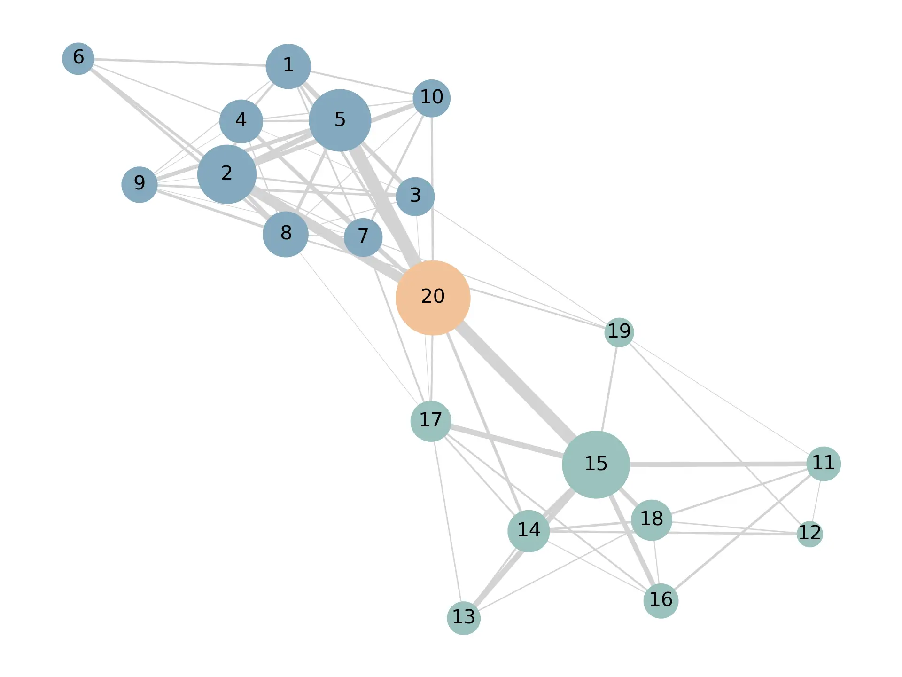

组织网络分析是当前大型企业中愿意尝试的工具，可以辅助识别关键人才和组织的协作模式。本文主要介绍如何基于处理好的数据，使用 NetworkX 绘制组织网络图。

## 构造数据集

首先，我们需要构建一个简单的模拟数据集。为了更好的演示效果，我们模拟一个经典的案例，即两个小团队以及一个桥梁作用的员工，在组织内的协作关系。

- 团队成员: 两个团队分别由编号为 1-10 和 11-20 的员工构成。
- 桥梁角色: 编号 20 的员工连接这两个团队，起到桥梁作用。
- 团队领导: 编号 2 和 5 的员工是第一个团队的 leader，编号 15 的员工是第二个团队的 leader。
- 协作密度: 同一团队内部的协作关系较紧密，不同团队之间的协作关系较少。

```python
import pandas as pd
import numpy as np

nodes = range(1, 21)
group1 = range(1, 11)
group2 = range(11, 20)
bridge = 20
leaders_group1 = [2, 5]
leaders_group2 = [15]

edges = []

for group in [group1, group2]:
    for i in group:
        for j in group:
            if i < j and np.random.rand() < 0.7:
                weight = np.random.uniform(0.3, 1.5) \
                    if i not in leaders_group1 + leaders_group2 and j not in leaders_group1 + leaders_group2 \
                    else np.random.uniform(0.3, 3.0)
                edges.append((i, j, weight))

group1_members = np.random.choice(group1, size=int(0.3 * len(group1)), replace=False)
group2_members = np.random.choice(group2, size=int(0.3 * len(group2)), replace=False)
for i in group1_members:
    for j in group2_members:
        edges.append((i, j, np.random.uniform(0.3, 1)))

for leader in leaders_group1 + leaders_group2:
    edges.append((bridge, leader, np.random.uniform(5, 8)))
for group in [group1, group2]:
    members = np.random.choice(list(set(group) - set(leaders_group1 + leaders_group2)),
                               size=int(0.4 * len(group)), replace=False)
    for member in members:
        edges.append((bridge, member, np.random.uniform(0.5, 2)))

edges_df = pd.DataFrame(edges, columns=['Source', 'Target', 'Weight'])
```

## 绘制组织网络图

1. 数据处理

    绘制组织网络图时，最好将数据处理成边表的形式，即每一行代表一条边，包含源节点、目标节点和权重，方便绘图。

    我们构造的数据集样本如下：

    ```text title="edges_df"
       Source  Target    Weight
    0       1       3  1.170925
    1       1       4  1.178765
    2       1       5  2.515340
    3       1       6  1.206517
    4       1       7  0.872205
    ```

2. 绘图

    ```python
    import networkx as nx
    import matplotlib.pyplot as plt

    # 从数据集创建图
    G = nx.from_pandas_edgelist(edges_df, 'Source', 'Target', edge_attr='Weight')

    # 设置不同节点的颜色
    colors = {'group1': '#84A9BF', 'group2': '#9AC2BE', 'bridge': '#F2C299'}
    node_colors = [colors['bridge'] if node == 20 else colors['group1'] if node in range(1, 11) else colors['group2'] for
                   node in G.nodes()]

    # 定义节点大小
    # 原始权重值较小，为了凸显效果，我们将权重值放大 50 倍
    node_sizes = [50 * G.degree(n, weight='Weight') for n in G.nodes()]

    # 可视化网络图
    pos = nx.spring_layout(G, seed=100)
    weights = [G[u][v]['Weight'] for u, v in G.edges()]
    nx.draw(G, pos, node_size=node_sizes, with_labels=False, node_color=node_colors, edge_color='lightgrey', width=weights)
    labels = nx.draw_networkx_labels(G, pos, font_size=10) # 自定义节点标签
    plt.show()
    ```

## 效果展示

可以看到，生成的组织网络图中，能够清楚的看到桥梁角色的员工在两个团队之间起到了衔接的作用。

:::note
当然，企业内的真实情况会更加复杂，多数情况下不会像案例中这样明显，需要我们具有一定的解读能力，依据对组织和业务的了解，进行假设和数据的双重验证。
:::



