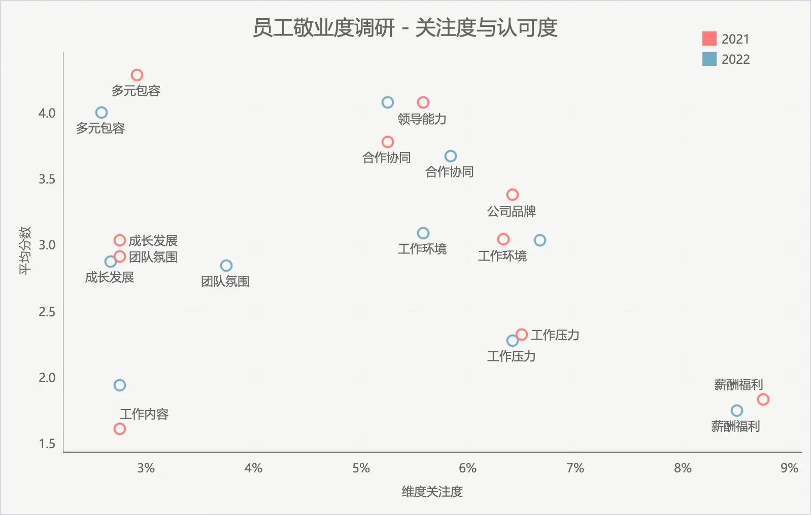
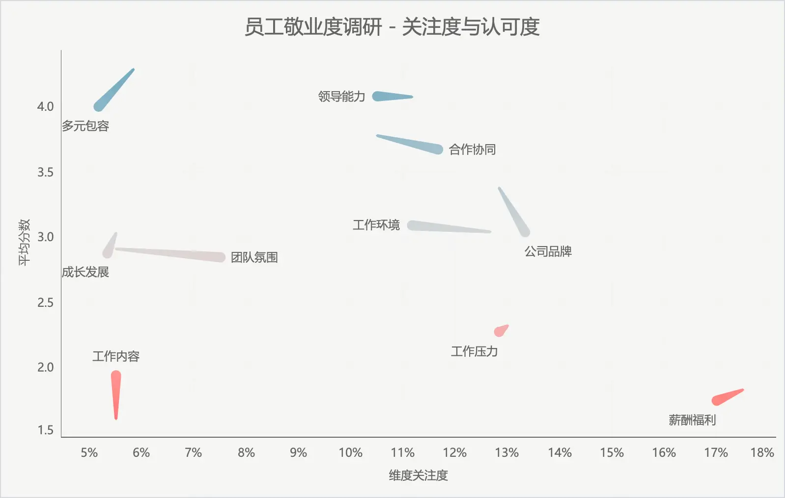

在员工调研场景中，我们常常用散点图来表示员工对于各个子维度的关注度，以及对于该子维度的认可度。但基础的散点图并不容易呈现连续两年的数据变化。



如图所示，即使我们使用了颜色来区分不同年份的数据，读图时也并不容易探索规律。

在 Tableau 中，我们可以使用某个维度作为路径，将两年的数据连接起来，形成一条线，这样就可以更直观地看到数据的变化。

## 绘制带有路径的散点图

import { Steps } from '@astrojs/starlight/components';
import { Image } from 'astro:assets';
import settings from '../../../../assets/visualization/tableau-scatter-path-settings.webp';

<Image src={settings} alt="Tableau 配置" height="300" />

<Steps>
    1. 将`年份`作为路径，可以使得两年的数据被线条连接起来。
    2. 将`年份`作为大小，可以使得两年的节点大小不同，连线看起来像从前一年指向后一年。
    3. 将`平均分数`作为颜色，可以显示出平均分数的高低。
</Steps>

## 效果演示



## 数据集构造

案例中的数据集同样是虚构的，模拟了两年的员工调研数据，生成代码如下，大家也可以拿去生成自己的数据集。

```python
import pandas as pd
import numpy as np

employee_ids = [f"E{str(i).zfill(4)}" for i in range(1, 201)]
dimensions = ["薪酬福利", "工作环境", "成长发展", "合作协同", "团队氛围", "领导能力", "工作压力", "公司品牌", "工作内容", "多元包容"]
probabilities = np.random.uniform(0.05, 0.45, len(dimensions))
probabilities /= probabilities.sum()
adjusted_means = np.array([1, 3, 3, 4, 3, 5, 2, 3, 1, 5])
departments = ["财务部", "人力资源部", "市场部", "技术部", "销售部", "客服部", "研发部", "行政部"]

def generate_scores(dimension, mean_score):
    score = np.random.normal(mean_score, 2)
    score = np.clip(round(score), 1, 5)
    return score

def generate_survey_data_with_department_and_scores(year):
    records = []
    for emp_id in employee_ids:
        chosen_dims = np.random.choice(dimensions, size=3, replace=False, p=probabilities)

        department = np.random.choice(departments)
        for dim in chosen_dims:
            index = dimensions.index(dim)
            mean_score = adjusted_means[index]  # Use the adjusted mean for this dimension
            score = generate_scores(dim, mean_score)
            records.append([emp_id, dim, score, year, department])
    return records

records_2021 = generate_survey_data_with_department_and_scores(2021)
records_2022 = generate_survey_data_with_department_and_scores(2022)

all_records = records_2021 + records_2022

df_survey_results = pd.DataFrame(all_records, columns=["Employee ID", "Dimension", "Score", "Year", "Department"])

df_survey_results.to_csv("employee_survey_results.csv", index=False)
```