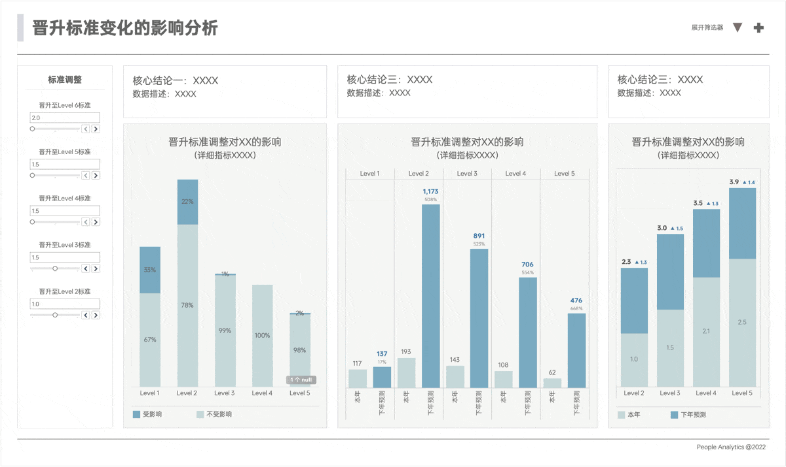

Tablau的宣传中，首先定位是一个分析工具，而不仅是一个可视化工具。本文我们看一下如何通过参数进行交互式图表，看看 tableau 在分析中的应用。

假设我们需要对晋升的标准进行调整，并测算在不同标准下，对于晋升活动的影响如何。我们可以通过参数化的方式，实现这一目的。

## 效果演示

可以看到，在仪表板中，我们把各个级别的晋升标准参数用滑块的方式展示出来，用户可以通过调整滑块，实时查看右侧图表在不同标准下的指标预测结果，辅助决策。