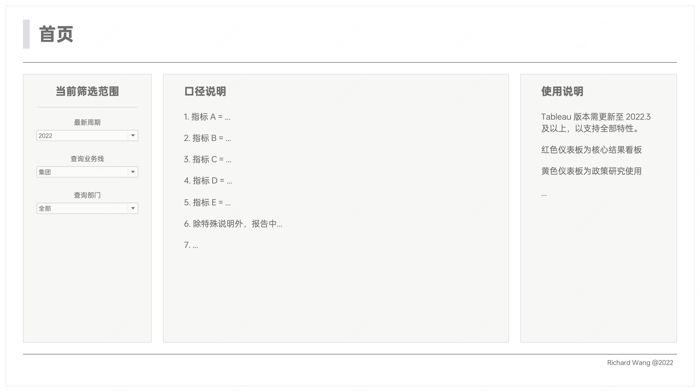
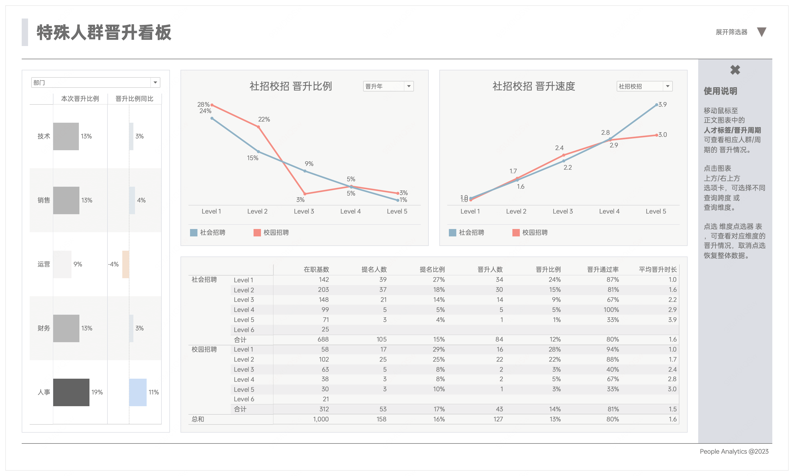
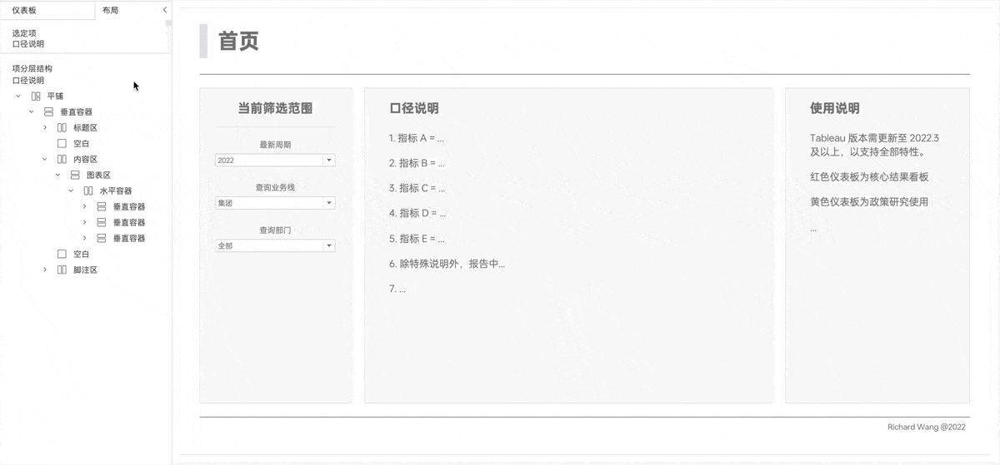

在搭建 Tableau 报告时，使用结构化的布局，我们可以控制报告中元素的排列和呈现方式，使得整个页面布局既统一又富有层次感。

在 Tableau 中，可以使用容器来实现这一目的，容器允许用户将不同的对象如工作表、文本和图例等组织在一起，我们可以精确地设置这些对象的位置、大小和对齐方式。

以下是在我们在项目案例中的应用效果。

**页面一**

**页面二**

**页面三**

从上述示例可以看出，尽管每个页面的具体内容不同，但通过容器的统一布局结构，整体风格和框架保持一致性，提高了视觉效果和用户体验。

## 容器层次的查看方法

在 Tableau 的仪表板布局选项卡下的项分层结构视图中，可以清晰地查看整个仪表板的布局结构和层次。这一功能对于设计复杂布局非常有帮助，因为它允许我们观察和调整布局的细节。

:::note
本例中页面的整体结构分为三个主要板块：

- 标题区：包含仪表板的主标题。
- 内容区：展示核心数据和图表。
- 脚注区：提供额外信息或版权声明。
:::

下图是一个动态展示，展示不同容器对应的页面模块：

