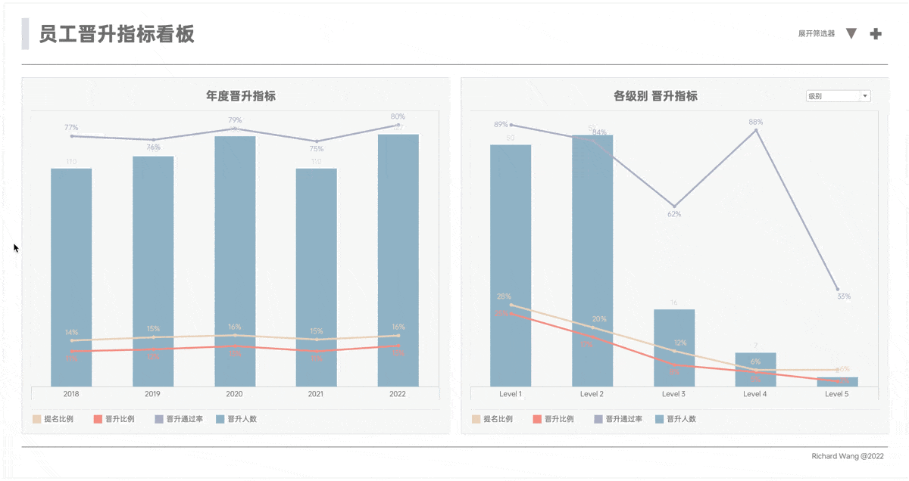
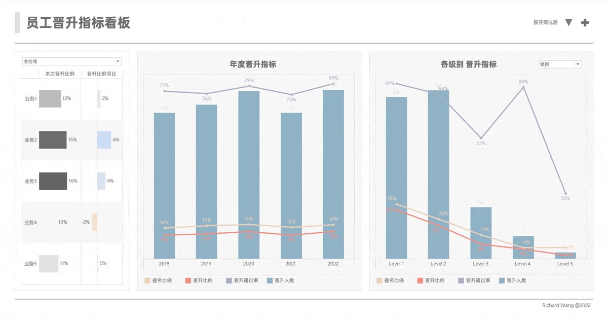
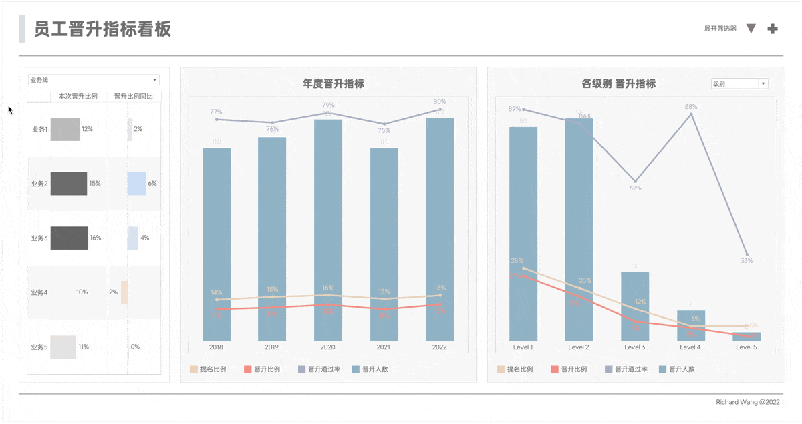

在Tableau中，可以通过配置仪表板操作（Actions）来实现图表之间的联动。这种联动可以更有效地观察数据规律和趋势，发现以往用平铺的数据透视表难以发现的信息。

我们继续以晋升数据看板为例进行演示。

## `悬停`联动

第一种操作是悬停，允许用户仅通过鼠标悬停在图表的特定部分，就触发其他图表进行相应的更新。这种互动方式快速且直观，非常适合快速浏览和比较数据。

我们现看一下效果演示：

1. 当用户鼠标悬停在左侧某一年的数据时，右侧图表即时更新，显示那一年的详细数据分布。
2. 当鼠标悬停在右侧的某个级别柱子上时，左侧的图表则实时更新展示该级别历年的数据。
3. 当悬停生效时，发现变化的图表，标题也会同步显示所选维度的名称。
4. 当鼠标移出图表区域时，所有图表恢复到原始状态。

:::caution
笔记中所有数据和图表均为虚构，请勿作为真实数据参考。如有雷同，纯属巧合。

本案例的数据集生成过程请参考[以员工晋升记录为例虚构数据集](../../analysis/dataprocessing/fictional-promotion-dataset)。
:::

## `点击选择`联动

点击选择是一种更为明确的互动方式，需要用户点击图表的具体部分才触发更新，但其原理与悬停基本一致。

我们看一下效果演示：

- 最左侧的维度点选器图表列出了五个业务线。当用户点击某个业务线的柱子时，右侧的所有图表会更新为该业务线的具体数据。
- 当点击生效时，发现变化的图表，标题也会同步显示所选维度的名称。
- 取消点选时，所有图表恢复到原始状态。

## 组合应用

将悬停和点击选择两种技术组合使用，可以提供更多层次的数据互动。

我们看一下效果演示：

1. 点击最左侧某个维度后，右侧图表更新显示该维度的数据，同时支持悬停在特定柱子上动态更新。
2. 当点击与悬停生效时，发现变化的图表，标题也会同步显示所选维度的名称。
3. 取消点选并将鼠标移出图表区域时，所有图表恢复到原始状态。

