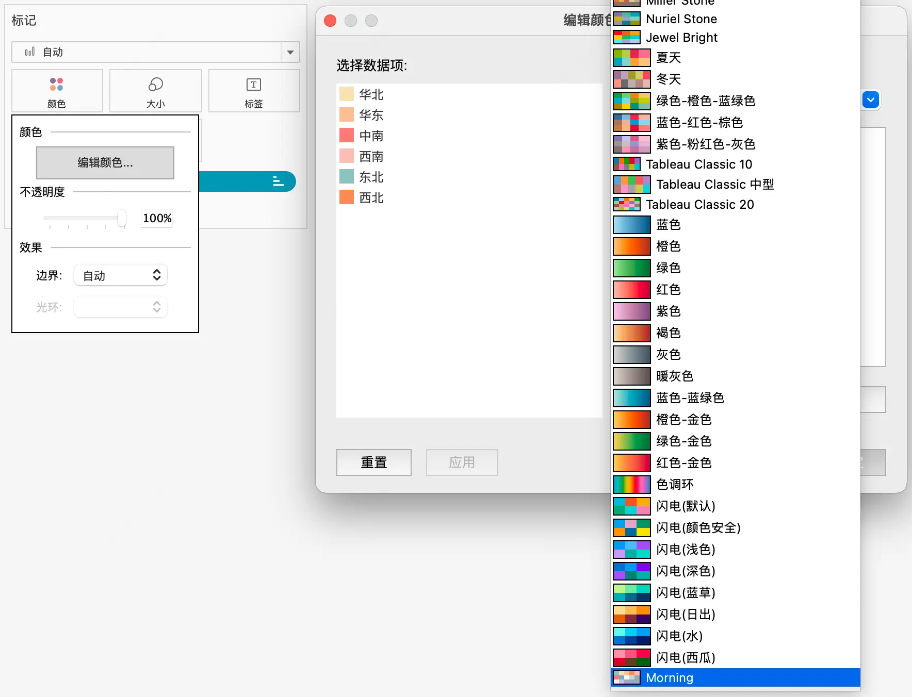
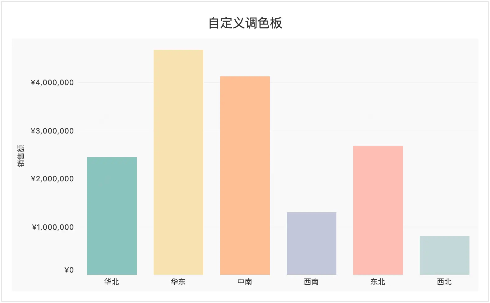

在制作 tableau 图表中，有时需要自定义调色板，比如需要使用公司的品牌色，或者需要使用特定的颜色来区分不同的数据。Tableau 提供了一些默认的调色板，但是有时候这些调色板的配色略显生硬。

## 创建自定义调色板

import { Steps } from '@astrojs/starlight/components';

<Steps>
1. 打开 Tableau 存储库文件夹

    - Windows: `C:\Users\username\Documents\我的 Tableau 存储库`
    - Mac: `/Users/username/Documents/我的 Tableau 存储库`

2. 编辑文件 `Preferences.tps`

    在 Preferences.tps 文件中，使用 XML 格式添加自定义调色板。示例中的颜色选用了 Adobe 2022 年的精选配色，可以根据需要自定义颜色。

    ```xml
    <?xml version='1.0'?>

    <workbook>

    <preferences>

        <color-palette name="Morning" type = "regular">
          <color>#9AC2BE</color>
          <color>#F2E3B6</color>
          <color>#F2C299</color>
          <color>#F2935C</color>
          <color>#F2C1B6</color>
          <color>#F28379</color>
          <color>#84A9BF</color>
          <color>#F4F7F0</color>
          <color>#C9D7D8</color>
          <color>#9BABB2</color>
          <color>#F0F0F0</color>
          <color>#C5C8D9</color>
          <color>#9FA7BF</color>
        </color-palette>

      </preferences>

    </workbook>
    ```

    - `color-palette` 标签中的 `Morning` 属性是调色板的名称，可以自定义
    - `color` 标签中的内容是颜色的十六进制表示

3. 重启 Tableau

    修改完成后，重启 Tableau 应用程序以使新调色板生效。

4. 在 Tableau 中应用自定义调色板

    重启后，在选择调色板时，可以尾部看到新添加的调色板。

    

    应用到图表上的效果如下，对比默认调色板，自定义调色板更加柔和美观。

    
</Steps>