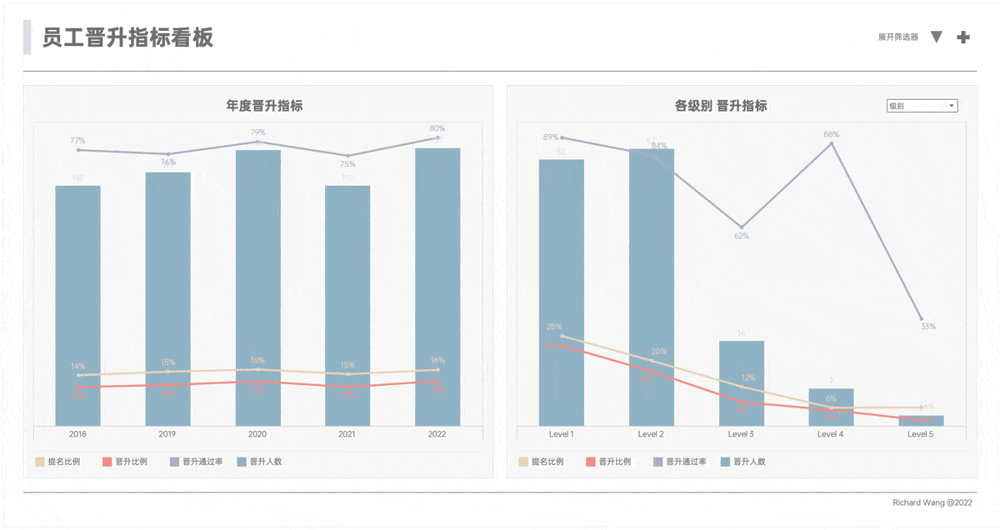
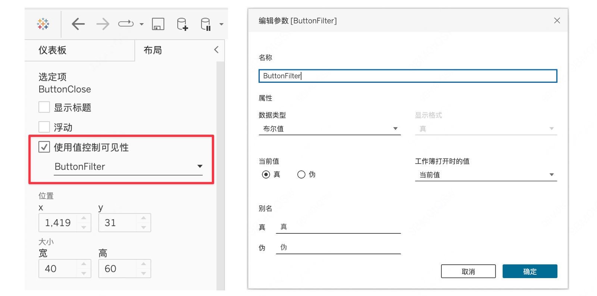
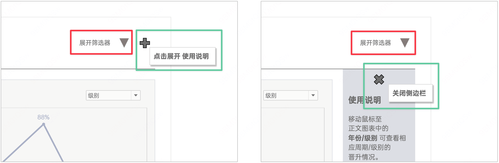

我们继续介绍与布局有关的用法。

在 2022.3 版本中，Tableau 新增了动态区域可见性功能，允许根据特定条件动态地显示或隐藏仪表盘中的区域。  这个功能可以用来实现一些动态交互效果，比如点击按钮展开或收起区域，或者根据条件显示不同的区域。

## 效果演示

在这个案例当中，一共有三个地方用到了动态区域可见性功能：

1. 展开/收起筛选区：通过点击▲和▼按钮，可以控制筛选区的显示或隐藏。
2. 控制右侧说明栏的显示：通过➕和✖️按钮，可以打开或关闭附加的说明栏，用以显示详细备注。
3. 基于筛选器的内容显示：根据用户在下拉菜单中的选择，动态地显示或隐藏特定的视图组件。

## 配置动态区域可见性

要配置动态区域可见性，首先需要在Tableau的布局面板中选择需要控制的区域。在区域的配置选项中，会看到一个“使用值控制可见性”的选项，此处可以绑定一个布尔类型的参数作为触发条件。

当然，为了实现精妙的控制，需要很多细节上的优化。本例中，在展开与收起的不同状态下，控件的图标、说明文本、鼠标悬停显示的提示，都是不同的，这就需要多个参数和操作联动才能现实。

