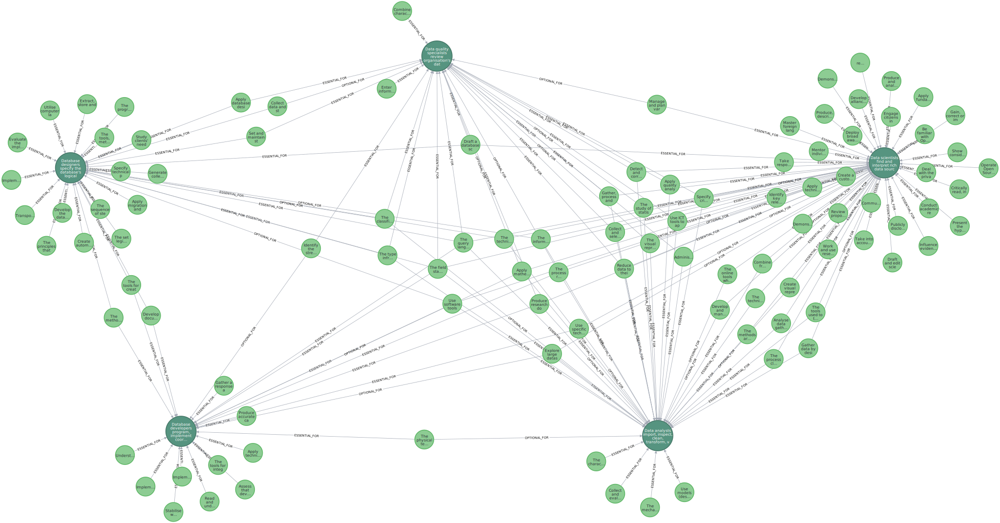

知识图谱在推荐系统以外，其实在管理领域同样有一定的探索空间。

本文将简单介绍如何技术性地构建一个基于岗位和技能的知识图谱，并通过这个图谱来实现技能匹配和管理优化等目标。

## 数据准备

数据源选用 ESCO（European Skills, Competences, Qualifications and Occupations），这是一个由欧盟开发的技能和职业分类体系。它综合涵盖了技能、职业、资格以及职业标准等多维度信息，为构建知识图谱提供了丰富的数据基础。

## 数据导入

知识图谱的构建选择了Neo4j作为存储引擎，通过Cypher语言实现数据的导入和关系的构建。

1. 导入职业数据

    ```cypher
    LOAD CSV WITH HEADERS FROM 'file:///occupations.csv' AS row
    MERGE (s:Skill {conceptUri: row.conceptUri})
    ON CREATE SET s.preferredLabel = row.preferredLabel, s.description = row.description, s.skillType = row.skillType
    ```

2. 导入技能数据

    ```cypher
    LOAD CSV WITH HEADERS FROM 'file:///skills.csv' AS row
    MERGE (o:Occupation {conceptUri: row.conceptUri})
    ON CREATE SET o.preferredLabel = row.preferredLabel, o.description = row.description
    ```

3. 导入技能与职业的关系

    ```cypher
    LOAD CSV WITH HEADERS FROM 'file:///occupationSkillRelations.csv' AS row
    MATCH (o:Occupation {conceptUri: row.occupationUri})
    MATCH (s:Skill {conceptUri: row.skillUri})
    FOREACH (_ IN CASE WHEN row.relationType = 'essential' THEN [1] ELSE [] END |
        MERGE (s)-[:ESSENTIAL_FOR]->(o)
    )
    FOREACH (_ IN CASE WHEN row.relationType = 'optional' THEN [1] ELSE [] END |
        MERGE (s)-[:OPTIONAL_FOR]->(o)
    )
    ```

## 数据查询

作为数据分析工作者，我们看一下与数据相关的职业种类，进行了以下Cypher查询，并以表格形式展示结果。

```cypher
MATCH (o:Occupation)
WHERE o.preferredLabel CONTAINS "data"
RETURN o.preferredLabel AS PreferredLabel
```

返回结果如下：

```text
╒══════════════════════════════════════╕
│PreferredLabel                        │
╞══════════════════════════════════════╡
│"data warehouse designer"             │
├──────────────────────────────────────┤
│"data protection officer"             │
├──────────────────────────────────────┤
│"data scientist"                      │
├──────────────────────────────────────┤
│"database integrator"                 │
├──────────────────────────────────────┤
│"big data archive librarian"          │
├──────────────────────────────────────┤
│"aviation data communications manager"│
├──────────────────────────────────────┤
│"data entry clerk"                    │
├──────────────────────────────────────┤
│"data quality specialist"             │
├──────────────────────────────────────┤
│"database administrator"              │
├──────────────────────────────────────┤
│"database designer"                   │
├──────────────────────────────────────┤
│"data centre operator"                │
├──────────────────────────────────────┤
│"data entry supervisor"               │
├──────────────────────────────────────┤
│"database developer"                  │
├──────────────────────────────────────┤
│"data analyst"                        │
├──────────────────────────────────────┤
│"chief data officer"                  │
└──────────────────────────────────────┘
```

## 展示与解读

接下来，我们选取几个职业示例，展示它们与技能之间的关系。

```cypher
MATCH (o:Occupation)-[r:ESSENTIAL_FOR]-(s:Skill)
WHERE o.preferredLabel IN [
    "data analyst",
    "data quality specialist",
    "data scientist",
    "database designer",
    "database developer"
]
RETURN o, r, s
```

通过这一步，我们能够看到数据以预期的知识图谱形式展示出来。



:::tip[解读]
知识图谱的图形化呈现使我们能够直观地理解不同岗位之间的技能关联和独特性。
- "data scientist"（右一）所需的独有核心技能最多，这反映了数据科学家这一职业的复杂性和对技能的广泛需求。
- 而相对来说，"data quality specialist"（中上）和 "data analyst"（右下）独有的核心技能较少，与其他岗位的技能重叠性更高，意味着他们的工作也更容易被其他岗位替代。
:::