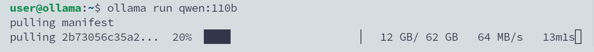

在之前的文章中，介绍了如何利用开源项目 Openai-api-for-open-llm 启动和调用大模型。但近期观察，Ollama 已经成为了个人玩家部署大模型的首选，正巧 Qwen 近期发布了 32B 和 110B 两个新的模型尺寸，所以本文以 Qwen-110B 为例，介绍如何使用 Ollama 部署大模型。

## 安装 Ollama

Ollama 提供了一键安装脚本，方便在 Linux 系统下部署。我在自己的主机上新创建了一个纯净的 Ubuntu 系统虚拟机，安装过程中未遇到任何问题，非常顺利。脚本会自动处理所有依赖和配置，确保安装后能立即使用。

:::tip
由于想尝试一下 110B 模型，手里的消费级 3090 显卡是肯定跑不起来的，因此没有给虚拟机添加显卡，Ollama 启动时检测不到显卡会默认以 CPU 模式加载模型。

若使用 GPU 加载模型，参考文章 [搭建 CUDA 环境虚拟机](/selfhosted/vm/cuda-vm)。
:::

```bash
sudo curl -fsSL https://ollama.com/install.sh | sh
```

## 下载并启动模型

运行以下命令即可开始模型的自动下载并启动。

```bash
ollama run qwen:110b
```

Ollama 的模型下载速度很快，110B 模型 4bit 量化后的大小为 62GB。



此外，如果你只希望下载模型以便后续进行定制化处理，可以使用以下命令：

```bash
ollama pull qwen:110b
```

## 修改监听地址配置

默认情况下，Ollama 配置为只在本地 127.0.0.1 地址监听，如果需要允许外部访问，需修改配置文件：

```bash
sudo vim /etc/systemd/system/ollama.service
```

在文件中添加以下环境变量，设置监听地址和端口：

```diff lang="yaml" title="/etc/systemd/system/ollama.service"
+Environment="OLLAMA_HOST=0.0.0.0:11434"
```

修改完成后，需要重启服务或重启系统以应用更改。

## 调用测试

Langchain Community 提供了适配 Ollama 的 Python SDK，可以方便的接入整个 Langchain 生态。

```python
from langchain_community.chat_models import ChatOllama
model = ChatOllama(
    base_url='http://ip:11434', # 你的 Ollama 服务地址
    model="qwen:110b"
)

model.invoke("你好, 你是谁?")
```

```text title="Output"
AIMessage(content='你好！我是来自阿里云的超大规模语言模型，我叫通义千问。我是阿里云自主研发的
超大规模语言模型，也能够回答问题、创作文字，还能表达观点、撰写代码。如果您有任何问题或需要帮助，
请随时告诉我，我会尽力提供支持。',response_metadata={'model': 'qwen:110b', 'created_at': '2024-04-27T05:43:05.60435353Z',
'message': {'role': 'assistant', 'content': ''}, 'done': True, 'total_duration': 74079467100,
'load_duration': 2642692, 'prompt_eval_duration': 1272573000, 'eval_count': 60, 'eval_duration': 72673757000})
```

可以看到，我们成功调用了 Qwen-110B 模型，并得到了回复。当然，由于模型尺寸较大且通过CPU推理，推理速度还是非常慢的。