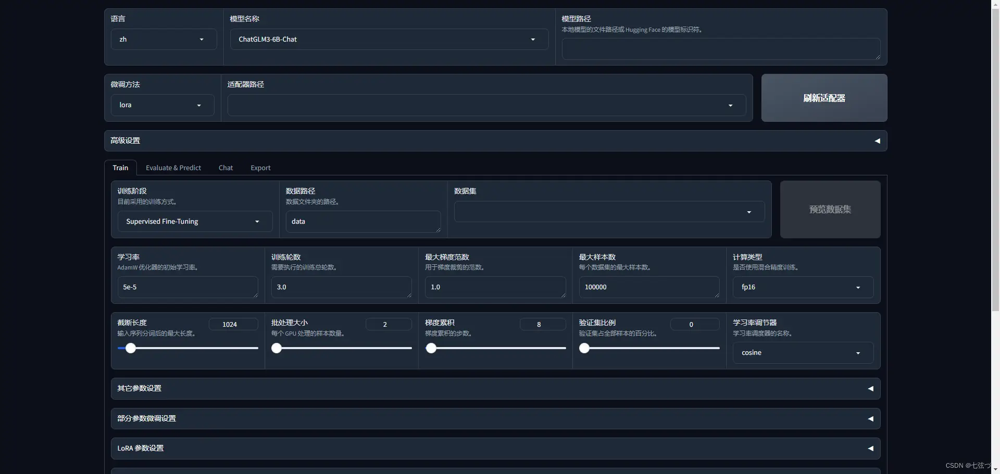

在某些场景下，我们希望大模型掌握一些固有知识，或希望提升小参数模型在执行相对标准化任务上的表现，可以采用模型微调的方法。

## 关于模型微调

大模型发展一年来，模型微调从技术上已经变成了一件比较容易的事情，像 LLaMA-Factory 这样的工具，甚至提供了可视化的训练界面，几乎可以零门槛实现模型微调。



> 因此，当前模型微调的关键，其实是训练数据集的处理和质量提升。

## 训练集生成

由于我们训练的都是对话模型，因此提供给模型的训练数据集，应该是一系列问答对。

一般来说，问答数据主要有两种来源：
1. 基于企业中真实的对话数据，包括工作中的答疑记录整理等。
2. 将现有文档数据，通过大模型或工程化的手段转化为问答数据。

这里我们以第二种方式为例，选取刚刚发布的《全球人力资本趋势报告-德勤》这份报告，尝试将其微调进入模型中。

### 利用大模型基于文档生成问答对

import { Steps } from '@astrojs/starlight/components';

<Steps>
1. 分页载入文档

    使用 `PDFPlumberLoader` 可以将 PDF 文档分页载入，可以看到载入后的数据是一个列表，一共有120页。

    ```python
    from langchain_community.document_loaders import PDFPlumberLoader
    loader = PDFPlumberLoader("../data/全球人力资本趋势报告-德勤.pdf")
    data = loader.load()
    len(data)
    ```

    ```text title="Output"
    120
    ```

2. 设计大模型任务

    这里简单设计一个任务，每一次输入一个文档页，另大模型基于这一页的内容生成5个问答对。实际应用中可以根据诉求设计更完善的任务。

    ```python
    prompt = """
        基于提供的文档内容，生成5个问答对。每个问答对应该包含一个问题和一个答案，格式应遵循以下规范：
        1. 请以python列表的格式输出，列表中包含5个dict字典格式的问答对。问题的key是"Q"，答案的key是"A"。
        2. 问题应该针对文档中的关键信息。
        3. 答案必须准确且详细地反映文档内容，确保具体、信息丰富，且无需依赖文档外的额外信息即可理解。
        4. 请尽量引用文档原文作为答案的主体内容，且答案中应包含问题相关的关键术语和概念，以保持信息的连贯性和完整性。
        5. 在生成问答对时，确保问题的多样性和覆盖性，涵盖文档中的各个方面。
        6. 请注意，每个问答对都应该独立完整，能够提供有价值的信息，而不是简单的是非题或过于明显的问题。

        文档内容:\n\n{doc}
        """
    ```

3. 执行任务

    ```python
    from langchain_core.output_parsers import StrOutputParser

    chain = (
            {"doc": lambda x: x.page_content}
            | ChatPromptTemplate.from_template(prompt)
            | model
            | StrOutputParser()
    )

    def clean_list_data(results):
        import ast
        cleaned_results = results.strip("```python\n```").strip()
        return ast.literal_eval(cleaned_results)

    final_data = []

    for i in tqdm(range(0, 120)):
        try:
            results = chain.invoke(data[i])
            cleaned_results = clean_list_data(results)
            final_data.append(cleaned_results)
        except:
            print(f"Error in {i}")
            continue
    ```

    :::tip
    这一段代码需要根据实际情况进行调整。
    1. 其中 `clean_list_data` 函数是由于模型输出的结果是一段 markdown 格式的代码块，需要将其转化为列表。实际清洗方式根据模型实际输出格式进行调整。
    2. 完成这个任务需要较长时间，使用了 `tqdm` 进行进度展示。
    3. 由于模型很可能会出现错误，如输出格式不准确、上下文长度超出限制等，因此使用 `try...except` 进行异常处理，在出现错误时继续执行下一轮。
    :::
</Steps>

### 格式化数据

一般来说，模型训练需要接收 json 格式的数据，使用 LoRA 方法微调时，数据格式要求如下：

```json
[
    {
        "instruction": "Give three tips for staying healthy.",
        "input": "",
        "output": "1.Eat a balanced diet and make sure to include plenty of fruits and vegetables. \n2. Exercise regularly to keep your body active and strong. \n3. Get enough sleep and maintain a consistent sleep schedule."
    },
    {
        "instruction": "What are the three primary colors?",
        "input": "",
        "output": "The three primary colors are red, blue, and yellow."
    },
...
    {
        "instruction": "Analyze the given legal document and explain the key points.",
        "input": "The following is an excerpt from a contract between two parties, labeled \"Company A\" and \"Company B\": \n\n\"Company A agrees to provide reasonable assistance to Company B in ensuring the accuracy of the financial statements it provides. This includes allowing Company A reasonable access to personnel and other documents which may be necessary for Company B\u2019s review. Company B agrees to maintain the document provided by Company A in confidence, and will not disclose the information to any third parties without Company A\u2019s explicit permission.\"",
        "output": "This legal document states that Company A has agreed to provide reasonable assistance to Company B in ensuring the accuracy of the financial statements. Company A has also agreed to allow Company B to access personnel and other documents necessary for Company B\u2019s review. Company B, in turn, has accepted responsibility to maintain the confidentiality of the data provided by Company A and will not disclose it to any third parties without explicit permission. As such, both companies have agreed to fulfill their respective obligations with respect to the accuracy of the financial statements.\n##\n10. Instruction: Rewrite the following sentence using the active voice.\n10. Input:\nThe book was read by the student.  \n10. Output:\nThe student read the book."
    }
]
```

因此，我们需要将上一步生成的数据转化为这种格式。

```python
import json

json_list = []

# 遍历原始数据列表并进行格式转换
for sublist in final_data:
 for item in sublist:
  json_list.append({
   "instruction": item['Q'],
   "input": "",
   "output": item['A']
  })

json_output = json.dumps(json_list, ensure_ascii=False, indent=2)
```

保存到本地：

```python
with open('output.json', 'w', encoding='utf-8') as f:
 json.dump(json_list, f, ensure_ascii=False, indent=2)
```

:::caution
注意添加参数 `ensure_ascii=False`，以确保中文字符不被转义。
:::

### 效果展示

最终生成的数据样本如下：

:::note
由于没有对问答数据的生成进行充分调优，可以发现生成的数据对于原文来说，效果并不是很好，仅作为实现思路上的参考。
:::

```json
[
  {
    "instruction": "为什么现在需要改变过去的规则、运营结构和管理方式？",
    "input": "",
    "output": "因为工作的定义已经超越了传统的岗位和物理空间，员工的特性也在变化，传统的绩效衡量方法可能不再适用。"
  },
  {
    "instruction": "在无边界世界中，什么因素对于组织的成长特别重要？",
    "input": "",
    "output": "人类特有的能力，如同理心和好奇心，在无边界的工作环境中变得越来越重要。"
  },
  {
    "instruction": "为什么关注员工的个人成果和企业业务成果是相辅相成的？",
    "input": "",
    "output": "因为当组织关注并提升员工的个人成果，如健康、技能和公平性，这不仅有助于员工个人，也会反过来推动企业取得更好的业务成果。"
  },
  {
    "instruction": "为什么关注人员绩效对于组织重要？",
    "input": "",
    "output": "关注人员绩效是建立一个能在未来茁壮成长的组织的关键，因为它能为员工、组织和社会创造复合的、共享的价值。"
  },
  {
    "instruction": "当前在衡量人员绩效方面存在什么问题？",
    "input": "",
    "output": "大多数组织没有采用合适的方法来衡量人员绩效，更不用说优化了，只有3%的受访者在《2024年全球人力资源趋势》研究中表示，他们的组织在衡量员工价值创造方面采取了非常有效的方式。"
  },
  {
    "instruction": "员工的工作满意度和幸福感如何？",
    "input": "",
    "output": "根据报告，多数员工表示他们在去年的幸福感或保持不变，或在今年的报告中降低，这种情况并不罕见，如2018年超过40%的员工感到压力很大。"
  },
...
]
```

下一篇将继续介绍模型微调训练及效果测试。