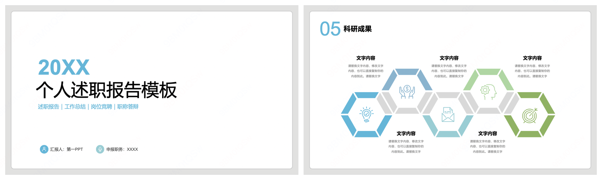
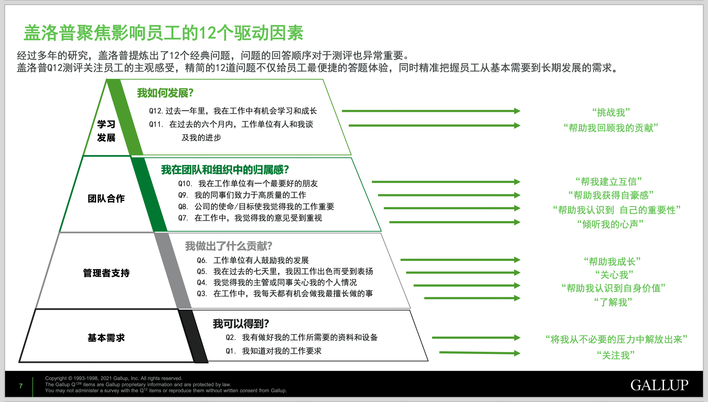
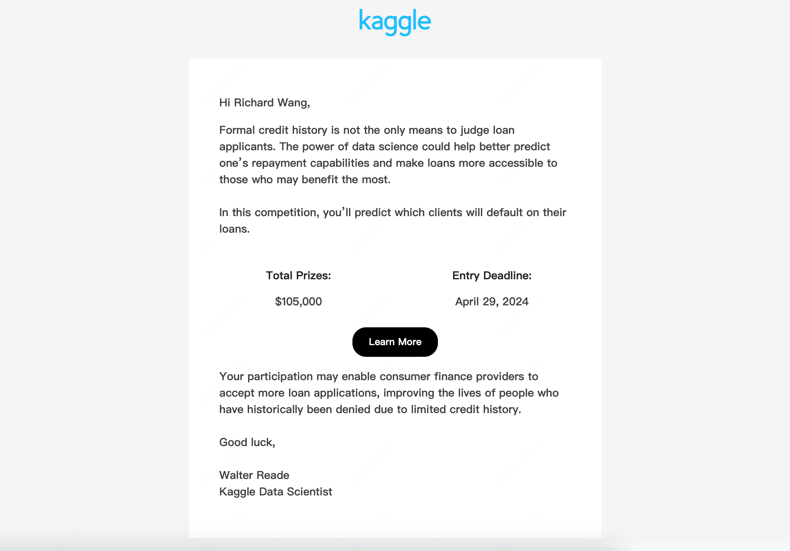

Unstructured是一个专注于大语言模型数据载入和清洗的服务平台，它提供了一个统一的接口来导入各种常见的文档格式，如PDF、Word、HTML、Markdown以及图片等。核心功能依赖于OCR和视觉识别模型等，需要在服务器端运行。通过在本次部署Unstructured服务或使用付费API，我们可以在本地通过API调用的方式轻松地处理不同来源的数据。

这一特性使得在进行数据导入时，不再需要为每种文件格式单独使用不同的库，极大地简化了数据处理流程。

我们将工作中可能遇到的场景分别进行本地部署方案的测试，验证一下效果。

## 1. 导入PPT效果

员工述职和部门战略规划的PPT包含非常丰富的信息，我们尝试一下导入PPT的效果。这是一份在网上找的述职报告模板，我们摘取两页作为示例。



```python
from langchain_community.document_loaders import UnstructuredAPIFileLoader

loader = UnstructuredAPIFileLoader(
    "述职报告.pptx",
    url="http://ip:8000/general/v0/general",
    languages = ['chi_sim'],
)

docs = loader.load()
```

导入的效果显示，文本内容被正确识别，并整理成结构化数据：

```text title="docs"
[Document(page_content='20XX\n\n个人述职报告模板\n\n述职报告｜工作总结｜岗位竞聘｜职称答辩\n\n汇报人：
第一PPT\n\n申报职务：XXXX\n\n05\n\n科研成果\n\n文字内容\n\n文字内容\n\n文字内容\n\n请替换文字内容，修改
文字内容，也可以直接复制你的内容到此。请替换文字\n\n请替换文字内容，修改文字内容，也可以直接复制你的内容到此。
请替换文字\n\n请替换文字内容，修改文字内容，也可以直接复制你的内容到此。请替换文字\n\n文字内容\n\n文字内容\n\n
请替换文字内容，修改文字内容，也可以直接复制你的内容到此。请替换文字\n\n请替换文字内容，修改文字内容，也可以直接
复制你的内容到此。请替换文字', metadata={'source': './述职报告.pptx'})]

```

## 2. 导入图片效果

我从盖洛普的员工敬业度报告中截取了一张图片，作为示例，看一下识别效果。



```python
from langchain_community.document_loaders import UnstructuredAPIFileLoader

loader = UnstructuredAPIFileLoader(
    "GALLUP_Q12.png",
    url="http://ip:8000/general/v0/general",
    languages = ['chi_sim'],
)

docs = loader.load()
```

识别结果展示如下，可以看到文本内容大体上能够准确提取，但是部分内容可能会有一些错误。

```text title="docs"
[Document(page_content="盖 洛 普 聚 焦 影 响 员 工 的 12 个 驱 动 因 素\n\n经 过 盘 洛\n\n多 年 的 研 究 , 盖 洛 普 提 炼 出 了 12
个 经 典 问 题 , 问 题 的 回 答 顺 序 对 于 测 评 也 异 常 重 要 。 普 Q12 测 评 关 注 员 工 的 主 观 感 受 , 精 筒 的 12 道 问 题 不
仅 给 员 工 最 便 捷 的 答 题 体 验 , 同 时 精 准 把 握 员 工 从 基 本 需 要 到 长 期 发 展\n\n的 需 求 。\n\n我 如 何 发 展 ? 012.
过 去 一 年 里 , 我 在 工 作 中 有 机 会 学 习 和 成 长 Q11. 在 过 去 的 六 个 月 内 , 工 作 单 位 有 人 和 我 谈 及 我 的 进 步 我 在
团 队 和 组 织 中 的 归 属 感 ? Q10, 我 在 工 作 单 位 有 一 个 最 要 好 的 朋 友 09. 我 的 同 事 们 致 力 于 高 质 量 的 工 作 Q8,
公 司 的 使 命 / 目 标 使 我 觉 得 我 的 工 作 重 要 07. 在 工 作 中 , 我 觉 得 我 的 意 见 受 到 重 视 我 做 出 了 什 么 贡 献 ? Q6,
工 作 单 位 有 人 鼓 励 我 的 发 展 一 一 405 我 在 过 去 的 七 天 里 , 我 因 工 作 出 色 而 受 到 表 扬 一 一 一 一 一 一 一 一 一 一
丁 04, 我 觉 得 我 的 主 管 或 同 事 关 心 我 的 个 人 情 况 E . 在 工 作 中 , 我 每 天 都 有 机 会 做 我 最 擅 长 做 的 事 我 可 以
得 到 ? 02, 我 有 做 好 我 的 工 作 所 需 要 的 资 料 和 设 备 Q1, 我 知 道 对 我 的 工 作 要 求 “ 挑 战 我 “ “ 帮 助 我 回 顾 我 的
贡 献 “ “ 帮 我 建 立 互 信 “ “ 帮 助 我 获 得 自 豪 感 “ “ 帮 助 我 认 识 到 自 己 的 重 要 性 “ 倾 听 我 的 心 声 “ “ 帮 助 我 成
长 “ “关心我” “ 帮 助 我 认 识 到 自 身 价 值 “ 吴 了『【'军手{之,， “ 将 我 从 不 必 要 的 压 力 中 解 放 “ 关 注 我 “\n\n“\n\n出\n\n
来 “", metadata={'source': './GALLUP_Q12.png'})]
```

## 3. 导入邮件效果

邮件也是企业内重要的数据来源，我们再来试试导入邮件的效果。我拿一封刚收到的来自 Kaggle 推送的竞赛启动邮件，我们尝试导入一下。



```python
loader = UnstructuredAPIFileLoader(
    "./Competition Launch_ Home Credit - Credit Risk Model Stability.eml",
    url="http://43.154.42.244:19026/general/v0/general",
    languages = ['chi_sim'],
)
docs = loader.load()
```

邮件内容被成功读取：

```text title="docs"
[Document(page_content="td>  \r\n                         Hi Richard Wang, Formal credit history is not the only means
to judge loan applicants. The power of data science could help better predict one’s repayment capabilities and make loans
more accessible to those who may benefit the most. In this competition, you’ll predict which clients will default on their
loans.  \r\n                  \r\n    \r\n                              \r\n    \r\n             \r\n
Total Prizes: $105,000 Entry Deadline: April 29, 2024    Learn More    Your participation may enable consumer finance
providers to accept more loan applications, improving the lives of people who have historically been denied due to limited
credit history. Good luck, Walter Reade  Kaggle Data Scientist  Kaggle, Inc 1600 Amphitheatre Pkwy Mountain View, CA\r\n
94043 This email was sent to kaggle@richardwang.me because you\r\n                        indicated that you'd like to
receive news and updates\r\n                        about Kaggle. If you don't want to receive these emails\r\n
in the future, please kaggle.com.", metadata={'source': './Competition Launch_ Home Credit - Credit Risk Model Stability.eml'})]
```