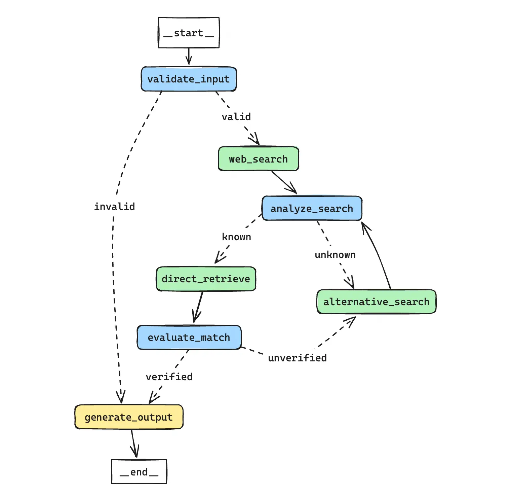

继续用一篇博客记录另一个完整的数据清洗案例，对于数据库中的公司名称，由于每家企业都可能存在众多合同主体，因此有必要在分析中需要将这些名称统一归为其最广为人知的名字。

在过往，我们一般通过关键字匹配以及其他基于规则的方法来进行公司名称的清洗，但总会存在某些公司主体中并不包含该公司的常用名等现象，人工处理的工作量很大，效率也不高。因此，我们尝试使用大模型来解决这个问题。

## 实现流程

整个实现流程可以概括为以下几个关键步骤：

1. 输入验证：首先，系统会验证用户输入是否是一个有效的公司名称。这通过使用语言模型来判断输入是否足够具体和明确。
2. 网络搜索：如果输入被认为是有效的，系统会使用DuckDuckGo搜索引擎进行网络搜索，以获取更多关于该公司的信息。
3. 搜索结果分析：系统分析搜索结果，尝试识别出一个更广为人知的公司名称，可能是输入公司的母公司或相关知名实体。
4. 替代搜索：如果初次搜索未能识别出公司，系统会使用另一个搜索工具（Tavily）进行第二次尝试。 
5. 向量数据库检索：基于识别出的公司名称（或原始查询），系统从预先准备的向量数据库中检索最相似的公司记录。 
6. 匹配评估：系统评估检索到的公司名称是否与用户的原始查询相匹配，考虑到可能的名称变体和子公司关系。 
7. 结果生成：最后，系统生成最终输出，提供匹配的公司简称（如果成功验证）或指示无法识别。



- 蓝色节点：利用大语言模型进行的任务
- 绿色节点：调用工具完成相应任务的节点，包括搜索、向量检索等
- 黄色节点：设定规则进行判断的节点

## 代码实现

### 准备工作

#### 导入依赖

```python
import sys
from typing import Dict, List, Literal, Optional
from typing_extensions import TypedDict
from IPython.display import Image, display
from pprint import pprint

import pandas as pd

from langchain_core.prompts import ChatPromptTemplate
from langchain_core.pydantic_v1 import BaseModel, Field
from langchain_core.output_parsers import PydanticOutputParser
from langchain_core.documents import Document
from langchain.output_parsers import PydanticOutputParser

from langchain_community.vectorstores import Chroma
from langchain_community.embeddings import DashScopeEmbeddings
from langchain_community.chat_models.tongyi import ChatTongyi
from langchain_community.utilities import DuckDuckGoSearchAPIWrapper
from langchain_community.tools import DuckDuckGoSearchRun
from langchain_community.tools.tavily_search import TavilySearchResults

from langgraph.graph import END, StateGraph
```

#### 数据准备

这一步我们模拟一个企业内已有的公司标签数据集，其中包含了公司的全称和简称，并将其保存为 Document 对象。

```python
company_data = pd.read_csv("company.csv")

# 将数据集中的每一行转换为Document对象，并存储公司简称作为元数据
company_documents = [
    Document(
        page_content=row.iloc[0],
        metadata={
            "company_abbreviation": row.iloc[1],
        },
    )
    for index, row in company_data.iterrows()
]

company_documents
```

```text title="Output"
[Document(page_content='阿里巴巴', metadata={'company_abbreviation': '阿里'}),
 Document(page_content='美团买菜', metadata={'company_abbreviation': '美团'}),
 Document(page_content='京东物流', metadata={'company_abbreviation': '京东'}),
 Document(page_content='字节跳动', metadata={'company_abbreviation': '字节'}),
 Document(page_content='京东零售', metadata={'company_abbreviation': '京东'}),
 Document(page_content='百度外卖', metadata={'company_abbreviation': '百度'}),
 Document(page_content='蚂蚁金服', metadata={'company_abbreviation': '阿里'}),
 Document(page_content='菜鸟', metadata={'company_abbreviation': '阿里'})]
```

#### 存入向量数据库

```python
# Set embeddings
embedding_model = DashScopeEmbeddings(model="text-embedding-v2")

# 添加到向量数据库
vector_db = Chroma.from_documents(
    documents=company_documents,
    collection_name="rag-chroma",
    embedding=embedding_model
)

# 创建检索器
retriever = vector_db.as_retriever(search_kwargs={"k": 1})
```

#### 工具准备

```python
# 初始化语言模型
language_model = ChatTongyi(model="qwen1.5-32b-chat", temperature=0.0)

# 初始化 DuckDuckGoSearch 工具
duckduckgo_wrapper = DuckDuckGoSearchAPIWrapper(max_results=5)
duckduckgo_search_tool = DuckDuckGoSearchRun(api_wrapper=duckduckgo_wrapper)

# 初始化 TavilySearch 工具
alternative_search_tool = TavilySearchResults(k=2)
```

### 构建任务

#### GraphState

```python
class CompanyVerificationState(TypedDict):
    """
    用于管理公司名称识别和验证的状态。

    Attributes:
        user_query: 用户关于公司名称的原始查询。
        is_valid: 用户输入是否为有效的公司名称。
        search_results: 可选；来自网络搜索的结果。
        identified_company_name: 可选；从搜索结果中识别出的公司名称。
        recognition_status: 可选；表示公司名称是否被成功识别（'known' 为已识别，'unknown' 为未识别）。
        retrieved_company_name: 可选；从向量数据库中检索到的公司名称。
        verification_status: 可选；表示检索到的公司名称是否与查询匹配（'verified' 为匹配，'unverified' 为不匹配）。
        search_count: 执行网络搜索的次数。
        retrieval_results: 可选；向量数据库检索的原始结果。
    """
    user_query: str
    is_valid: bool
    search_results: Optional[List[str]]
    identified_company_name: Optional[str]
    recognition_status: Optional[str]
    retrieved_company_name: Optional[str]
    verification_status: Optional[str]
    search_count: int
    retrieval_results: Optional[List[str]]
    final_company_name: Optional[str]
```

#### validate_input

```python
class InputValidation(BaseModel):
    """Validation result for the user input."""
    is_valid: bool = Field(
        ...,
        description="Indicates whether the user input is a valid company name ('True') or not ('False')."
    )

validation_parser = PydanticOutputParser(pydantic_object=InputValidation)

system_message_validation = """你的任务是判断用户输入的查询公司名称是否是一个具体的、有效的公司名称。
你将收到一个用户查询的公司名称。
请判断该名称是否足以识别一个特定的公司。
如果名称具体且明确，足以识别一个特定的公司，则将其标记为'True'。
如果名称模糊，或者不是指一个特定的公司，则标记为'False'。
"""

format_instructions = """
Output your answer as JSON adhering to the given schema: ```json\n{schema}\n```. But no need to repeat the schema.
"""

validation_prompt = ChatPromptTemplate.from_messages(
    [
        ("system", system_message_validation + format_instructions),
        ("human", "用户查询的公司名称：{user_query}"),
    ]
).partial(schema=InputValidation.schema())

input_validator = validation_prompt | language_model | validation_parser

def validate_input(state: Dict) -> Dict:
    """
    验证用户输入是否为有效的公司名称。
    """
    print("---验证用户输入---")
    validation_result = input_validator.invoke({"user_query": state["user_query"]})
    state["is_valid"] = validation_result.is_valid
    return state
```

#### determine_initial_step

```python
def determine_initial_step(state: Dict) -> str:
    """
    根据输入验证结果确定下一步操作。
    """
    if state["is_valid"]:
        print("---输入有效，跳转到网络搜索---")
        return "valid"
    else:
        print("---输入无效，跳转到结束流程---")
        return "invalid"
```

#### web_search

```python
def web_search(state: Dict) -> Dict:
    """
    使用DuckDuckGoSearch执行网络搜索。
    """
    query = state["user_query"]
    print("---执行网络搜索---")
    results = duckduckgo_search_tool.invoke(query + "简称")
    state["search_results"] = results
    state["search_count"] += 1
    return state
```

#### analyze_search

```python
class CompanyNameRecognition(BaseModel):
    """Recognition result for company names from web search."""
    identified_company_name: str = Field(
        ...,
        description="The recognized company name, extracted from the search results, if it is a variation or subsidiary of a known company."
    )
    recognition_status: Literal["known", "unknown"] = Field(
        ...,
        description="Indicates whether the company name was successfully identified ('known') or not ('unknown')."
    )

recognition_parser = PydanticOutputParser(pydantic_object=CompanyNameRecognition)

system_message_search_analysis = """
你的工作是根据提供的网络搜索结果来判断搜索结果是否与查询的公司名称相关。
如果搜索结果与查询的公司名称相关，你需要进一步推断该公司是否是某家知名公司的合同主体变体或其子公司。
如果能够推断出该公司是某家知名公司的变体或子公司，请提供这家更普遍和知名的公司名称，并标记状态为'known'。
如果无法推断出相关信息，或者搜索结果与查询的公司名称不相关，请标记状态为'unknown'，并省略公司名称。
在进行判断时，请考虑公司名称的相似性、搜索结果中提及的母公司或集团信息、以及提及的公司简称等。
"""

format_instructions = """
Output your answer as JSON adhering to the given schema: ```json\n{schema}\n```.
"""

search_analysis_prompt = ChatPromptTemplate.from_messages(
    [
        ("system", system_message_search_analysis + format_instructions),
        ("human", "针对特定查询'{user_query}'，请仔细评估以下网络搜索片段：{snippets}。"
                  "如果搜索结果明确指向查询中的公司，并且您能够推断出该公司是某家知名公司的变体或子公司，"
                  "请提供该知名公司的名称并标注状态为'known'。"
                  "如果搜索结果不明确或无法推断出相关信息，请标注状态为'unknown'，并省略公司名称。"),
    ]
).partial(schema=CompanyNameRecognition.schema())

search_analysis = search_analysis_prompt | language_model | recognition_parser


def analyze_search(state: Dict) -> Dict:
    """
    分析网络搜索结果以识别和确认公司名称。
    """
    print("---分析搜索结果---")
    snippets = state["search_results"]
    analysis_result = search_analysis.invoke({"user_query": state["user_query"], "snippets": snippets})
    state["identified_company_name"] = analysis_result.identified_company_name if analysis_result.recognition_status == "known" else None
    state["recognition_status"] = analysis_result.recognition_status
    return state
```

#### determine_next_step

```python
def determine_next_step(state: Dict) -> str:
    """
    根据分析搜索结果中的recognition_status和搜索次数确定下一步操作。
    """
    if state["recognition_status"] == "known":
        print("---状态：已知，跳转到直接检索---")
        return "known"
    elif state["search_count"] == 1:
        print("---状态：未知，搜索次数为1，跳转到替代搜索---")
        return "unknown"
    else:
        print("---状态：未知，搜索次数为2或更多，跳转到直接检索---")
        return "known"
```

#### alternative_search

```python
def alternative_search(state: Dict) -> Dict:
    """
    使用替代搜索工具执行网络搜索。
    """
    query = state["user_query"]
    print("---执行替代搜索---")
    results = alternative_search_tool.invoke(query)
    state["search_results"] = results
    state["search_count"] += 1
    return state
```

#### direct_retrieve

```python
def direct_retrieve(state: Dict) -> Dict:
    """
    根据识别的公司名称从向量存储中检索公司名称，并更新状态。
    """
    if state["recognition_status"] == "known":
        search_term = state["identified_company_name"]
    else:
        search_term = state["user_query"]
    
    retrieval_results = retriever.invoke(search_term)
    retrieved_company_name = retrieval_results[0].page_content
    state["retrieved_company_name"] = retrieved_company_name
    state["retrieval_results"] = retrieval_results
    return state
```

#### evaluate_match

```python
class CompanyNameVerification(BaseModel):
    """Verification result for the match between the retrieved company name and the user query."""
    verification_status: Literal["verified", "unverified"] = Field(
        ...,
        description="Indicate whether the retrieved company name is verified to match the user's query ('verified') or not ('unverified')."
    )

verification_parser = PydanticOutputParser(pydantic_object=CompanyNameVerification)

system_message_verification = """你的任务是验证从向量数据库检索到的公司名称是否与用户提供的查询公司名称指向同一个母公司。
你将收到一个用户查询的公司名称、从数据库检索到的最相似的公司名称以及相关的搜索结果。
请结合搜索结果来判断检索到的公司名称是否确实是指向用户查询的公司的同一个母公司。
如果检索到的公司名称与搜索结果一致，并且可以确认是指向同一个母公司，则将其标记为'verified'。
如果无法确认是同一母公司，或者搜索结果与查询不相关，则标记为'unverified'。
在判断时，请考虑公司名称的正式表述、可能的简称或全称差异，以及搜索结果中的相关信息。
即使名称表述不同，只要指向同一个母公司，也应视为匹配。"""

format_instructions = """
Output your answer as JSON adhering to the given schema: ```json\n{schema}\n```. But no need to repeat the schema.
"""

verification_prompt = ChatPromptTemplate.from_messages(
    [
        ("system", system_message_verification + format_instructions),
        ("human", "用户查询的公司名称：{user_query} \n检索到的公司名称：{retrieved_name} \n搜索结果：{search_results}"),
    ]
).partial(schema=CompanyNameVerification.schema())

name_verifier = verification_prompt | language_model | verification_parser


def evaluate_match(state: Dict) -> Dict:
    """
    评估检索到的公司名称是否与原始用户查询准确匹配。
    """
    print("---评估名称匹配---")
    verified_result = name_verifier.invoke({
        "user_query": state["user_query"],
        "retrieved_name": state["retrieved_company_name"],
        "search_results": state["search_results"]
    })
    verification_status = verified_result.verification_status
    state["verification_status"] = verification_status
    return state
```

#### determine_post_verification_step

```python
def determine_post_verification_step(state: Dict) -> str:
    """
    根据验证状态和搜索次数确定下一步操作。
    """
    if state["verification_status"] == "verified":
        print("---验证状态：已验证，跳转到生成最终输出---")
        return "verified"
    elif state["verification_status"] == "unverified" and state["search_count"] == 1:
        print("---验证状态：未验证，搜索次数为1，跳转到替代搜索---")
        return "unverified"
    else:
        print("---验证状态：未验证，搜索次数为2或更多，跳转到生成最终输出---")
        return "verified"
```

#### generate_output

```python
def generate_output(state: Dict) -> Dict:
    """
    根据处理状态生成最终输出。
    """
    print("---生成最终输出---")
    if state["is_valid"]:
        final_name = state["retrieval_results"][0].metadata['company_abbreviation'] if state["verification_status"] == "verified" else "未知"
    else:
        final_name = "无效输入"
    state["final_company_name"] = final_name
    print(f"---最终公司简称：{final_name}---")
    return state
```

### 构建流程图

```python
workflow = StateGraph(CompanyVerificationState)

workflow.add_node("validate_input", validate_input)
workflow.add_node("web_search", web_search)
workflow.add_node("analyze_search", analyze_search)
workflow.add_node("direct_retrieve", direct_retrieve)
workflow.add_node("evaluate_match", evaluate_match)
workflow.add_node("generate_output", generate_output)
workflow.add_node("alternative_search", alternative_search)

# 构建流程图
workflow.set_entry_point("validate_input")
workflow.add_conditional_edges(
    "validate_input",
    determine_initial_step,
    {
        "valid": "web_search",
        "invalid": "generate_output"
    }
)
workflow.add_edge("web_search", "analyze_search")
workflow.add_conditional_edges(
    "analyze_search",
    determine_next_step,
    {
        "known": "direct_retrieve",
        "unknown": "alternative_search",
    }
)
workflow.add_edge("alternative_search", "analyze_search")
workflow.add_edge("direct_retrieve", "evaluate_match")
workflow.add_conditional_edges(
    "evaluate_match",
    determine_post_verification_step,
    {
        "verified": "generate_output",
        "unverified": "alternative_search"
    }
)
workflow.add_edge("generate_output", END)

# 编译流程图
app = workflow.compile()
```

## 效果演示

#### 案例一

```python
inputs = {
    "user_query": "口碑（杭州）信息技术有限公司",
    "search_count": 0
}

result = app.invoke(inputs)
```

```text title="Log"
---验证用户输入---
---输入有效，跳转到网络搜索---
---执行网络搜索---
---分析搜索结果---
---状态：已知，跳转到直接检索---
---评估名称匹配---
---验证状态：未验证，搜索次数为1，跳转到替代搜索---
---执行替代搜索---
---分析搜索结果---
---状态：已知，跳转到直接检索---
---评估名称匹配---
---验证状态：已验证，跳转到生成最终输出---
---生成最终输出---
---最终公司简称：阿里---
```

```text title="result"
{'final_company_name': '阿里',
 'identified_company_name': '阿里巴巴集团',
 'is_valid': True,
 'recognition_status': 'known',
 'retrieval_results': [Document(page_content='阿里巴巴集团', metadata={'company_abbreviation': '阿里', 'pk': 450230264673989583})],
 'retrieved_company_name': '阿里巴巴集团',
 'search_count': 2,
 'search_results': [{'content': '基本信息 口碑（杭州）信息技术有限公司成立于2015-11-11，是koubei '
                                'china holding '
                                'limited旗下企业，位于浙江省杭州市西湖区，法定代表人为张玉东，目前处于存续状态，以从事信息传输、软件和信息技术服务业为主，人员规模少于50人，参保人数39人，注册资本为3000万元人民币，实缴资本为3000万元人民币 '
                                '...',
                     'url': 'https://www.qcc.com/firm/6596da1f31acdf50b0a0f0e3e5ad0aec.html'},
                    {'content': '口碑（杭州）信息技术有限公司是一家小微企业，该公司成立于2015年11月11日，位于浙江省杭州市西湖区西溪路556号5层A段501-2，目前处于开业状态，经营范围包括计算机软硬件的技术开发、技术咨询、技术服务、成果转让，承接计算机网络系统工程（涉及资质证 '
                                '...',
                     'url': 'https://aiqicha.baidu.com/company_detail_22875240824826'},
                    {'content': '口碑是阿里巴巴集团与蚂蚁金服集团整合双方资源，联手打造的一家互联网本地生活服务平台，于2015年6月23日正式成立。公司以"生态模式"向线下扩张，平台开放支付、会员、营销、信用、社交关系链等九大接口，引入更多的系统商、服务商共同为线下商家提供价值。覆盖餐饮、超市、便利店 '
                                '...',
                     'url': 'https://baike.baidu.com/item/口碑/17871247'},
                    {'content': '口碑（杭州）信息技术有限公司. '
                                '口碑是阿里巴巴集团与蚂蚁金融服务集团深度整合双方优势资源，联手打造的一家互联网本地生活服务平台，于2015年6月23日正式成立，致力于用开放的心态，以支付为起点、会员为基础、大数据为支撑，吸引优质开发者，共同为 '
                                '...',
                     'url': 'https://career.xujc.com/2019/0625/c3959a115604/page.htm'},
                    {'content': '口碑（杭州）信息技术有限公司于2015年11月11日在杭州市市场监督管理局登记成立。法定代表人范驰，公司经营范围包括计算机软硬件的技术开发、技术咨询、技术服务等。',
                     'url': 'https://baike.baidu.com/item/口碑（杭州）信息技术有限公司/20896194'}],
 'user_query': '口碑（杭州）信息技术有限公司',
 'verification_status': 'verified'}
```

#### 案例二

```python
inputs = {
    "user_query": "互联网公司",
    "search_count": 0
}

result = app.invoke(inputs)
```

```text title="Log"
---验证用户输入---
---输入无效，跳转到结束流程---
---生成最终输出---
---最终公司简称：无效输入---
```

```text title="result"
{'final_company_name': '无效输入',
 'identified_company_name': None,
 'is_valid': False,
 'recognition_status': None,
 'retrieval_results': None,
 'retrieved_company_name': None,
 'search_count': 0,
 'search_results': None,
 'user_query': '互联网公司',
 'verification_status': None}
```

