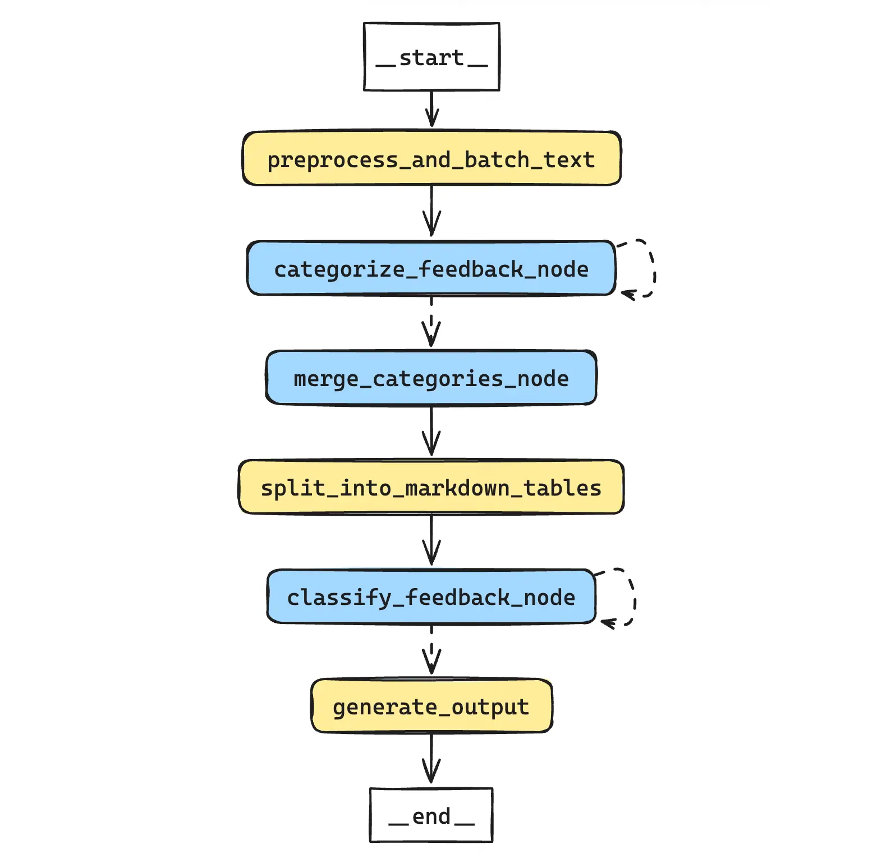
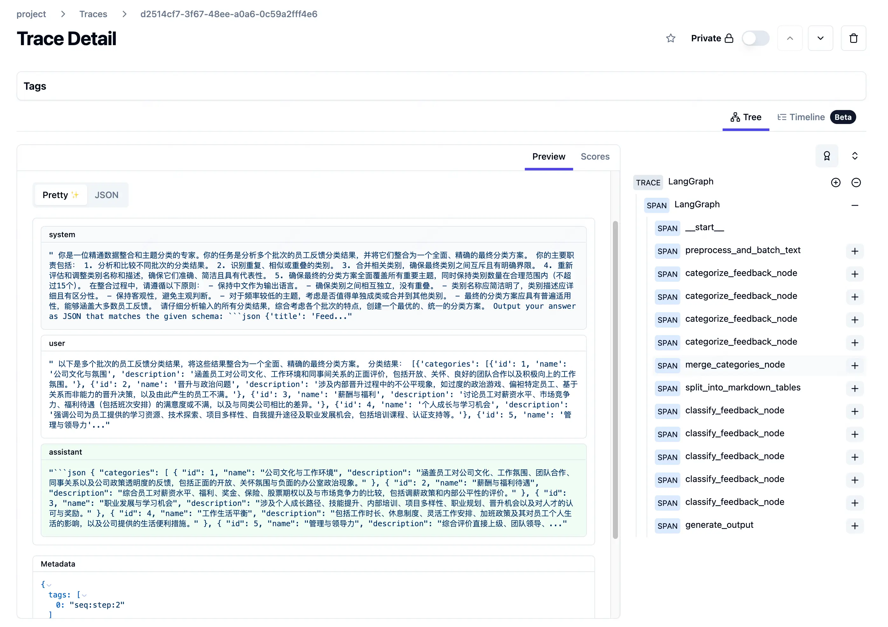

在处理大量非结构化文本数据时，传统的数据标注方法往往依赖于已知的分类清单。
然而，在许多实际应用场景中，我们可能没有一个明确的分类清单。
这时，利用大模型进行文本聚类就显得尤为重要，它可以作为分类任务的前置环节，帮助我们将非结构化的文本反馈转化为结构化的、可分析的数据。

## 项目介绍及实现流程

#### 项目流程图



项目的核心目标是将非结构化的文本反馈转化为结构化的、可分析的数据。实现过程主要包括以下几个关键步骤：


1. **数据预处理与分块**：
    - 对原始反馈数据进行清洗和标准化。
    - 考虑到大模型的上下文窗口限制，将文本数据按字符数量进行分块。

2. **主题聚类**：
    - 利用大模型对每个数据批次进行主题聚类。
    - 通过迭代方式处理所有数据批次，确保全面覆盖。

3. **主题整合**：
    - 对多批次的聚类结果进行整合和优化。
    - 消除重复类别，合并相似主题，确保分类方案的全面性和精确性。

4. **数据集切分**：
    - 将处理后的数据转换为Markdown格式的表格。

5. **分类任务**：
    - 基于优化后的分类方案，对每条员工反馈进行逐条分类。

6. **生成最终输出**：
    - 整合原始反馈和对应分类，生成结构化的结果数据，供后续统计分析。

## 代码实现

### 准备工作

#### 导入依赖

导入依赖与上一个[数据清洗](data-cleaning-case#导入依赖)的案例基本一致，在此省略。

#### 案例数据集

案例中使用的文本数据集，采用Kaggle上的公开数据集[Attrition Based on Accenture Review's 2021](https://www.kaggle.com/datasets/abhi211b/attrition-based-on-accenture-reviews-2021)，这是一个包含了员工反馈文本的数据集。

### 构建任务

#### GraphState

```python
class FeedbackClassificationState(TypedDict):
    """
    用于管理反馈分类的状态。
    """
    raw_feedback_data: pd.DataFrame
    batched_texts: List[List[str]]
    classification_results_list: List[Dict]
    merged_categories: Dict
    markdown_tables: List[str]
    feedback_classification_results: List[Dict]
    final_output: pd.DataFrame
    batch_index: int
    total_batches: int
    classification_batch_index: int
    total_classification_batches: int
```

#### 数据分块

在这个阶段，我们首先对原始文本进行清洗，包括去除特殊字符、统一格式等。
然后，考虑到大模型的输入限制，我们需要将长文本分割成适当大小的块。这里我们采用了基于字符数的分块策略，同时确保每个块的语义完整性。

关键技术点：
- 使用正则表达式进行文本清洗
- 实现动态分块算法，平衡块大小和语义完整性
- 随机打乱数据，提高样本多样性，避免类似内容集中在一起

```python
def preprocess_and_batch_text(state: Dict) -> Dict:
    import re
    import random

    input_dataset = state['raw_feedback_data']
    batch_char_limit = 700
    seed = 94

    random.seed(seed)

    def preprocess_text(text):
        pattern = r"['‘’""“”{}]"
        replacement = '`'

        if isinstance(text, str):
            return re.sub(pattern, replacement, text)
        return ''

    def count_words(text):
        chinese_char_count = len(re.findall(r'[\u4e00-\u9fff]', text))
        english_word_count = len(re.findall(r'\b[a-zA-Z]+\b', text))
        return chinese_char_count + english_word_count

    input_dataset.loc[:, 'pros'] = input_dataset['pros'].apply(preprocess_text)
    input_dataset.loc[:, 'cons'] = input_dataset['cons'].apply(preprocess_text)

    all_texts = input_dataset['pros'].tolist() + input_dataset['cons'].tolist()
    random.shuffle(all_texts)

    batches = []
    current_batch = []
    current_batch_char_count = 0

    for text in all_texts:
        text_char_count = count_words(text)
        if current_batch_char_count + text_char_count > batch_char_limit and current_batch:
            batches.append(current_batch)
            current_batch = []
            current_batch_char_count = 0

        current_batch.append(text)
        current_batch_char_count += text_char_count

    if current_batch:
        batches.append(current_batch)

    state['batched_texts'] = batches
    state['total_batches'] = len(batches)
    state['batch_index'] = 0
    state['classification_results_list'] = []
    return state
```

#### 主题聚类

主题聚类是本项目的核心步骤之一。我们利用大模型的强大语义理解能力，对每个数据批次进行无监督的主题发现。

技术要点：
- 设计专门的提示模板，引导模型进行主题识别和分类
- 使用Pydantic模型定义输出格式，确保结果的一致性和可解析性
- 实现批次处理逻辑，有效管理大规模数据集

```python
class FeedbackCategory(BaseModel):
    id: int = Field(..., description="Category ID starting from 1.")
    name: str = Field(..., description="Concise and clear label for the category.")
    description: str = Field(..., description="Detailed description differentiating the category from others.")


class FeedbackCategories(BaseModel):
    categories: List[FeedbackCategory] = Field(..., description="List of categorized themes in the feedback.")


system_message = """
你是一位文本挖掘和分类专家。你的任务是深入分析员工的反馈内容，并将反馈中涉及的主题按照以下原则进行分类：
1. 分类原则：
   - 互斥：确保每个类别之间相互独立，没有重叠或交集。
   - 具体：类别应明确、清晰，避免模糊不清的分类。
   - 有意义：类别应具有普遍性，能涵盖多数相关的员工反馈。
2. 分类要求：
   - 使用中文进行分类。
   - 类别数量不超过10个。
   - 类别名称应简洁、准确，一目了然地反映核心主题。
   - 类别描述应详尽、清晰，阐述该类别所包含的内容，并与其他类别区分。
3. 分类策略：
   - 全面覆盖原始数据中所有主要主题。
   - 避免创建过多类别，可将较少出现的主题合并到"其他"类别。
   - 忽略质量不高或内容不清晰的反馈。
请严格遵循这些原则和要求，确保分类结果的准确性和实用性。
"""

format_instructions = """
Output your answer as JSON that matches the given schema: ```json\n{schema}\n```. Make sure to wrap the answer in ```json and ``` tags. No need to repeat the schema.
"""

human_message_template = """
请根据以下员工反馈内容进行分析，严格遵循系统消息中的分类原则、要求和策略，使用中文对反馈内容进行分类。
分析步骤：
1. 仔细阅读并理解所有员工反馈。
2. 识别反馈中的主要主题和关键词。
3. 根据主题的相似性和重要性进行初步分类。
4. 检查并调整分类，确保符合所有要求。
5. 为每个类别创建简洁的名称和详细的描述。
员工反馈内容：
{feedback_text}
请提供符合指定JSON格式的分类结果。
"""

parser = PydanticOutputParser(pydantic_object=FeedbackCategories)

prompt_template = ChatPromptTemplate.from_messages(
    [
        ("system", system_message + format_instructions),
        ("human", human_message_template),
    ]
).partial(schema=FeedbackCategories.schema())

categorize_feedback = prompt_template | language_model | parser
```

```python
def categorize_feedback_node(state: Dict) -> Dict:
    batch_index = state['batch_index']
    batched_texts = state['batched_texts']
    feedback_text = batched_texts[batch_index]
    result = categorize_feedback.invoke({"feedback_text": feedback_text})
    state['classification_results_list'].append(result.dict())
    state['batch_index'] += 1
    return state
```

#### determine_next_step

```python
def determine_next_step(state: Dict) -> str:
    if state['batch_index'] < state['total_batches']:
        return "categorize_feedback_node"
    else:
        return "merge_categories_node"
```

#### 主题整合

在完成初步聚类后，我们需要对多个批次的结果进行整合。这个过程不仅仅是简单的合并，还涉及到类别的重新评估和优化。

```python
class FeedbackCategory(BaseModel):
    id: int = Field(..., description="Category ID starting from 1.")
    name: str = Field(..., description="Concise and clear label for the category.")
    description: str = Field(..., description="Detailed description differentiating the category from others.")


class FeedbackCategories(BaseModel):
    categories: List[FeedbackCategory] = Field(..., description="List of categorized themes in the feedback.")


system_message = """
你是一位精通数据整合和主题分类的专家。你的任务是分析多个批次的员工反馈分类结果，并将它们整合为一个全面、精确的最终分类方案。
你的主要职责包括：
1. 分析和比较不同批次的分类结果。
2. 识别重复、相似或重叠的类别。
3. 合并相关类别，确保最终类别之间互斥且有明确界限。
4. 重新评估和调整类别名称和描述，确保它们准确、简洁且具有代表性。
5. 确保最终的分类方案全面覆盖所有重要主题，同时保持类别数量在合理范围内（不超过15个）。
在整合过程中，请遵循以下原则：
- 保持中文作为输出语言。
- 确保类别之间相互独立，没有重叠。
- 类别名称应简洁明了，类别描述应详细且有区分性。
- 保持客观性，避免主观判断。
- 对于频率较低的主题，考虑是否值得单独成类或合并到其他类别。
- 最终的分类方案应具有普遍适用性，能够涵盖大多数员工反馈。
请仔细分析输入的所有分类结果，综合考虑各个批次的特点，创建一个最优的、统一的分类方案。
"""

human_message_template = """
以下是多个批次的员工反馈分类结果，将这些结果整合为一个全面、精确的最终分类方案。
分类结果：
{classification_results}
请按照以下步骤进行整合：
1. 仔细阅读并分析所有批次的分类结果。
2. 识别各批次中重复、相似或重叠的类别。
3. 合并相关类别，确保最终类别之间互斥且有明确界限。
4. 重新评估并优化类别名称和描述。
5. 检查是否有遗漏的重要主题，必要时添加新类别。
6. 确保最终的分类方案全面且类别数量合理（建议在10-15个之间）。
请提供符合指定JSON格式的最终整合分类结果。
"""

parser = PydanticOutputParser(pydantic_object=FeedbackCategories)

prompt_template = ChatPromptTemplate.from_messages(
    [
        ("system", system_message + format_instructions),
        ("human", human_message_template),
    ]
).partial(schema=FeedbackCategories.schema())

merge_categories = prompt_template | language_model | parser
```

```python
def merge_categories_node(state: Dict) -> Dict:
    classification_results_list = state['classification_results_list']
    classification_results = [FeedbackCategories.parse_obj(result).dict() for result in classification_results_list]
    result = merge_categories.invoke({"classification_results": classification_results})
    state['merged_categories'] = result.dict()
    return state
```

#### 数据分块为Markdown表格

为了便于后续的分类任务，我们将处理后的数据转换为Markdown格式的表格，适合作为模型的输入。

```python
def split_into_markdown_tables(state: Dict) -> Dict:
data = state['raw_feedback_data']
columns = ['index', 'pros']
n = 10

    data = data.dropna(subset=columns, how='any')

    text_columns = [col for col in columns if data[col].dtype == 'object']

    for col in text_columns:
        data[col] = data[col].str.replace('\r\n', ' ', regex=True)

    df = data[columns]

    markdown_tables = []

    for start in range(0, len(df), n):
        subset = df.iloc[start:start + n]

        markdown_table = "| " + " | ".join(columns) + " |\n"
        markdown_table += "| " + " | ".join(["---"] * len(columns)) + " |\n"

        for index, row in subset.iterrows():
            row_values = [str(row[col]) for col in columns]
            markdown_table += "| " + " | ".join(row_values) + " |\n"

        markdown_tables.append(markdown_table)

    state['markdown_tables'] = markdown_tables
    state['total_classification_batches'] = len(markdown_tables)
    state['classification_batch_index'] = 0
    state['feedback_classification_results'] = []
    return state
```

#### 分类任务

在这个阶段，我们使用优化后的分类方案对每条员工反馈进行分类。

```python
class FeedbackOutput(BaseModel):
    id: str = Field(..., description="Corresponding employee feedback ID from input")
    category: str = Field(..., description="Feedback category based on predefined classification")


class FeedbackClassification(BaseModel):
    classifications: List[FeedbackOutput] = Field(..., description="List of classification results for all feedbacks")


system_message = """
你是一位文本分类专家。你的任务是根据预定义的分类规则，对给定的员工反馈进行主题分类。请遵循以下指南：
1. 分类规则：
   {categories}
2. 分类要求：
   - 仔细阅读每条反馈，理解其核心内容。
   - 根据反馈内容，从预定义的类别中选择最合适的一个。
   - 如果一条反馈涉及多个主题，选择最主要或最突出的一个。
   - 如果反馈内容不清晰或不属于任何预定义类别，将其归类为"其他"。
3. 输出格式：
   - 对每条反馈，输出其ID和对应的类别。
   - 严格遵循指定的JSON格式。
请确保分类的一致性和准确性，不要遗漏任何反馈。
"""

human_message_template = """
请对以下员工反馈进行分类。输入数据为Markdown格式的表格，包含ID和反馈文本两列。
员工反馈：
{feedback_table}
请按照系统消息中的指南进行分类，并以指定的JSON格式输出结果。
"""

parser = PydanticOutputParser(pydantic_object=FeedbackClassification)

prompt_template = ChatPromptTemplate.from_messages(
    [
        ("system", system_message + format_instructions),
        ("human", human_message_template),
    ]
).partial(schema=FeedbackClassification.schema())

classify_feedback = prompt_template | language_model | parser
```

```python
def classify_feedback_node(state: Dict) -> Dict:
    classification_batch_index = state['classification_batch_index']
    markdown_tables = state['markdown_tables']
    merged_categories = state['merged_categories']
    feedback_table = markdown_tables[classification_batch_index]
    result = classify_feedback.invoke({"feedback_table": feedback_table, "categories": merged_categories})

    state['feedback_classification_results'].append(result.dict())
    state['classification_batch_index'] += 1

    return state
```

#### determine_classification_next_step

```python
def determine_classification_next_step(state: Dict) -> str:
    if state['classification_batch_index'] < state['total_classification_batches']:
        return "classify_feedback_node"
    else:
        return "generate_output"
```

#### 生成最终输出

最后，我们将分类结果与原始数据整合，生成最终的结构化输出。这个输出不仅包含原始反馈，还包括对应的分类标签。

```python
def generate_output(state: Dict) -> Dict:
    feedback_classification_results = state['feedback_classification_results']
    final_output_list = []

    for batch_result in feedback_classification_results:
        for classification in batch_result['classifications']:
            final_output_list.append({
                'id': classification['id'],
                'category': classification['category']
            })

    final_output_df = pd.DataFrame(final_output_list)

    # 拼接回原始数据集
    raw_feedback_data = state['raw_feedback_data']
    final_output_df = raw_feedback_data.merge(final_output_df, on='id', how='left')

    state['final_output'] = final_output_df
    return state
```

### 构建流程图

```python
workflow = StateGraph(FeedbackClassificationState)

workflow.add_node("preprocess_and_batch_text", preprocess_and_batch_text)
workflow.add_node("categorize_feedback_node", categorize_feedback_node)
workflow.add_node("merge_categories_node", merge_categories_node)
workflow.add_node("split_into_markdown_tables", split_into_markdown_tables)
workflow.add_node("classify_feedback_node", classify_feedback_node)
workflow.add_node("generate_output", generate_output)

# 构建流程图
workflow.set_entry_point("preprocess_and_batch_text")
workflow.add_edge("preprocess_and_batch_text", "categorize_feedback_node")
workflow.add_conditional_edges(
    "categorize_feedback_node",
    determine_next_step,
    {
        "categorize_feedback_node": "categorize_feedback_node",
        "merge_categories_node": "merge_categories_node"
    }
)
workflow.add_edge("merge_categories_node", "split_into_markdown_tables")
workflow.add_edge("split_into_markdown_tables", "classify_feedback_node")
workflow.add_conditional_edges(
    "classify_feedback_node",
    determine_classification_next_step,
    {
        "classify_feedback_node": "classify_feedback_node",
        "generate_output": "generate_output"
    }
)
workflow.add_edge("generate_output", END)

# 编译流程图
app = workflow.compile()
```

## 效果演示

由于该任务的数据量较大，输入输出和保存在 state 中的信息无法在博客中展示，因此放一下在执行任务过程，在 langgraph 中的监控流程。



可以看到，主题聚类的任务循环了 4 次，而数据标注的任务迭代了 5 次完成。

## 结论

本项目展示了如何利用大型语言模型进行文本聚类和分类，为非结构化文本数据的分析提供了一个强大而灵活的解决方案。
通过结合大模型的语义理解能力和传统的数据处理技术，我们能够更有效地从文本数据中提取有价值的见解。