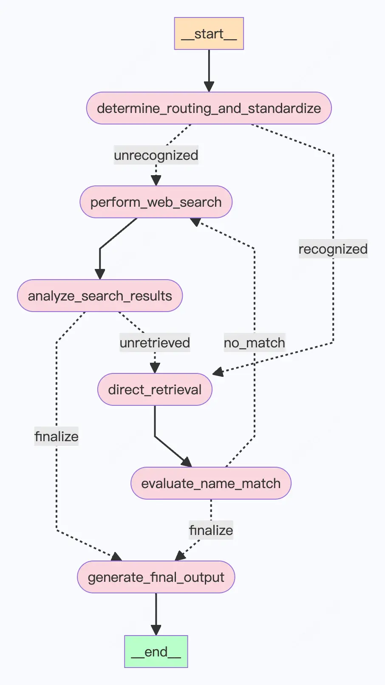

在数据分析工作当中，数据治理和标准化是令我们最头痛的过程，不仅耗时耗力，还缺乏成就感。

我们以学校名称的标准化为例，由于各种原因，学校名称在记录过程中常常出现不规范的情况，如缩写、错别字、或存在多余的学院专业等，这给数据的处理和分析带来了诸多困扰。
为了解决这一问题，本项目演示如何利用大模型和Langgraph框架，对不规范的学校名称进行清洗和标准化处理。

本文将首先概述项目的整体思路和流程逻辑，Langgraph框架的基本规范，并完成项目的准备工作。这一节重点关注图状态的定义和工具节点函数的实现，为后续的大模型任务构建打下基础。

## 项目整体思路和流程逻辑

为了实现学校名称的标准化，我们基于Langgraph框架构建任务流程。整个项目可以划分为几个核心步骤，每个步骤都通过Langgraph框架中的节点来实现。

### 项目流程图

:::tip
为了演示LangGraph的工作，项目中构造了一个略显复杂的流程。在实际应用中，若不考虑token消耗和处理速度等费用和时间上的消耗，存在流程简化的空间。
:::

import { Steps } from '@astrojs/starlight/components';



核心步骤概述：

- 确定路由和标准化 (determine_routing_and_standardize): 流程的入口点，它使用大模型来判断是直接从向量存储中检索学校名称，还是通过网络搜索来获取更多信息。
- 直接检索 (direct_retrieval): 如果大模型凭借原生知识或搜索信息确定了他认为的官方学校名称，这一步骤将从已有学校名称的向量数据库中检索。
- 评估名称匹配 (evaluate_name_match): 确认环节，这一步骤将评估检索出来的学校名称与原始查询是否为同一所学校。
- 网络搜索 (perform_web_search): 当大模型判断需要更多信息时，这一步骤将执行网络搜索，以获取与学校名称相关的更多信息。
- 分析搜索结果 (analyze_search_results): 网络搜索的结果将在此步骤中被分析，根据网络信息识别和抽取学校名称。
- 生成最终输出 (generate_final_output): 流程的最后一步，将汇总所有信息并判断生成最终的标准学校名称。

## Langgraph框架规范介绍

Langgraph是LangChain团队开发的用于构建复杂大语言模型工作流的工具，一定程度上解决了 Agent 灵活性不足和黑盒问题。
在本项目中，我们使用Langgraph框架来管理学校名称标准化的各个步骤，通过定义图和节点函数，实现大模型自动化处理和决策。

1. 通过节点和边来表示流程的各个步骤及其之间的关系。在Langgraph中，每个节点代表一个处理步骤或任务，而边则表示从一个节点到另一个节点的决策路径与方法。
2. 通过状态图，我们可以清晰地定义各个步骤的执行顺序，以及在不同条件下应该采取的处理路径，不仅易于理解和维护，还能帮助我们快速定位和解决流程中的问题。

### 状态图的基本概念

在Langgraph框架中，状态图由以下几个基本概念组成：

1. **节点（Node）**：表示工作流中的一个处理步骤或任务。每个节点都可以定义相应的处理函数，当节点被调用时执行该函数。

2. **边（Edge）**：表示从一个节点到另一个节点的连接路径。在状态图中，边通常用于表示条件决策路径，根据不同的条件决定流程的下一步。

3. **状态（State）**：表示在工作流执行过程中存储的上下文信息。状态可以包含任何需要在不同节点之间传递的数据。

4. **入口点（Entry Point）**：表示状态图的起始节点，即工作流开始执行的地方。

5. **结束点（End Point）**：表示状态图的结束节点，即工作流完成执行的地方。

通过使用Langgraph框架，我们能够清晰地定义和管理任务的各个步骤。

## 数据准备

首先，我们准备一个包含标准学校名称的清单文件，这里列举了一些著名大学的名称，放到示例的Excel文件中。

```
清华大学
北京大学
浙江大学
复旦大学
上海交通大学
南京大学
西安交通大学
中国科学技术大学
哈尔滨工业大学
University of Oxford
Harvard University
Stanford University
University of Pennsylvania
University of Cambridge
```

接下来将数据转换为Langchain框架所需的文档格式，方便后续处理。

```python
import pandas as pd
from langchain_core.documents import Document

# 读取Excel文件
df = pd.read_excel('标准学校清单.xlsx', header=None)

# 将数据转换为Document对象列表
documents = [
    Document(
        page_content=row.iloc[0],
        metadata={"source": "school"},
    )
    for index, row in df.iterrows()
]
```

这段代码将每一行数据转换为一个`Document`对象，这些文档对象将用于后续的向量数据库初始化和检索操作。

## 图状态数据结构定义

图状态（GraphState）是LangGraph中的一个重要概念，它用于存储和传递流程执行过程中的状态信息。图状态定义了流程图在执行过程中需要维护的状态变量，这些变量可以在流程图的不同节点之间传递和访问。

这里使用`TypedDict`定义一个名为`GraphState`的数据结构，用于管理学校名称标准化查询的状态。这个类包含了一系列的字段，用于存储流程图执行过程中的关键信息，如用户查询、检索到的记录、标准化的名称、匹配状态等。

通过图状态，我们可以跟踪流程图的执行进度，并在需要时对状态进行更新和传递。

以下是`GraphState`数据结构的定义：

```python
from typing import List, Optional
from typing_extensions import TypedDict

class GraphState(TypedDict):
    """
    Represents the state for managing school name standardization queries.

    Attributes:
        user_query: The original query from the user regarding a school name.
        routing_action: The action determined by the router, either 'direct_retrieval' or 'perform_search'.
        retrieved_records: Optional; list of records if 'direct_retrieval' was chosen.
        standardized_name: Optional; the standardized school name if resolved.
        search_results: Optional; results from the web search if 'perform_search' was chosen.
        match_status: Optional; indicates if the standardized or retrieved name matches the query ('match' or 'no_match').
        retrieved_school_name: Optional; the school name retrieved from the vector store.
        search_status: Optional[str]; the status of the search analysis ('known' or 'unknown').
    """

    user_query: str
    routing_action: Optional[str]
    retrieved_records: Optional[List[str]]
    standardized_name: Optional[str]
    search_results: Optional[List[str]]
    match_status: Optional[str]
    retrieved_school_name: Optional[str]
    search_status: Optional[str]
```

### 状态属性的定义和解释

- **user_query**: 用户输入的关于学校名称的原始查询，即不规范的学校名称。

- **routing_action**: 路由决定的动作，可以是'direct_retrieval'或'perform_search'。根据这个属性，我们可以确定应该执行直接检索还是进行网络搜索。

- **retrieved_records**: 如果流转到'direct_retrieval'，则用于存储从向量数据库中检索到的记录。

- **standardized_name**: 用于存储利用大模型给出的标准化学校名称。

- **search_results**: 如果流转到'perform_search'，则用于存储网络搜索返回的结果。

- **match_status**: 指示标准化名称或检索到的名称是否与用户查询匹配，可能的值为'match'或'no_match'。

- **retrieved_school_name**: 从向量数据库中检索到的学校名称。

- **search_status**: 指示大模型依据网络搜索的分析状态，可能的值为'known'或'unknown'。

通过定义`GraphState`数据结构，可以确保在工作流的各个节点之间有效地传递和共享必要的数据。


## 工具节点函数的实现

除了大模型的调用以外，在任务中我们一共用到两个工具节点，`direct_retrieval` 和 `perform_web_search`。

### direct_retrieval函数

`direct_retrieval`函数用于从向量数据库中检索我们数据库中已经整理好的标准化学校名称。该函数首先使用检索器从向量数据库中获取结果，然后更新状态中的`retrieved_school_name`属性。

以下是`direct_retrieval`函数的代码实现：

:::tip
在整个项目中，函数的说明与描述等，均可以借助大模型辅助生成，提高函数的可读性。
:::

```python
from typing import Dict

def direct_retrieval(state: Dict) -> Dict:
    """
    Retrieve the school name from the vector store based on the query and update the state.

    Args:
        state (Dict): The current state of the process

    Returns:
        Dict: The updated state
    """
    # 使用检索器从向量数据库中获取结果
    retrieved_school_name = retriever.invoke(state["standardized_name"])[0].page_content

    # 更新状态中的retrieved_school_name属性
    state["retrieved_school_name"] = retrieved_school_name

    return state
```

#### 效果演示

```python {6-6}
from pprint import pprint

initial_state = {
    'user_query': '剑桥',
    'routing_action': 'direct_retrieval',
    'standardized_name': ['剑桥大学', 'University of Cambridge']
}

updated_state = direct_retrieval(initial_state)
pprint(updated_state)
```

```text {1-1} title="Output"
{'retrieved_school_name': 'University of Cambridge',
 'routing_action': 'direct_retrieval',
 'standardized_name': ['剑桥大学', 'University of Cambridge'],
 'user_query': '剑桥'}
```

在这个示例中，通过`retriever.invoke`方法从向量数据库中检索与`standardized_name`匹配的学校名称，然后将结果更新到状态的`retrieved_school_name`属性中。

### perform_web_search函数

`perform_web_search`函数用于执行网络搜索，以获取更多关于该学校的信息，搜索结果会更新到状态的`search_results`属性中。

:::note
推荐使用Langchain官方最常用的TavilySearch，较单独的google或bing搜索等有更好的效果。

但由于其免费额度只有 1000次/月，在函数中额外定义了如果 Tavily 搜索失败，则切换到免费搜索工具（DuckDuckGoSearch）。
:::

以下是`perform_web_search`函数的代码实现：

```python
def perform_web_search(state: Dict) -> Dict:
    """
    Perform a web search using TavilySearch. If it fails, switch to DuckDuckGoSearch.
    Updates the state with the search results.

    Args:
        state (Dict): The current state of the process

    Returns:
        Dict: The updated state with search results
    """
    query = state["user_query"]

    print("---PERFORM WEB SEARCH---")

    try:
        results = tavily_search_tool.invoke(query)
        if isinstance(results, str) and 'HTTPError' in results:
            raise ValueError("TavilySearch HTTPError")
    except Exception as e:
        results = duckduckgo_search_tool.invoke(query)

    state["search_results"] = results
    return state
```

#### 效果演示

```python {2-2}
initial_state = {
    'user_query': '光华商学院',
    'routing_action': 'direct_retrieval'
}

updated_state = perform_web_search(initial_state)
pprint(updated_state)
```

```text title="Output"
---PERFORM WEB SEARCH---
{'routing_action': 'direct_retrieval',
 'search_results': [{'content': '邮编：710600. 电话：029-81361999. 传真：029-81361991. '
                                '地址：成都市天府新区天府菁蓉中心B区2-6栋. 邮编：610000. '
                                '联系电话：028-86035758. 电子邮件：cd@gsm.pku.edu.cn. '
                                '认证机构名称：. ©2017 北京大学光华管理学院 版权所有 '
                                '京ICP备05065075-1.',
                     'url': 'https://www.gsm.pku.edu.cn/index.htm'},
                    {'content': '作为北大工商管理教育的主体，北京大学光华管理学院是亚太地区最优秀的商学院之一。 '
                                '秉承北大百年风骨，以"创造管理知识，培养商界领袖，推动社会进步"为使命，光华管理学院在厉以宁等历任院长和现任院长刘俏的领导下，已走过30余载春秋。',
                     'url': 'https://www.gsm.pku.edu.cn/pkugsm/xyjj.htm'},
                    {'content': '北京大学光华管理学院是北京大学工商管理教育的主体，是亚太地区最优秀的商学院之一。1978年，北京大学成立国民经济管理专业。1993年，北京大学经济学院经济管理系与北京大学管理科学中心合并为北京大学工商管理学院。1985年，北京大学经济学院和北京大学管理科学中心同时成立，经济学院 '
                                '...',
                     'url': 'https://baike.baidu.com/item/北京大学光华管理学院/3981692'},
                    {'content': '北大光华管理学院mba项目自1994年成立以来，一直致力于培养具有社会责任感和全球视野的高级管理者与未来商业领袖。光华mba项目坚持以"创造管理知识，培养商界领袖，推动社会进步"为使命，努力打造富有人文精神的mba项目，并借助北大深厚的人文底蕴、系统而创新的课程设置以及优秀的师资 '
                                '...',
                     'url': 'https://www.gsm.pku.edu.cn/mba/index.htm'},
                    {'content': 'Guanghua School of Management is proud to '
                                'announce that nine of its professors, along '
                                'with 107 other faculty members from various '
                                'fields in Peking University, were named as '
                                '"Highly Cited Chinese Researchers of 2020" by '
                                'Elsevier, a globally renowned academic '
                                "publication group. Professor Li Yining's "
                                '"Cultural Economics" Named as 2020 Best ...',
                     'url': 'https://en.gsm.pku.edu.cn/index.htm'}],
 'user_query': '光华商学院'}
```

在这个示例中，我们模拟大模型不清楚光华商学院是哪所学校，尝试使用工具执行搜索，并将搜索结果更新到状态的`search_results`属性中。