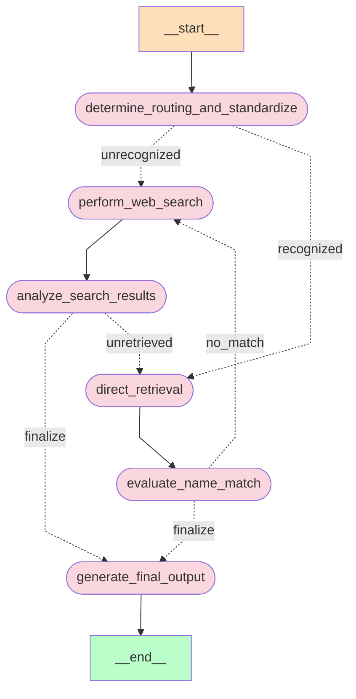

在前三篇的基础上，最后一步就是将所有独立的组件组合成一个完整的工作流Graph，并通过多个实际案例进行效果演示。

## Graph创建

1. 定义状态图

    初始化Langgraph框架中的StateGraph对象。这个对象将用于管理整个工作流的节点和边。

    ```python
    from langgraph.graph import END, StateGraph
    from typing import Dict

    # 初始化状态图
    workflow = StateGraph(GraphState)
    ```

2. 添加节点和边

    ```
    # 设置入口点
    workflow.set_entry_point("determine_routing_and_standardize")

    # 添加节点函数到状态图
    workflow.add_node("determine_routing_and_standardize", determine_routing_and_standardize)
    workflow.add_node("direct_retrieval", direct_retrieval)
    workflow.add_node("analyze_search_results", analyze_search_results)
    workflow.add_node("generate_final_output", generate_final_output)
    workflow.add_node("evaluate_name_match", evaluate_name_match)
    workflow.add_node("perform_web_search", perform_web_search)

    # 设置节点之间的连接路径
    workflow.add_edge("determine_routing_and_standardize", determine_next_step, {
        "perform_web_search": "perform_web_search",
        "direct_retrieval": "direct_retrieval",
    })
    workflow.add_edge("direct_retrieval", "evaluate_name_match")
    workflow.add_edge("evaluate_name_match", handle_match_evaluation, {
        "no_match": "perform_web_search",
        "generate_final_output": "generate_final_output",
    })
    workflow.add_edge("perform_web_search", "analyze_search_results")
    workflow.add_edge("analyze_search_results", determine_post_search_step, {
        "generate_final_output": "generate_final_output",
        "direct_retrieval": "direct_retrieval",
    })
    workflow.add_edge("generate_final_output", END)
    ```

3. 完成Graph构建

    ```
    # 编译状态图
    app = workflow.compile()
    ```

## 可视化状态图

LangGraph提供了可视化状态图的功能，可以通过Mermaid语法生成状态图的可视化效果，在第一篇文章中的项目流程图就是该图的效果。

```python
from IPython.display import Image, display

try:
    display(Image(app.get_graph().draw_mermaid_png()))
except:
    pass
```

重新回顾一下整个流程图：

import { Image } from 'astro:assets';
import mermaid from '../../../../assets/llm-assets/Langgraph_graph_mermaid.webp';

<Image src={mermaid} alt="Langgraph_graph_mermaid" height="800" />

这里也可以输出 mermaid 语法，然后复制到 Markdown 中显示。

```python
print(app.get_graph().draw_mermaid())
```



## 效果演示

### 案例一

这一案例应该算是最简单的执行路径，大模型认出该学校，直接从向量存储中检索学校名称并匹配成功。

```python
inputs = {
    "user_query": "剑桥大学"
}

result = app.invoke(inputs)
```

```text title="Output"
---DETERMINE ROUTING AND STANDARDIZE---
---ROUTING TO DIRECT RETRIEVAL---
---EVALUATE NAME MATCH---
---EVALUATION RESULT: MATCH---
---GENERATE FINAL OUTPUT---
---FINAL SCHOOL NAME: University of Cambridge---
```

```python title="GraphState"
{'user_query': '剑桥大学',
 'routing_action': 'direct_retrieval',
 'retrieved_records': None,
 'standardized_name': ['剑桥大学', 'University of Cambridge'],
 'search_results': None,
 'match_status': 'match',
 'retrieved_school_name': 'University of Cambridge',
 'search_status': None}
```

### 案例二

从打印的执行环节中可以看到，模型不确认光华商学院属于哪所学校，所以直接执行了网络搜索，并在数据库中匹配到了北京大学。

```python
inputs = {
    "user_query": "光华商学院"
}

result = app.invoke(inputs)
```

```text title="Output"
---DETERMINE ROUTING AND STANDARDIZE---
---ROUTING TO PERFORM SEARCH---
---ANALYZE SEARCH RESULTS---
---SEARCH ANALYSIS RESULT: known---
---POST SEARCH: ROUTING TO DIRECT RETRIEVAL---
---EVALUATE NAME MATCH---
---EVALUATION RESULT: MATCH---
---GENERATE FINAL OUTPUT---
---FINAL SCHOOL NAME: 北京大学---
```

```python title="GraphState"
{'user_query': '光华商学院',
 'routing_action': 'perform_search',
 'retrieved_records': None,
 'standardized_name': 'Peking University',
 'search_results': [{'url': 'https://en.gsm.pku.edu.cn/index.htm',
   'content': 'Guanghua School of Management is proud to announce that nine of its professors, along with 107 other faculty members from various fields in Peking University, were named as "Highly Cited Chinese Researchers of 2020" by Elsevier, a globally renowned academic publication group. Professor Li Yining\'s "Cultural Economics" Named as 2020 Best ...'},
  {'url': 'https://www.gsm.pku.edu.cn/pkugsm/xyjj.htm',
   'content': '作为北大工商管理教育的主体，北京大学光华管理学院是亚太地区最优秀的商学院之一。 秉承北大百年风骨，以"创造管理知识，培养商界领袖，推动社会进步"为使命，光华管理学院在厉以宁等历任院长和现任院长刘俏的领导下，已走过30余载春秋。'},
  {'url': 'https://www.gsm.pku.edu.cn/mba/index.htm',
   'content': '北大光华管理学院mba项目自1994年成立以来，一直致力于培养具有社会责任感和全球视野的高级管理者与未来商业领袖。光华mba项目坚持以"创造管理知识，培养商界领袖，推动社会进步"为使命，努力打造富有人文精神的mba项目，并借助北大深厚的人文底蕴、系统而创新的课程设置以及优秀的师资 ...'},
  {'url': 'https://www.gsm.pku.edu.cn/index.htm',
   'content': '邮编：710600. 电话：029-81361999. 传真：029-81361991. 地址：成都市天府新区天府菁蓉中心B区2-6栋. 邮编：610000. 联系电话：028-86035758. 电子邮件：cd@gsm.pku.edu.cn. 认证机构名称：. ©2017 北京大学光华管理学院 版权所有 京ICP备05065075-1.'},
  {'url': 'https://baike.baidu.com/item/北京大学光华管理学院/3981692',
   'content': '北京大学光华管理学院是北京大学工商管理教育的主体，是亚太地区最优秀的商学院之一。1978年，北京大学成立国民经济管理专业。1993年，北京大学经济学院经济管理系与北京大学管理科学中心合并为北京大学工商管理学院。1985年，北京大学经济学院和北京大学管理科学中心同时成立，经济学院 ...'}],
 'match_status': 'match',
 'retrieved_school_name': '北京大学'}
```

### 案例三

这个案例展示了另一条不同的路径，模型认出了该学校，但由于我们的数据库中没有该学校的名称，所以执行了网络搜索，最终确认为茅台学院。

```python
inputs = {
    "user_query": "茅台学院"
}

result = app.invoke(inputs)
```

```text title="Output"
---DETERMINE ROUTING AND STANDARDIZE---
---ROUTING TO DIRECT RETRIEVAL---
---EVALUATE NAME MATCH---
---EVALUATION RESULT: NO MATCH, ROUTING TO PERFORM SEARCH---
---PERFORM WEB SEARCH---
---ANALYZE SEARCH RESULTS---
---SEARCH ANALYSIS RESULT: known---
---POST SEARCH: ROUTING TO FINAL OUTPUT---
---GENERATE FINAL OUTPUT---
---FINAL SCHOOL NAME: 茅台学院---
```

```python title="GraphState"
{'user_query': '茅台学院',
 'routing_action': 'direct_retrieval',
 'retrieved_records': None,
 'standardized_name': '茅台学院',
 'search_results': '茅台学院是2017年设立的非营利性全日制应用型普通本科高校，以酿酒产业链为特色，设有15个本科专业，拥有一支专兼结合的师资队伍。学校秉承"德才兼备、承创并举、酿理通融、知行合一"的办学理念，努力建设成为与茅台品牌相称的"行业一流、世界知名"的大学。 茅台学院（Moutai Institute）位于贵州省仁怀市，是由中国贵州茅台酒厂（集团）有限责任公司举办，2017年5月23日经国家教育部批准设置的全日制普通本科高校。学校以全日制应用型普通本科教育为主，适时发展研究生教育，是我国第一所围绕酿酒产业链培养应用型人才的非营利性本科高校。 茅台学院是一所非营利性全日制应用型普通本科高校，围绕酿酒产业链建设学科专业，拥有多个省部级科研平台和国家级科研项目。该公告介绍了学校的招聘层次、待遇、流程、条件和联系方式，欢迎有意向的高层次人才报名。 本文提供了茅台学院2023年在各省的录取分数线信息，包括文科、理科、物理类等不同科类和招生类型的最低分和最低位次。考生可以参考本文的数据，但也要注意其他因素影响录取结果。 茅台学院哪些专业晋升2024年世界一流专业、中国顶尖专业和中国一流专业行列？ 2024年全国高考即将来临，为了给2024年全国高考优秀考生选择报考茅台学院提供权威参考指南，全国第三方大学评价机构艾瑞深校友会网(Cuaa.net)撰写、科学出版社即将公开出版发行 ...',
 'match_status': 'no_match',
 'retrieved_school_name': '复旦大学',
 'search_status': 'known'}
```

### 案例四

最后，我们再来用编造的学校名称进行测试，在经过整个流程后，无法确认该学校，给出了未知的结果，当然这也是正确的结果。

```python
inputs = {
    "user_query": "北京手机大学"
}

result = app.invoke(inputs)
```

```text title="Output"
---DETERMINE ROUTING AND STANDARDIZE---
---ROUTING TO PERFORM SEARCH---
---PERFORM WEB SEARCH---
---ANALYZE SEARCH RESULTS---
---SEARCH ANALYSIS RESULT: unknown---
---POST SEARCH: STATUS UNKNOWN, ROUTING TO FINAL OUTPUT---
---GENERATE FINAL OUTPUT---
---FINAL SCHOOL NAME: None---
```

```python title="GraphState"
{'user_query': '北京手机大学',
 'routing_action': 'perform_search',
 'retrieved_records': None,
 'standardized_name': None,
 'search_results': [{'url': 'https://portal.pku.edu.cn/portal2017/',
   'content': '北京大学校内信息门户是一个为在校师生提供便捷的网上办事和查询功能的平台。'},
  {'url': 'https://news.pku.edu.cn/xwzh/1ff32e2fe3b64879bc8902a4458c6d47.htm',
   'content': '学党史办实事，在北京大学喜迎2021级新生的美好时节，为了进一步方便全校师生的校园生活，北京大学将于2021年9月1日正式推出数字校园卡服务，同时启动nfc校园卡众测，只需一部手机即可实现门禁、就餐、消费、图书借阅等校园卡功能，无卡畅游北大的智慧校园生活即将成为现实。'},
  {'url': 'https://news.pku.edu.cn/xwzh/586b56b4e614432e9ff211dce5bb34e0.htm',
   'content': '更多机型，更多应用——北大NFC校园卡功能持续强化. 日前，北京大学与北京市政交通一卡通公司联合开通"北大电子交通卡"在线服务，不仅为北大同学在线办理学生交通卡提供了便捷通道，也使北大NFC校园卡迅速支持华为、苹果等一系列主流机型。. 申请该卡 ...'},
  {'url': 'https://www.pku.edu.cn/',
   'content': '9月，奉教育部令，北京大学与清华大学、南开大学南迁至湘，合组长沙临时大学。 复员后的北京大学 1946年7月，新任校长胡适（蒋梦麟辞去北大校长职务后，1945年9月由胡适接替，胡适到任前由傅斯年代行）宣布北大重要教职员人选。'},
  {'url': 'https://its.pku.edu.cn/download_portalapp.jsp',
   'content': '北京大学App是由北京大学计算中心开发和维护的移动信息平台，致力于全方位地为北京大学师生提供优质的信息服务。. 北大师生可以在手机等移动设备上登录App，安全和便捷地获取北京大学官方网站上的各类信息和服务。. 计算中心将不断改进和完善北京大学App ...'}],
 'match_status': None,
 'retrieved_school_name': None,
 'search_status': 'unknown'}
```

---

至此，我们通过四个案例演示了经过不同流程路径的case，模拟了实际中遇到的各种情况，均能够按照预期的方式执行，最终得到了正确的结果。

:::tip
在实际应用中，我们可以根据具体需求和数据情况，调整和优化整个工作流程，以达到更好的效果。
:::