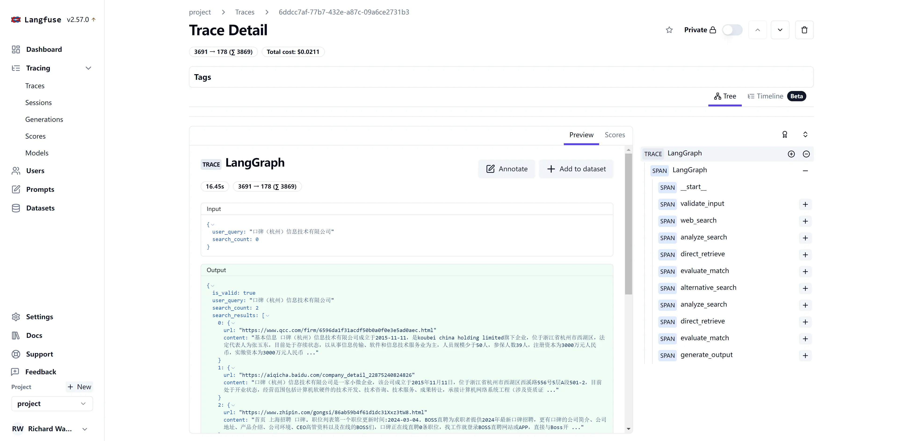
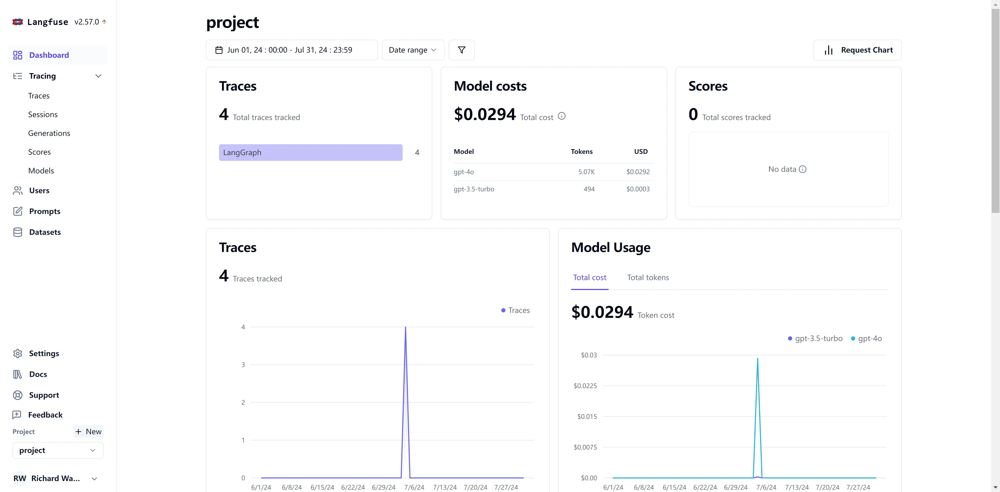

在大语言模型（LLM）项目开发中，监控和分析模型的调用链至关重要。对于熟悉Langchain框架的开发者来说，Langsmith是一个强大的监控工具，能够提供详细的输入输出记录和执行时间分析。
然而，在生产环境中，数据隐私和安全性常常限制了我们直接使用云端监控平台的能力。

作为一个开源的替代方案，Langfuse不仅提供了与Langsmith相似的功能，还可以轻松地在本地环境中部署，从而解决了数据隐私的顾虑。

## Langfuse本地部署

要在本地部署Langfuse，我们可以使用Docker Compose来简化这个过程。以下是一个完整的docker-compose.yml配置文件：

```yml title="docker-compose.yml"
services:
  langfuse-server:
    image: langfuse/langfuse:latest
    depends_on:
      db:
        condition: service_healthy
    ports:
      - "3000:3000"
    environment:
      - DATABASE_URL=postgresql://postgres:postgres@db:5432/postgres
      - NEXTAUTH_SECRET=mysecret
      - SALT=mysalt
      - NEXTAUTH_URL=http://localhost:3000
      - TELEMETRY_ENABLED=${TELEMETRY_ENABLED:-true}
      - LANGFUSE_ENABLE_EXPERIMENTAL_FEATURES=${LANGFUSE_ENABLE_EXPERIMENTAL_FEATURES:-false}

  db:
    image: postgres
    restart: always
    healthcheck:
      test: ["CMD-SHELL", "pg_isready -U postgres"]
      interval: 3s
      timeout: 3s
      retries: 10
    environment:
      - POSTGRES_USER=postgres
      - POSTGRES_PASSWORD=postgres
      - POSTGRES_DB=postgres
    ports:
      - 5432:5432
    volumes:
      - database_data:/var/lib/postgresql/data

volumes:
  database_data:
    driver: local
```

这个配置文件定义了两个主要服务：

- langfuse-server：运行Langfuse主应用
- db：PostgreSQL数据库，用于存储Langfuse的数据

```bash
docker-compose up -d
```

## 环境配置

成功部署Langfuse后，下一步是配置环境以便在项目中使用它。

1. 账号注册并获取token

    首先，访问`http://localhost:3000`并注册一个新账户。

    登录后，导航到Settings页面，您将找到secret_key和public_key。

2. 配置token

    在Python环境中，可以通过以下方式初始化Langfuse的callback handler：

    ```
    from langfuse.callback import CallbackHandler
    langfuse_handler = CallbackHandler(
        secret_key="sk-lf-...",
        public_key="pk-lf-...",
        host="http://localhost:3000",
    )
    ```

    为了增加安全性和灵活性，建议将这些配置存储为环境变量：

    ```yml
    LANGFUSE_SECRET_KEY="sk-lf-..."
    LANGFUSE_PUBLIC_KEY="pk-lf-..."
    LANGFUSE_HOST="http://localhost:3000"
    ```

    这样，就可以直接初始化handler而无需硬编码敏感信息：

    ```python
    langfuse_handler = CallbackHandler()
    ```

3. 在LLM应用中集成Langfuse

    我们以一个实际的LLM项目为例，展示如何集成Langfuse进行监控。这里使用之前介绍的[公司标签清洗](/llm/project/data-cleaning-case)项目，该项目使用Langgraph构建了一个复杂的LLM应用。

    集成Langfuse只需要在调用应用时添加一个配置参数：

    ```python {7-7}
    inputs = {
        "user_query": "口碑（杭州）信息技术有限公司",
        "search_count": 0
    }

    result = app.invoke(inputs,
        config={"callbacks": [langfuse_handler]}
    )
    ```

    这个简单的配置允许Langfuse捕获整个执行过程的详细信息。

## Langfuse监控效果展示

成功集成Langfuse后，让我们来看看它能提供哪些有价值的监控信息。

1. 任务执行追踪

    Langfuse提供了详细的任务执行追踪视图，让您能够清晰地看到LLM应用中每个步骤的执行情况：

    

    这个视图展示了任务流经过的每个步骤，包括输入、输出和执行时间。这对于理解复杂LLM应用的工作流程和识别潜在的性能瓶颈非常有帮助。

2. 时间线视图

    时间线视图提供了任务执行的时间维度分析：

    

3. 监控大盘

    Langfuse还提供了一个综合的监控大盘：

    

    这个大盘汇总了关键的性能指标和使用统计，能够快速把握LLM应用的整体运行状况。