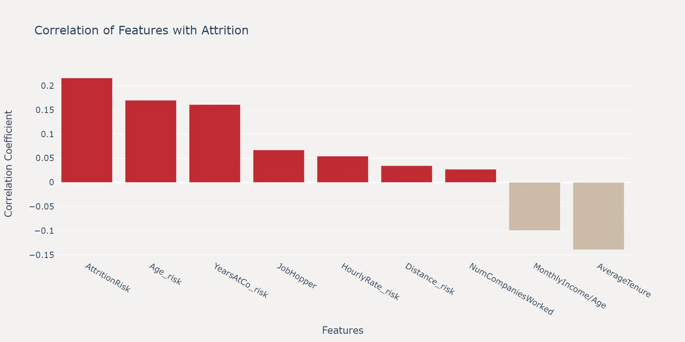

在细致进行探索性数据分析后，我们需要基于察觉到的分布规律，以及数据集的特点构造一些新的特征。这些新特征可以帮助模型更好地理解数据，提高模型的预测能力，这个过程称为特征工程（Feature Engineering）。

特征工程可以说是建模中最重要的环节，相比于模型的选择和调参，特征工程往往能够带来更大的提升，也是能够拉开差距的最关键环节。

当然，上一节中探索性分析的过程，也可以看作是特征工程的一部分，这些了解可以帮助我们构造更加有效的特征。

## 特征衍生

:::note
以下特征均可以通过上一节中介绍的绘制特征与标签的分布图，观察其分布规律，以及特征之间的关系来构造。这里省略绘图观察过程。
:::

1. 年龄风险

    ```python
    df_fe = pd.DataFrame()
    
    df_fe["Age_risk"] = (df["Age"] < 34).astype(int)
    ```

2. 薪资与年龄比

    ```python
    df_fe['MonthlyIncome/Age'] = df['MonthlyIncome'] / df['Age']
    ```

3. 时薪风险

    ```python
    df_fe["HourlyRate_risk"] = (df["HourlyRate"] < 60).astype(int)
    ```

4. 距离风险

    ```python
    df_fe["Distance_risk"] = (df["DistanceFromHome"] >= 20).astype(int)
    ```

5. 司龄风险

    ```python
    df_fe["YearsAtCo_risk"] = (df["YearsAtCompany"] < 4).astype(int)
    ```

6. 历史工作经历

    ```python
    df_fe['NumCompaniesWorked'] = df['NumCompaniesWorked'].replace(0, 1)
    ```

7. 平均任职时长

    ```python
    df_fe['AverageTenure'] = df["TotalWorkingYears"] / df["NumCompaniesWorked"]
    ```

8. 职业跳槽风险

    ```python
    df_fe['JobHopper'] = ((df["NumCompaniesWorked"] > 2) & (df["AverageTenure"] < 2.0)).astype(int)
    ```
   
9. 综合风险

    ```python
    df_fe["AttritionRisk"] = (df_fe["Age_risk"] + df_fe["HourlyRate_risk"] + df_fe["Distance_risk"] + df_fe["YearsAtCo_risk"] + df_fe['JobHopper'])
    ```
   
## 衍生特征相关性

在创建了这些特征之后，我们可以绘制相关性系数来验证一下这些特征是否有效。

```python
df_fe["Attrition"] = df["Attrition"]

# 计算相关性矩阵并移除 'Attrition' 自己
corr_with_label = train_df_encoded.corr()['Attrition'].drop('Attrition').sort_values(ascending=False)

# 创建条形图
fig = go.Figure()

fig.add_trace(go.Bar(
    x=corr_with_label.index,
    y=corr_with_label.values,
    marker_color=['#C02B34' if x > 0 else '#CDBBA7' for x in corr_with_label.values]
))

# 更新布局
fig.update_layout(
    title='Correlation of Features with Attrition',
    xaxis_title='Features',
    yaxis_title='Correlation Coefficient',
    plot_bgcolor='#F4F2F0',
    paper_bgcolor='#F4F2F0', height=500, width=1000
)

# 显示图表
fig.show()
```



可以看出，我们构造的特征还是比较有效的，尤其是最终汇总的 `AttritionRisk` 特征，与标签的相关性高于原始数据集的任何特征。