import {Tabs, TabItem} from '@astrojs/starlight/components';

在基本完成数据质量的校验之后，接下来我们可以通过查看标签在不同特征上的分布，初步探索哪些特征对标签取值影响较大，以及这些特征是如何影响标签取值的，是后续进行特征工程的重要输入。

首先可以查看一下标签字段的取值分布情况。

:::note
本文中绘图代码会尽量使用两种常用的绘图库，`Matplotlib`和`Plotly`，分别绘制相似的图表。
- `Matplotlib`是Python中最常用的绘图库之一，它提供了丰富的绘图功能，但美观性和对中文的支持相对较弱。
- `Plotly`是一个交互式绘图库，更加现代化，对中文的支持也更好，但代码没有`Matplotlib`简洁，有一定的学习曲线。
:::

## 标签分布

拿到数据集的首要任务就是看一下标签的分布情况，有助于了解标签类别数量以及样本是否平衡等。

柱状图和饼状图是最常用的两种最常用的观测标签分布的图表。

从该数据集的标签分布可以看出，这是一个严重的偏态分布问题，离职的人数远远少于在职的人数。

---

<Tabs>
<TabItem label="Plotly" icon="seti:python">

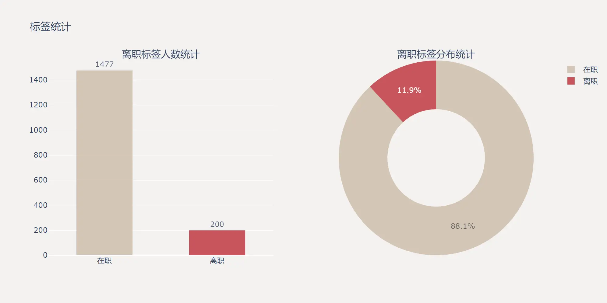

```python
import plotly.graph_objects as go
from plotly.subplots import make_subplots

# 计算离职和在职的数量
attrition_counts = train_df['Attrition'].value_counts()
labels = ['在职', '离职']
values = [attrition_counts[0], attrition_counts[1]]

# 定义配色
colors = ['#CDBBA7', '#C02B34']

fig = make_subplots(rows=1, cols=2, subplot_titles=('离职标签人数统计', '离职标签分布统计'),
                    specs=[[{"type": "bar"}, {"type": "pie"}]])

# 添加柱状图
fig.add_trace(
    go.Bar(x=labels, y=values, marker_color=colors, opacity=.8,
           text=values, textposition='outside', width=0.5, showlegend=False),
    row=1, col=1
)

# 添加饼状图
fig.add_trace(
    go.Pie(labels=labels, values=values, marker_colors=colors, opacity=.8, name='占比', hole=0.5, showlegend=True),
    row=1, col=2
)

# 更新布局
fig.update_layout(
    title_text='标签统计',
    plot_bgcolor='#F4F2F0', paper_bgcolor='#F4F2F0',  # 设置画布和图表的背景颜色
    width=1000, height=500,
)

# 显示图表
fig.show()
```

</TabItem>
<TabItem label="Matplotlib" icon="seti:python">

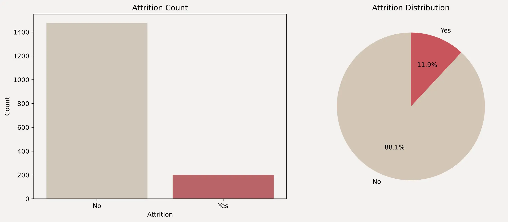

```python
import pandas as pd
import matplotlib.pyplot as plt
import seaborn as sns

# 加载数据集
train_df = pd.read_csv('train.csv')

# 设置背景颜色
plt.rcParams['figure.facecolor'] = '#F4F2F0'
plt.rcParams['axes.facecolor'] = '#F4F2F0'

# 计算 Attrition 的值分布
attrition_counts = train_df['Attrition'].value_counts()
attrition_labels = ['No', 'Yes']

# 设置颜色
colors = ['#CDBBA7', '#C02B34']
colors_alpha = [plt.cm.colors.to_rgba(c, 0.8) for c in colors]

# 创建画布
fig, axes = plt.subplots(1, 2, figsize=(12, 5))

# 绘制柱状图
sns.barplot(x=attrition_labels, y=attrition_counts.values, palette=colors, ax=axes[0], alpha=0.8)
axes[0].set_title('Attrition Count')
axes[0].set_xlabel('Attrition')
axes[0].set_ylabel('Count')

# 绘制饼状图
axes[1].pie(attrition_counts, labels=attrition_labels, autopct='%1.1f%%', colors=colors_alpha, startangle=90)
axes[1].set_title('Attrition Distribution')

# 显示图表
plt.tight_layout()
plt.show()
```
</TabItem>
</Tabs>

## 相关性系数

在直观的观察特征在不同标签上的分布情况之前，我们可以先通过计算特征与标签之间的相关性系数来量化特征对标签的影响程度。

:::tip
在读图时，不仅要关注左侧正相关的特征，也要关注末尾负相关的特征，正负相关都是对标签有重要影响的特征。因此有时也会给相关性取绝对值，来观察特征对标签的影响程度。
:::

---

<Tabs>
<TabItem label="Plotly" icon="seti:python">
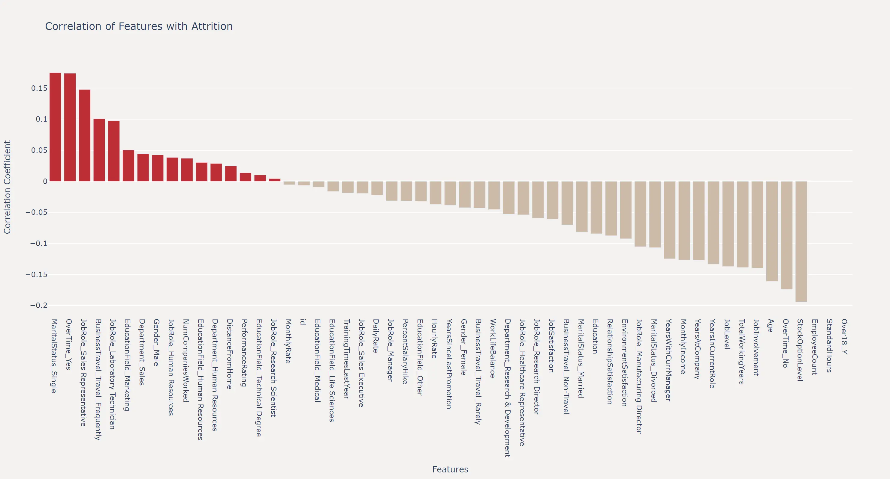

```python
# 将分类变量转换为数值变量
train_df_encoded = pd.get_dummies(train_df)

# 计算相关性矩阵并移除 'Attrition' 自己
corr_with_label = train_df_encoded.corr()['Attrition'].drop('Attrition').sort_values(ascending=False)

# 创建条形图
fig = go.Figure()

fig.add_trace(go.Bar(
    x=corr_with_label.index,
    y=corr_with_label.values,
    marker_color=['#C02B34' if x > 0 else '#CDBBA7' for x in corr_with_label.values]
))

# 更新布局
fig.update_layout(
    title='Correlation of Features with Attrition',
    xaxis_title='Features',
    yaxis_title='Correlation Coefficient',
    plot_bgcolor='#F4F2F0',
    paper_bgcolor='#F4F2F0',
    height=800,
    width=1500
)

# 显示图表
fig.show()
```

</TabItem>
<TabItem label="Matplotlib" icon="seti:python">

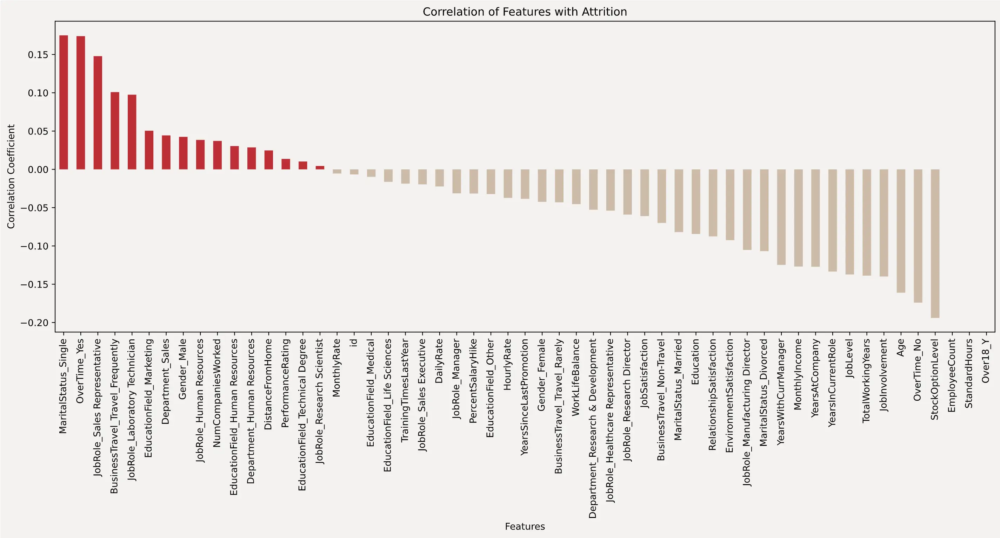

```python
# 将分类变量转换为数值变量
train_df_encoded = pd.get_dummies(train_df)

# 设置背景颜色
plt.rcParams['figure.facecolor'] = '#F4F2F0'
plt.rcParams['axes.facecolor'] = '#F4F2F0'

# 计算相关性矩阵并移除 'Attrition' 自己
corr_with_label = train_df_encoded.corr()['Attrition'].drop('Attrition').sort_values(ascending=False)

# 创建画布
plt.figure(figsize=(18, 6))

# 绘制相关性条形图
corr_with_label.plot(kind='bar', color=['#C02B34' if x > 0 else '#CDBBA7' for x in corr_with_label])

# 设置标题和标签
plt.title('Correlation of Features with Attrition')
plt.xlabel('Features')
plt.ylabel('Correlation Coefficient')

# 显示图表
plt.show()
```
</TabItem>
</Tabs>

## 连续特征在不同标签上的分布

对于连续特征，我们可以通过绘制直方图和核密度估计曲线来查看特征在不同标签上的分布情况。这里以 `Age` 特征为例，绘制了离职和在职员工的年龄分布图。

可以看出，33岁是一个明显的分界点，在此以下离职均高于在职，反之在此以上在职均高于离职。下一节的特征工程，我们就可以基于该结论，创造一个新的特征`是否33岁以上`。

:::tip
这也是对连续特征进行特征工程时，最直观有效的方法。即通过观察特征在不同标签上的分布情况，来确定最佳的分箱点。
:::

:::note
可以替换代码中的 `feature` 变量为你感兴趣的特征，或写一个for循环来一次性绘制出所有连续特征的分布图。
:::

---

<Tabs>
<TabItem label="Plotly" icon="seti:python">

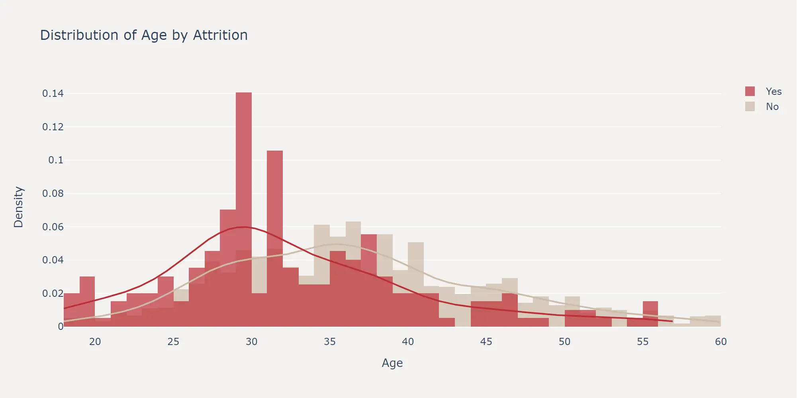

```python
import pandas as pd
import plotly.figure_factory as ff
import plotly.graph_objects as go

# 选择一个连续特征进行可视化，比如 'Age'
feature = 'Age'

# 按 'Attrition' 分组获取特征数据
no_attrition = train_df[train_df['Attrition'] == 0][feature].dropna()
yes_attrition = train_df[train_df['Attrition'] == 1][feature].dropna()

# 数据分组和标签
hist_data = [no_attrition, yes_attrition]
group_labels = ['No', 'Yes']
colors = ['#CDBBA7', '#C02B34']

# 使用 create_distplot 创建分布图
fig = ff.create_distplot(hist_data, group_labels, show_hist=True, show_rug=False, colors=colors)

# 更新布局
fig.update_layout(
    title_text=f'Distribution of {feature} by Attrition',
    xaxis_title_text=feature,
    yaxis_title_text='Density',
    plot_bgcolor='#F4F2F0',
    paper_bgcolor='#F4F2F0', width=1000, height=500
)

# 显示图表
fig.show()
```

</TabItem>
<TabItem label="Matplotlib" icon="seti:python">

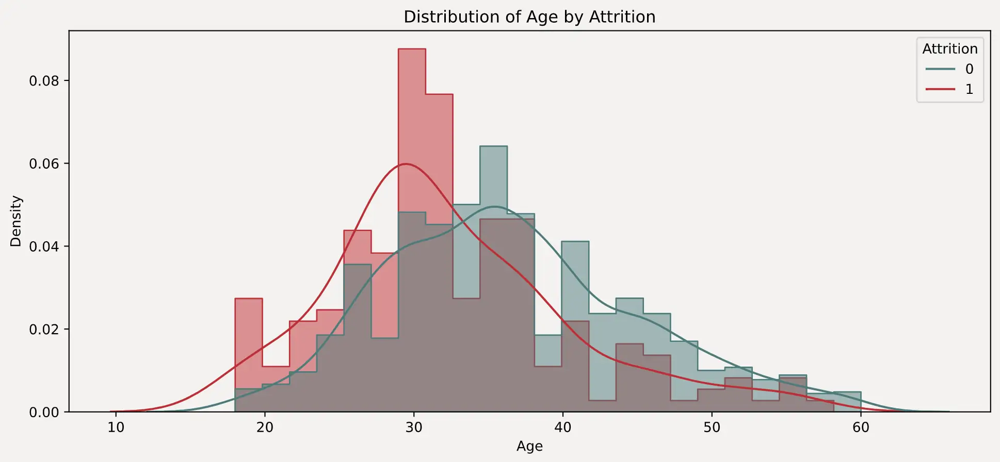

```python
# 设置背景颜色
plt.rcParams['figure.facecolor'] = '#F4F2F0'
plt.rcParams['axes.facecolor'] = '#F4F2F0'

# 选择一个连续特征进行可视化，比如 'Age'
feature = 'Age'

# 设置颜色
colors = {1: '#C02B34', 0: '#497B7A'}

# 创建画布
plt.figure(figsize=(12, 5))

# 绘制标准化的直方图
sns.histplot(data=train_df, x=feature, hue='Attrition', element='step', stat='density', common_norm=False,
palette=colors, alpha=0.5)

# 绘制 KDE 曲线
sns.kdeplot(data=train_df, x=feature, hue='Attrition', palette=colors, common_norm=False)

# 设置标题和标签
plt.title(f'Distribution of {feature} by Attrition')
plt.xlabel(feature)
plt.ylabel('Density')

# 显示图表
plt.show()
```

</TabItem>
</Tabs>

## 离散特征在不同标签上的分布

而对于离散特征来说，最有效的观察方式其实就是简单的计算离职率。这里以 `Department` 特征为例，绘制了各部门的在职和离职人数柱状图，以及离职率折线图。

---
<Tabs>
<TabItem label="Plotly" icon="seti:python">

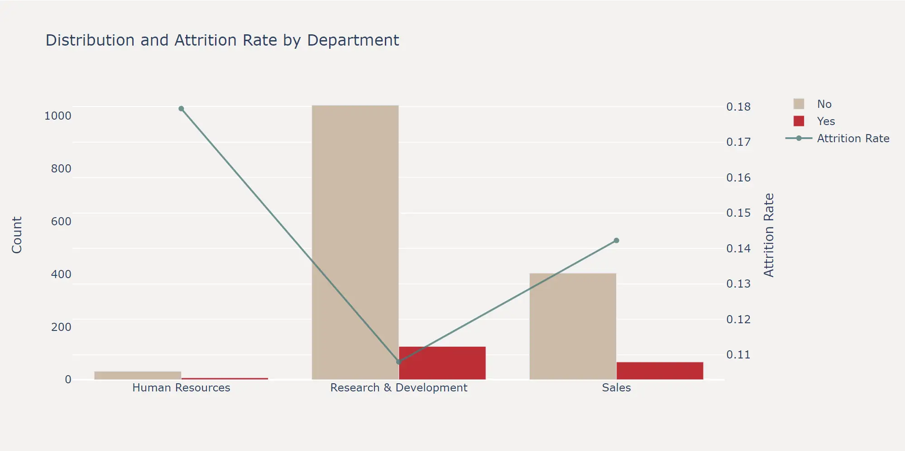

```python
# 选择一个离散特征，比如 'Department'
feature = 'Department'

# 计算每个部门的在职和离职人数
department_counts = train_df.groupby([feature, 'Attrition']).size().unstack(fill_value=0)
department_counts['Total'] = department_counts.sum(axis=1)
department_counts['Attrition Rate'] = department_counts[1] / department_counts['Total']

# 创建子图
fig = make_subplots(specs=[[{"secondary_y": True}]])

# 添加在职和离职的柱状图
fig.add_trace(
    go.Bar(name='No', x=department_counts.index, y=department_counts[0], marker_color='#CDBBA7'),
    secondary_y=False,
)

fig.add_trace(
    go.Bar(name='Yes', x=department_counts.index, y=department_counts[1], marker_color='#C02B34'),
    secondary_y=False,
)

# 添加离职率的折线图
fig.add_trace(
    go.Scatter(name='Attrition Rate', x=department_counts.index, y=department_counts['Attrition Rate'], mode='lines+markers', marker_color='#497B7A', opacity = 0.8),
    secondary_y=True,
)

# 更新布局
fig.update_layout(
    title_text=f'Distribution and Attrition Rate by {feature}',
    yaxis_title='Count',
    yaxis2_title='Attrition Rate',
    plot_bgcolor='#F4F2F0',
    paper_bgcolor='#F4F2F0',
    barmode='group'
)

fig.update_yaxes(showgrid=False, secondary_y=False)
fig.update_yaxes(showgrid=False, secondary_y=False)

# 显示图表
fig.show()
```
</TabItem>
<TabItem label="Matplotlib" icon="seti:python">

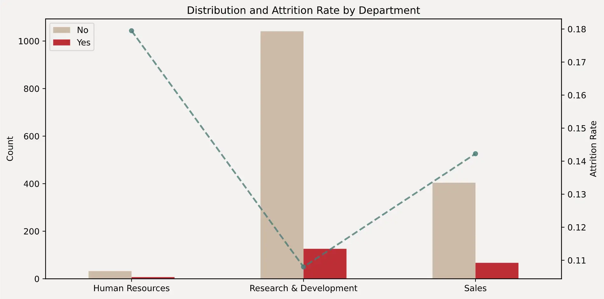

```python
# 选择一个离散特征，比如 'Department'
feature = 'Department'

# 计算每个部门的在职和离职人数
department_counts = train_df.groupby([feature, 'Attrition']).size().unstack(fill_value=0)
department_counts['Total'] = department_counts.sum(axis=1)
department_counts['Attrition Rate'] = department_counts[1] / department_counts['Total']

# 设置背景颜色
plt.rcParams['figure.facecolor'] = '#F4F2F0'
plt.rcParams['axes.facecolor'] = '#F4F2F0'

# 创建画布和双 y 轴
fig, ax1 = plt.subplots(figsize=(10, 5))

# 绘制在职和离职的柱状图
department_counts[[0, 1]].plot(kind='bar', stacked=False, color=['#CDBBA7', '#C02B34'], ax=ax1)
ax1.set_xlabel('')
ax1.set_ylabel('Count')
ax1.set_title(f'Distribution and Attrition Rate by {feature}')
ax1.legend(['No', 'Yes'], loc='upper left')

# 去掉横向网格线
ax1.grid(False)

# 调整横坐标标签的字体大小
ax1.set_xticklabels(ax1.get_xticklabels(), rotation=0, fontsize=10)

# 创建次 y 轴并绘制离职率折线图
ax2 = ax1.twinx()
ax2.plot(department_counts.index, department_counts['Attrition Rate'],
         color='#497B7A', alpha = 0.8, marker='o', linestyle='--', linewidth=2, markersize=5)
ax2.set_ylabel('Attrition Rate')
ax2.grid(False)


# 显示图表
plt.tight_layout()
plt.show()
```

</TabItem>
</Tabs>

## 组合特征在不同标签上的分布

### 离散特征&连续特征组合

进一步的，我们可以将特征两两结合，探索组合特征在不同标签上的分布情况。这里以 `MaritalStatus` 和 `DistanceFromHome` 两个特征为例，绘制了在职和离职员工的 `DistanceFromHome` 分布箱线图。

可以看出，单身和离异的员工在距离公司较远时有更高的离职概率，在特征工程环节我们依然可以据此来构造新的特征。

---

<Tabs>
<TabItem label="Plotly" icon="seti:python">
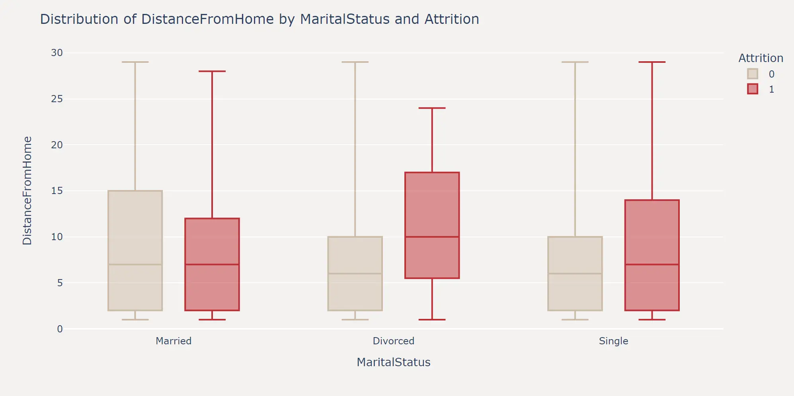

```python
# 选择特征和标签
feature_categorical = 'MaritalStatus'
feature_continuous = 'DistanceFromHome'
target = 'Attrition'

# 创建箱线图
fig = px.box(train_df, y=feature_continuous, x=feature_categorical, color=target,
             points=False, hover_data=train_df.columns,
             color_discrete_map={0: '#CDBBA7', 1: '#C02B34'})

# 更新布局
fig.update_layout(
    title=f'Distribution of {feature_continuous} by {feature_categorical} and {target}',
    xaxis_title=feature_categorical,
    yaxis_title=feature_continuous,
    plot_bgcolor='#F4F2F0',
    paper_bgcolor='#F4F2F0', width=1000, height=500
)

# 显示图表
fig.show()
```
</TabItem>
<TabItem label="Matplotlib" icon="seti:python">
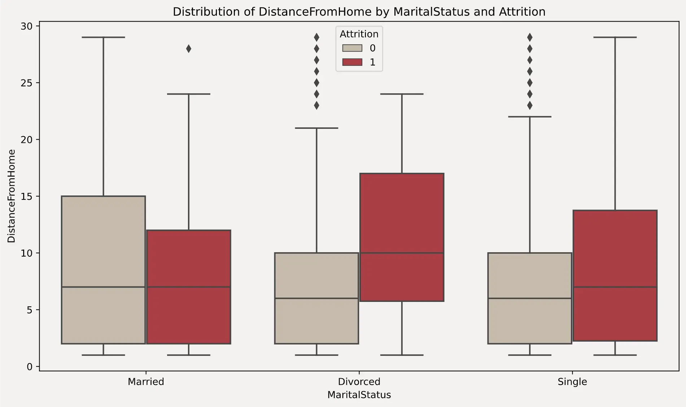

```python
# 设置背景颜色
plt.rcParams['figure.facecolor'] = '#F4F2F0'
plt.rcParams['axes.facecolor'] = '#F4F2F0'

# 选择特征和标签
feature_categorical = 'MaritalStatus'
feature_continuous = 'DistanceFromHome'
target = 'Attrition'

# 创建画布
fig, ax = plt.subplots(figsize=(10, 6))

# 绘制箱线图
sns.boxplot(x=feature_categorical, y=feature_continuous, hue=target, data=train_df, palette=['#CDBBA7', '#C02B34'], ax=ax)

# 设置标题和标签
ax.set_title(f'Distribution of {feature_continuous} by {feature_categorical} and {target}')
ax.set_xlabel(feature_categorical)
ax.set_ylabel(feature_continuous)

# 显示图表
plt.tight_layout()
plt.show()
```
</TabItem>
</Tabs>

当然，对于连续变量与离散变量组合的情况，我们也可以绘制每个维度下的概率密度曲线。

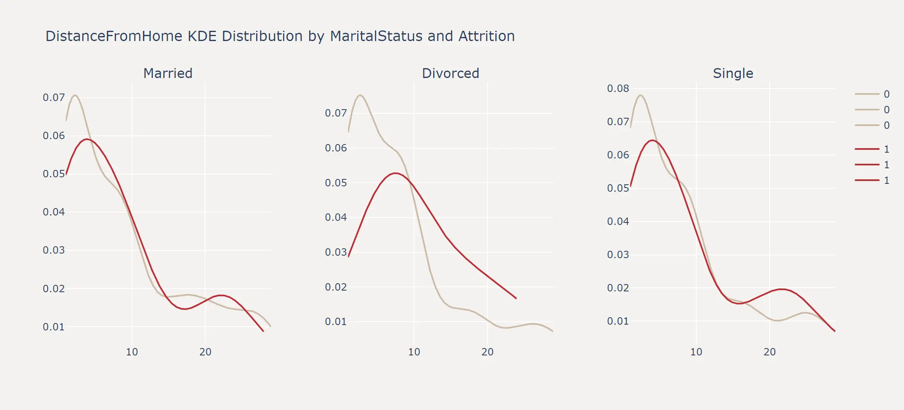

```python
# 选择特征和标签
feature_categorical = 'MaritalStatus'
feature_continuous = 'DistanceFromHome'
target = 'Attrition'

# 获取不同MaritalStatus的值
marital_statuses = train_df[feature_categorical].unique()

# 创建子图布局
fig = make_subplots(rows=1, cols=3, subplot_titles=marital_statuses, horizontal_spacing=0.1)

# 设置颜色映射
colors = {0: '#CDBBA7', 1: '#C02B34'}

# 为每个MaritalStatus创建KDE分布图
for i, status in enumerate(marital_statuses):
    subset = train_df[train_df[feature_categorical] == status]
    hist_data = [subset[subset[target] == 0][feature_continuous], subset[subset[target] == 1][feature_continuous]]
    group_labels = [0, 1]

    # 使用 create_distplot 创建KDE分布图
    distplot = ff.create_distplot(hist_data, group_labels, show_hist=False, show_rug=False, colors=[colors[0], colors[1]])

    # 添加KDE分布曲线到子图
    for trace in distplot['data']:
        fig.add_trace(trace, row=1, col=i+1)

# 更新布局
fig.update_layout(
    title_text=f'{feature_continuous} KDE Distribution by {feature_categorical} and {target}',
    plot_bgcolor='#F4F2F0',
    paper_bgcolor='#F4F2F0', width=1000, height=500
)

# 显示图表
fig.show()
```

### 连续特征&连续特征组合

对于两个连续特征的组合，我们可以绘制等高线图来观察两个特征之间的关系。这里以 `Age` 和 `MonthlyIncome` 两个特征为例，绘制了在职和离职员工的 `Age` 和 `MonthlyIncome` 的等高线图。

---

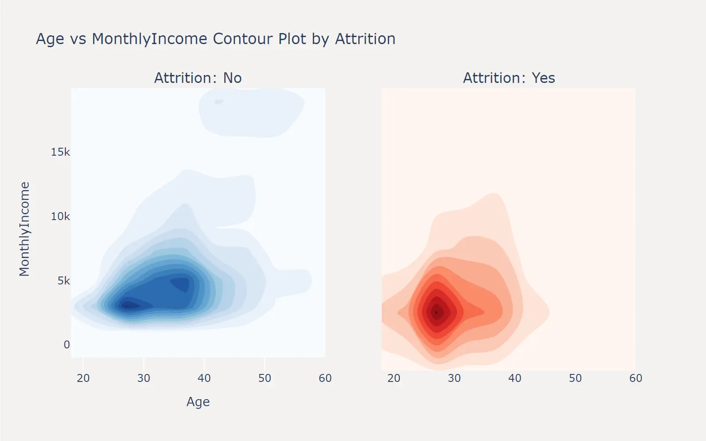

```python
import plotly.graph_objects as go
from plotly.subplots import make_subplots

# 选择特征和标签
feature_x = 'Age'
feature_y = 'MonthlyIncome'
target = 'Attrition'

# 创建子图布局
fig = make_subplots(rows=1, cols=2, subplot_titles=['Attrition: No', 'Attrition: Yes'], shared_yaxes=True)

# 绘制在职等高线图
no_attrition = train_df[train_df[target] == 0]
fig.add_trace(
    go.Histogram2dContour(
        x=no_attrition[feature_x],
        y=no_attrition[feature_y],
        colorscale='Blues',
        contours=dict(showlines=False),
        showscale=False
    ),
    row=1, col=1
)

# 绘制离职等高线图
yes_attrition = train_df[train_df[target] == 1]
fig.add_trace(
    go.Histogram2dContour(
        x=yes_attrition[feature_x],
        y=yes_attrition[feature_y],
        colorscale='Reds',
        contours=dict(showlines=False),
        showscale=False
    ),
    row=1, col=2
)

# 获取特征的最大和最小值，用于设置相同的坐标轴比例尺
x_range = [train_df[feature_x].min(), train_df[feature_x].max()]
y_range = [-2000, train_df[feature_y].max()]

# 更新布局
fig.update_layout(
    title_text=f'{feature_x} vs {feature_y} Contour Plot by {target}',
    xaxis_title=feature_x,
    yaxis_title=feature_y,
    xaxis=dict(range=x_range),
    yaxis=dict(range=y_range),
    plot_bgcolor='#F4F2F0',
    paper_bgcolor='#F4F2F0', width=800, height=500
)

# 显示图表
fig.show()
```