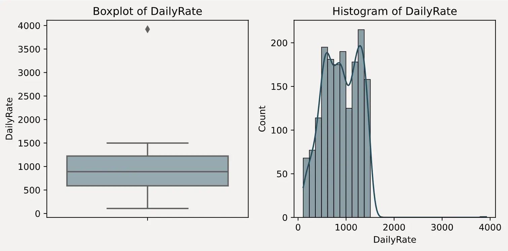
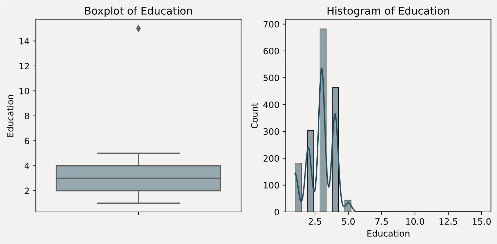
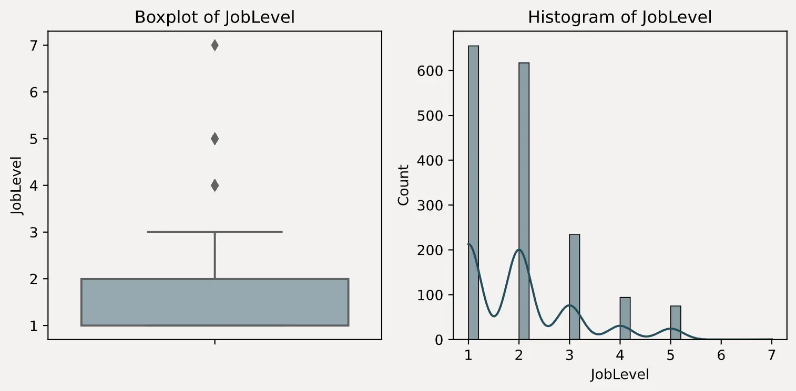

## 了解建模目标

在当今的企业环境中，员工流失是一个普遍存在的问题，它会对公司的运营效率和成本产生重大影响。通过对员工的各种属性和工作行为的数字化描述，我们可以在这些数据中寻找导致员工流失的潜在因素。更进一步，如果能够实时接入这些数据，我们或许能够借助模型来预测未来员工流失的风险，从而及时制定相应的挽留策略，防止员工真实流失情况的发生。

因此，在这个背景下，我们的算法建模目标主要有两个：
1. 一是预测员工是否会流失 
2. 二是找出影响员工流失的关键因素，以辅助人力资源部门进行策略调整或制定员工挽留措施。

综合上述两个目标，我们可以发现，我们需要的模型不仅要具备较强的预测能力，还需要能够输出特征重要性排名，并且最好具备一定的可解释性，即能够清晰地解释特征变化是如何影响标签取值变化的。

## 字段解释

| 字段名称                     | 含义                 |
|--------------------------| ---------------------- |
| Age                      | 年龄                 |
| Attrition                | 离职情况（是否离职） |
| BusinessTravel           | 出差频率             |
| DailyRate                | 每日工资             |
| Department               | 部门                 |
| DistanceFromHome         | 离家距离             |
| Education                | 教育水平             |
| EducationField           | 教育领域             |
| EmployeeCount            | 员工计数             |
| id                       | 员工编号             |
| EnvironmentSatisfaction  | 环境满意度           |
| Gender                   | 性别                 |
| HourlyRate               | 时薪                 |
| JobInvolvement           | 工作投入度           |
| JobLevel                 | 工作级别             |
| JobRole                  | 职位                 |
| JobSatisfaction          | 工作满意度           |
| MaritalStatus            | 婚姻状况             |
| MonthlyIncome            | 月收入               |
| MonthlyRate              | 月工资               |
| NumCompaniesWorked       | 曾工作过的公司数量   |
| Over18                   | 是否成年             |
| OverTime                 | 加班情况             |
| PercentSalaryHike        | 加薪百分比           |
| PerformanceRating        | 绩效评级             |
| RelationshipSatisfaction | 人际关系满意度       |
| StandardHours            | 标准工时             |
| StockOptionLevel         | 股票期权级别         |
| TotalWorkingYears        | 总工作年限           |
| TrainingTimesLastYear    | 去年培训次数         |
| WorkLifeBalance          | 工作与生活的平衡     |
| YearsAtCompany           | 在公司的年限         |
| YearsInCurrentRole       | 当前职位的年限       |
| YearsSinceLastPromotion  | 自上次晋升后的年限   |
| YearsWithCurrManager     | 与现任经理共事的年限 |

## 数据质量分析

一旦我们掌握了数据集的字段含义，接下来的关键步骤就是对数据质量进行分析，这是数据探索过程中最基础也是最重要的角度。

数据质量分析的常见任务包括缺失值检查、异常值检测、重复值检查、数据类型检查等。

### 数据结构查看

```python
print(f"训练集数据结构: {train_df.shape}")
print(f"测试集数据结构: {test_df.shape}")
```

```text title="Output"
训练集数据结构: (1677, 35)
测试集数据结构: (1119, 34)
```

### 数据质量检查

---

:::note
这里常用的代码为了方便复用，都封装成了函数。如果只是简单查看，可以直接复制函数内的核心代码执行。
:::

#### 1. 缺失值、唯一值和数据类型

这里我们定义一个任务函数 `column_info`，用于一次性输出每个字段的缺失值、唯一值和数据类型。

```python
import pandas as pd
from tabulate import tabulate

def column_info(df, sort_by='default'):
    """
    计算并输出每一列的缺失值、唯一值和数据类型。
    
    参数:
    df: 数据集（DataFrame）
    sort_by: 排序依据，接受的值包括 'missing', 'unique' 或 'default'（默认顺序）
    """
    # 创建列信息表，直接计算缺失值和唯一值
    column_info_df = pd.DataFrame({
        'Missing_Count': df.isnull().sum(),
        'Missing_Percent': df.isnull().mean() * 100,  # 使用mean()直接得到百分比
        'Unique_Count': df.nunique(),
        'Data_Type': df.dtypes
    })

    # 根据指定的排序依据进行排序
    if sort_by == 'missing':
        column_info_df.sort_values(by='Missing_Count', ascending=False, inplace=True)
    elif sort_by == 'unique':
        column_info_df.sort_values(by='Unique_Count', ascending=False, inplace=True)

    # 输出列信息表格
    print("Column Information:")
    print(tabulate(column_info_df, headers='keys', tablefmt='pretty'))

# 查看训练集数据质量    
column_info(train_df, sort_by='unique')
```

```text title="Output"
Column Information:
+--------------------------+---------------+-----------------+--------------+-----------+
|                          | Missing_Count | Missing_Percent | Unique_Count | Data_Type |
+--------------------------+---------------+-----------------+--------------+-----------+
|            id            |       0       |       0.0       |     1677     |   int64   |
|       MonthlyRate        |       0       |       0.0       |     903      |   int64   |
|      MonthlyIncome       |       0       |       0.0       |     895      |   int64   |
|        DailyRate         |       0       |       0.0       |     625      |   int64   |
|        HourlyRate        |       0       |       0.0       |      71      |   int64   |
|           Age            |       0       |       0.0       |      43      |   int64   |
|    TotalWorkingYears     |       0       |       0.0       |      41      |   int64   |
|      YearsAtCompany      |       0       |       0.0       |      34      |   int64   |
|     DistanceFromHome     |       0       |       0.0       |      29      |   int64   |
|    YearsInCurrentRole    |       0       |       0.0       |      19      |   int64   |
|   YearsWithCurrManager   |       0       |       0.0       |      18      |   int64   |
| YearsSinceLastPromotion  |       0       |       0.0       |      16      |   int64   |
|    PercentSalaryHike     |       0       |       0.0       |      15      |   int64   |
|    NumCompaniesWorked    |       0       |       0.0       |      10      |   int64   |
|         JobRole          |       0       |       0.0       |      9       |  object   |
|  TrainingTimesLastYear   |       0       |       0.0       |      7       |   int64   |
|        Education         |       0       |       0.0       |      6       |   int64   |
|         JobLevel         |       0       |       0.0       |      6       |   int64   |
|      EducationField      |       0       |       0.0       |      6       |  object   |
|     JobSatisfaction      |       0       |       0.0       |      4       |   int64   |
| EnvironmentSatisfaction  |       0       |       0.0       |      4       |   int64   |
|     WorkLifeBalance      |       0       |       0.0       |      4       |   int64   |
|     StockOptionLevel     |       0       |       0.0       |      4       |   int64   |
| RelationshipSatisfaction |       0       |       0.0       |      4       |   int64   |
|      JobInvolvement      |       0       |       0.0       |      4       |   int64   |
|        Department        |       0       |       0.0       |      3       |  object   |
|      BusinessTravel      |       0       |       0.0       |      3       |  object   |
|      MaritalStatus       |       0       |       0.0       |      3       |  object   |
|    PerformanceRating     |       0       |       0.0       |      2       |   int64   |
|          Gender          |       0       |       0.0       |      2       |  object   |
|         OverTime         |       0       |       0.0       |      2       |  object   |
|        Attrition         |       0       |       0.0       |      2       |   int64   |
|      StandardHours       |       0       |       0.0       |      1       |   int64   |
|          Over18          |       0       |       0.0       |      1       |  object   |
|      EmployeeCount       |       0       |       0.0       |      1       |   int64   |
+--------------------------+---------------+-----------------+--------------+-----------+
```

> 从上面的输出结果可以看出训练集中没有缺失值。
> 
> 但我们发现 `StandardHours`、`Over18` 和 `EmployeeCount` 这三列的唯一值只有一个，这意味着这三列的值都是相同的，对于模型训练没有任何意义，在建模中可以直接删除。
> 
> 另外，`id` 列的唯一值数量为 1677，这意味着每一行的 `id` 都是唯一的，对于模型训练也没有任何意义，可以删除。

#### 2. 检查重复数据

接下来我们看一下数据集中有没有重复数据，在企业的真实环境中，由于收集的数据不干净导致数据存在重复行是很常见的。

```python
def duplicate_info(df):
    """
    计算并输出数据集的重复值统计。
    
    参数:
    df: 数据集（DataFrame）
    """
    total_count = len(df)

    # 计算数据集的重复值及占比
    duplicate_count = df.duplicated().sum()
    duplicate_percent = (duplicate_count / total_count) * 100
    duplicate_info_df = pd.DataFrame({
        'Duplicate_Count': [duplicate_count],
        'Duplicate_Percent': [duplicate_percent]
    })

    # 输出重复值统计
    print("Duplicate Rows Information:")
    print(tabulate(duplicate_info_df, headers='keys', tablefmt='psql'))

# 检验训练集中是否存在重复数据
duplicate_info(train_df)
```

```text title="Output"
Duplicate Rows Information:
+----+-------------------+---------------------+
|    |   Duplicate_Count |   Duplicate_Percent |
|----+-------------------+---------------------|
|  0 |                 0 |                   0 |
+----+-------------------+---------------------+
```

#### 3. 测试集的未知数据

在检查完数据集中不存在数据缺失和重复数据后，还不能直接认定为这是一个完美的数据集。

在实际业务场景中，测试集（或新产生的数据）中可能会出现训练集中没有出现过的数据，这些数据被称为未知数据。

当然这一检验仅针对离散字段而言。

```python
def check_categorical_values(train_df, test_df, categorical_cols):
    """
    检查测试数据集中指定的离散字段取值是否都包含在训练数据集中。

    参数:
    categorical_cols (list): 要检查的离散字段列表
    """
    issues = {}
    for col in categorical_cols:
        train_values = set(train_df[col].unique())
        test_values = set(test_df[col].unique())
        if not test_values.issubset(train_values):
            issues[col] = test_values - train_values

    if issues:
        print("以下离散字段在测试集中包含训练集中未出现的取值:")
        for col, values in issues.items():
            print(f"{col}: {values}")
    else:
        print("测试集中所有离散字段的取值都包含在训练集中。")
        
check_categorical_values(train_df, test_df, categorical_cols)
```

```text title="Output"
以下离散字段在测试集中包含训练集中未出现的取值:
EnvironmentSatisfaction: {0}
JobInvolvement: {0}
StockOptionLevel: {4}
```

> 从结果可以看出，测试集中的 `EnvironmentSatisfaction`、`JobInvolvement` 和 `StockOptionLevel` 这三个字段包含了训练集中未出现的取值。

:::tip
一般来说，在处理测试集中包含训练集中未出现的取值时，针对 One-Hot 编码，一般采用忽略未知取值的策略，而对于 Ordinal Encoding，一般会讲未知取值映射到一个默认值，比如 `-1`。
:::

#### 4. 异常值

最后，我们还需要检查数据集中是否存在异常值，一般都是针对连续型字段。

异常值检测有很多方法，可以通过三倍标准差、箱线图、以及分布图等方式来检测。相较而言，箱线图与分布图更加直观，方便我们结合业务理解判断是否为异常值。

我的习惯是先用三倍标准差检测异常值，再结合箱线图和分布图来进一步确认。

1. 异常值检测（三倍标准差）

    这里定义了一个函数来计算每个字段是否存在异常值，注意我设置了两个输出，一个是异常值数量，用于打印查看，另一个是异常值字段的名称列表，方便我们后续绘图处理。
    
    ```python
    def find_outliers(df, cols=None):
        """
        利用三倍标准差法来识别数据集中每列的异常值。如果没有传入列列表，则自动检测所有数值型字段。
    
        参数:
        df (pd.DataFrame): 要分析的数据集。
        cols (list, optional): 要分析的字段列表。如果没有提供，则自动检测所有数值型列。
    
        返回:
        tuple: 包含两个元素的元组：
            - outlier_counts (dict): 每个列的异常值数量。
            - outlier_columns (list): 存在异常值的字段名称列表。
        """
        if cols is None:
            cols = df.select_dtypes(include=['int64', 'float64']).columns
    
        outlier_counts = {}
        outlier_columns = []
        for col in cols:
            mean = df[col].mean()
            std = df[col].std()
            lower_bound = mean - 3 * std
            upper_bound = mean + 3 * std
            outliers = df[(df[col] < lower_bound) | (df[col] > upper_bound)]
            outlier_count = outliers.shape[0]
            if outlier_count > 0:
                outlier_columns.append(col)
            outlier_counts[col] = outlier_count
        return outlier_counts, outlier_columns
    
    # 检查异常值
    outlier_counts, outlier_columns = find_outliers(train_df)
    
    # 打印每个字段的异常值数量
    for col, count in outlier_counts.items():
        if count > 0:
            print(f"字段: {col} - 异常值数量: {count}")
    ```
    
    ```text title="Output"
    字段: DailyRate - 异常值数量: 1
    字段: Education - 异常值数量: 1
    字段: JobLevel - 异常值数量: 1
    字段: MonthlyIncome - 异常值数量: 9
    字段: TotalWorkingYears - 异常值数量: 21
    字段: YearsAtCompany - 异常值数量: 26
    字段: YearsInCurrentRole - 异常值数量: 21
    字段: YearsSinceLastPromotion - 异常值数量: 34
    字段: YearsWithCurrManager - 异常值数量: 16
    ```
    
    当然，这里检测出来的异常值，并不意味着在实际业务场景中也是异常，接下来结合箱线图和分布图来进一步确认。

2. 箱线图与分布图

    这里同样定义一个绘图函数，将上一步中检测出的异常值字段的箱线图和分布图绘制出来。
    
    ```python
    def visualize_outliers(df, cols):
        """
        使用箱线图和直方图可视化数据集中可能存在异常值的字段。
    
        参数:
        df (pd.DataFrame): 要分析的数据集。
        cols (list): 要可视化的列的列表。
        """
        for col in cols:
            plt.rcParams['axes.facecolor'] = '#F4F2F0'
            plt.rcParams['figure.facecolor'] = '#F4F2F0'
            plt.rcParams['axes.grid'] = False
            
            fig, axes = plt.subplots(1, 2, figsize=(8, 4))
    
            # 绘制箱线图
            sns.boxplot(y=df[col], color='#91ABB4', ax=axes[0])
            axes[0].set_title(f'Boxplot of {col}')
    
            # 绘制直方图
            sns.histplot(df[col], bins=30, kde=True, color='#214D5C', ax=axes[1])
            axes[1].set_title(f'Histogram of {col}')
    
            plt.tight_layout()
            plt.show()
    
    # 可视化存在异常值的列
    visualize_outliers(train_df, outlier_columns)
    ```
   
3. 图表查看

    > 结合前面的异常值统计，以及绘制出来的箱线图和直方图分布，可以很明显的判断出 `DailyRate`、`Education` 和 `JobLevel` 这三个字段存在异常值。
    > 
    > - `DailyRate` 有且只有一个值接近 4000
    > - `Education` 有且只有一个值为 15
    > - `JobLevel` 有且只有一个值为 7

    :::tip
    通常来说，对于训练集，一般会选择将异常值替换为众数或截断为边界值。如果放任异常值不管，可能会对模型的训练产生负面影响，影响模型的性能和稳定性。
    :::

    
    
    
    
    

