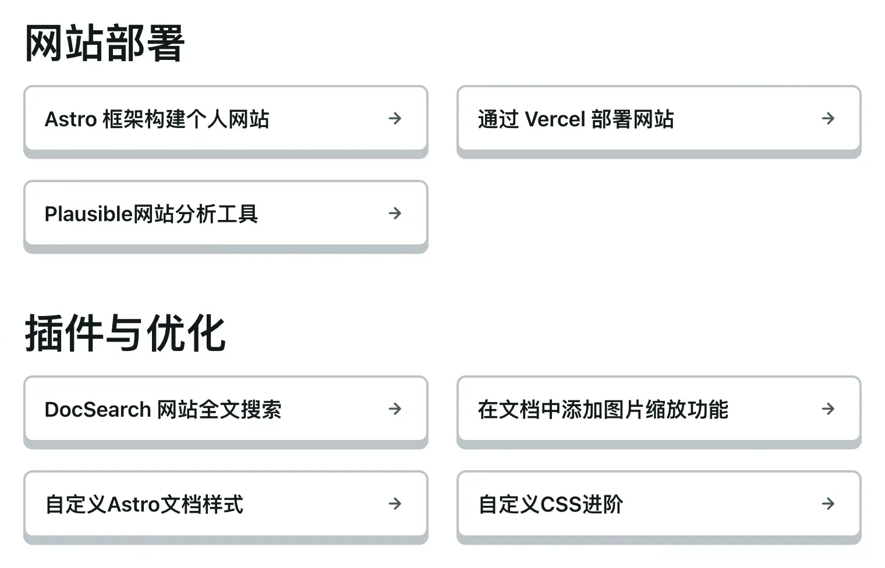
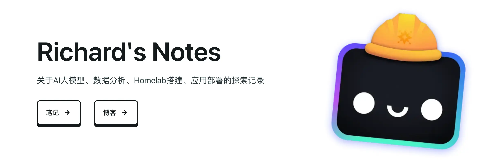

上一篇我们介绍了自定义样式中简单的修改主题颜色，调整字体大小的方法。这一节记录一下进阶用法，也就是当前网站风格的全部优化内容。

## LinkCard

* 为链接卡片添加边框、圆角和阴影。
* 在普通状态下，卡片背景色为纯色，边框和阴影为灰色。
* 当鼠标悬停在卡片上时，边框和阴影变为蓝色。
* 点击时，卡片会向下移动，模拟出按压效果。

```css
:root {
    --border-radius-fa: .5rem;
    --border-width-fa: 2px;
    --box-shadow-depth-fa: .385rem;
    --spacing-sm-fa: .5rem;
    --spacing-md-fa: 1rem;
    --spacing-lg-fa: 1.5rem;
    --spacing-xl-fa: 2.5rem;
    --balloon-border-radius: 2px;
    --balloon-font-size: 12px;
    --balloon-move: 4px
}

.sl-link-card {
    --card-bg-fa: var(--sl-color-black);
    background-color:var(--card-bg-fa);
    border:var(--border-width-fa) solid var(--sl-color-gray-5);
    border-radius:var(--border-radius-fa);
    box-shadow:0 var(--box-shadow-depth-fa) 0 var(--sl-color-gray-5);
    padding:var(--spacing-md-fa)
}
:not(.card-grid)>.sl-link-card {
    margin-block-end:var(--spacing-lg-fa)
}
.sl-link-card:hover {
    --card-bg-fa: var(--sl-color-black);
    background-color:var(--card-bg-fa);
    border:var(--border-width-fa) solid var(--sl-color-blue);
    box-shadow:0 var(--box-shadow-depth-fa) 0 var(--sl-color-blue)
}
.sl-link-card:active {
    transform:translateY(var(--box-shadow-depth-fa));
    box-shadow:none
}
```

#### 效果演示



## action

action是主页上进入文档和博客的进入按钮。

* 为按钮设置圆角、边框、阴影、背景色、文字颜色等效果。
* .primary变体在悬停和点击时会有不同的交互效果。
* 当鼠标悬停在按钮上时，背景色变为灰色。
* 点击时，卡片会向下移动，模拟按压效果。

```css
.action {
    border-radius:var(--border-radius-fa);
    border:var(--border-width-fa) solid var(--sl-color-white);
    box-shadow:0 var(--box-shadow-depth-fa) 0 var(--sl-color-white);
    background-color:var(--sl-color-black);
    color:var(--sl-color-white);
    font-weight:600;
    transition:all .15s ease-in-out
}
.action.primary {
    background-color:var(--sl-color-black);
    color:var(--sl-color-white)
}
.action.primary:hover {
    background-color:var(--sl-color-gray-5)
}
.action.primary:active {
    box-shadow:none;
    transform:translateY(6px)
}
```

#### 效果演示




## 图片边框

由于文档中含有大量截图，白色背景的图片容易与文档背景融为一体，因此为图片添加边框

```css
.sl-markdown-content img {
    border: var(--border-width-fa) solid var(--sl-color-gray-3);
    border-radius: var(--border-radius-fa)
}
```

## Callout样式

```css
.starlight-aside {
    border-radius: var(--border-radius-fa);
    border: var(--border-width-fa) solid;
    margin-block:var(--spacing-lg-fa)}

.starlight-aside--note {
    border-color: var(--sl-color-blue);
    background-color: var(--sl-color-blue-low)
}

.starlight-aside--info {
    border-color: var(--sl-color-blue);
    background-color: var(--sl-color-blue-low)
}

.starlight-aside--tip {
    border-color: var(--sl-color-green);
    background-color: var(--sl-color-green-low)
}

.starlight-aside--caution {
    border-color: var(--sl-color-orange);
    background-color: var(--sl-color-orange-low)
}

.starlight-aside--danger {
    border-color: var(--sl-color-red);
    background-color: var(--sl-color-red-low)
}

.starlight-aside code {
    --sl-color-bg-inline-code: var(--sl-color-gray-7)
}
```

## pagination

* 页脚的分页链接取消阴影

```css
.pagination-links a {
box-shadow:none
}
.pagination-links .link-title {
font-size:var(--sl-text-lg)
}
```