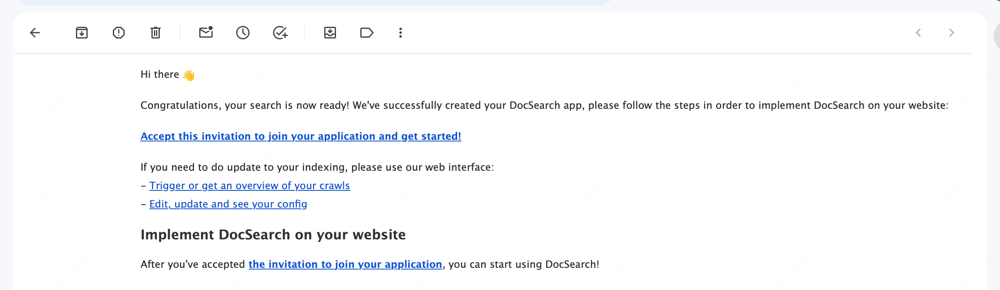
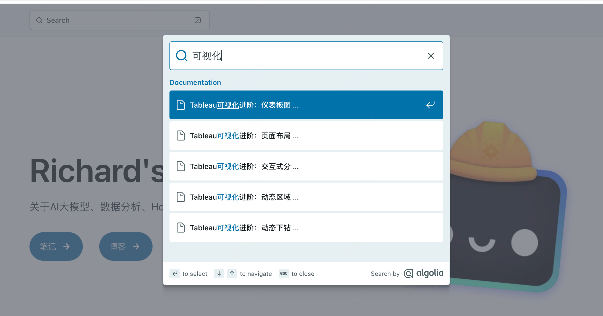

import { Steps } from '@astrojs/starlight/components';
import { Image } from 'astro:assets';
import docsearch from '../../../assets/docsearch-apply.png';

Astro 框架内置提供了基于 Pagefind 的搜索功能，但对于中文的支持并不好，而不具备即时建议等高级功能，在搜索效果和体验上均有所欠缺。

因此我们将搜索功能替换为 Algolia DocSearch，他是Free Algolia Search For Developer Docs，我们可以在其官网申请，只要保证我们的网站是公开且内容是技术向的，就可以免费使用。

## 申请 Algolia DocSearch

首先我们需要到 [Algolia DocSearch](https://docsearch.algolia.com/) 官网申请，点击 Apply 开始申请。

需要填写的信息包括网站的地址、联系邮箱、以及仓库地址，提交后等待审核通过的邮件即可。

<Image src={docsearch} alt="docsearch" height="600" />

我这里等待了三天就收到了审核通过的邮件，邮件中包含了apiKey等配置信息，也可以使用申请时的联系邮箱注册并登录到 Algolia 官网查看。



## 在 Astro 中配置 Algolia DocSearch

<Steps>

    1. 安装 Algolia DocSearch 的 npm 包

        ```bash
        npm install @astrojs/starlight-docsearch
        ```

    2. 在 Astro 的 `astro.config.mjs` 中配置 Algolia DocSearch

        ```js ins={4,10-16}
        // astro.config.mjs
        import { defineConfig } from 'astro/config';
        import starlight from '@astrojs/starlight';
        import starlightDocSearch from '@astrojs/starlight-docsearch';

        export default defineConfig({
        integrations: [
            starlight({
                title: '使用 DocSearch 的网站',
                plugins: [
                    starlightDocSearch({
                        appId: 'YOUR_APP_ID',
                        apiKey: 'YOUR_SEARCH_API_KEY',
                        indexName: 'YOUR_INDEX_NAME',
                    }),
                ],
            }),
        ],
        });
        ```

</Steps>

## 效果演示

