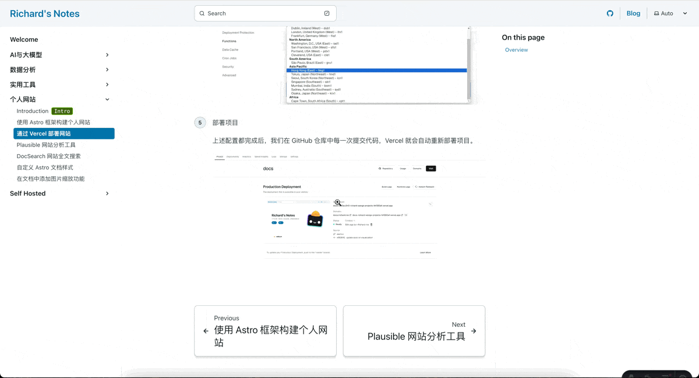

import { Steps } from '@astrojs/starlight/components';

由于 starlight 文档模板本身不提供图片缩放功能，但由于页宽的限制，正文中的图片细节可能无法清晰展示。因此，我们可以通过引入第三方插件实现图片放大功能。

<Steps>
    1. 安装插件

        ```bash
        npm i starlight-image-zoom
        ```

    2. 在 astro.config.mjs 中引入插件

        ```diff lang="js"
        // astro.config.mjs
        import starlight from '@astrojs/starlight'
        import { defineConfig } from 'astro/config'
        +import starlightImageZoom from 'starlight-image-zoom'

        export default defineConfig({
          integrations: [
            starlight({
        +      plugins: [starlightImageZoom()],
              title: 'My Docs',
            }),
          ],
        })
        ```
</Steps>

## 效果演示

