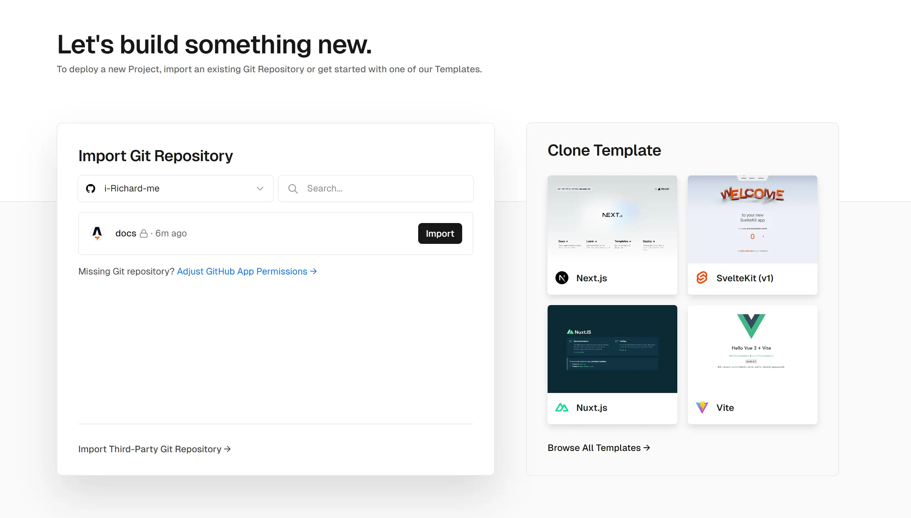
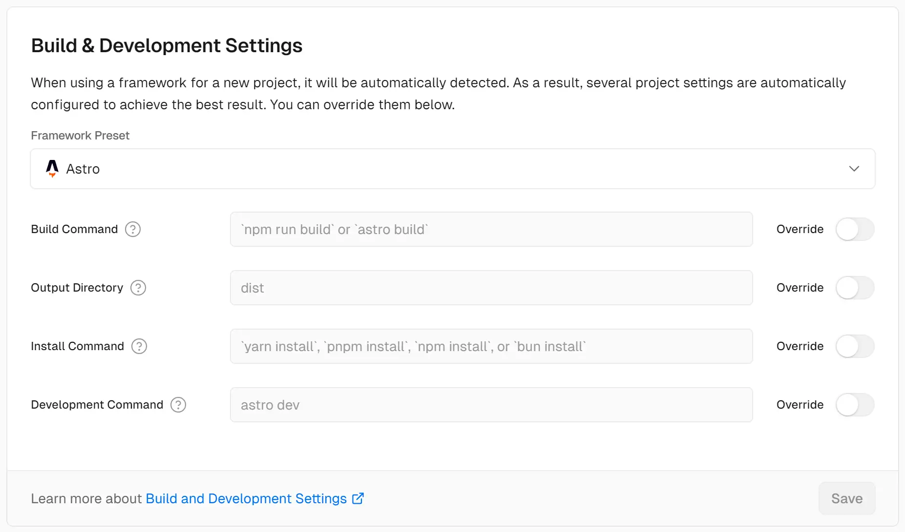
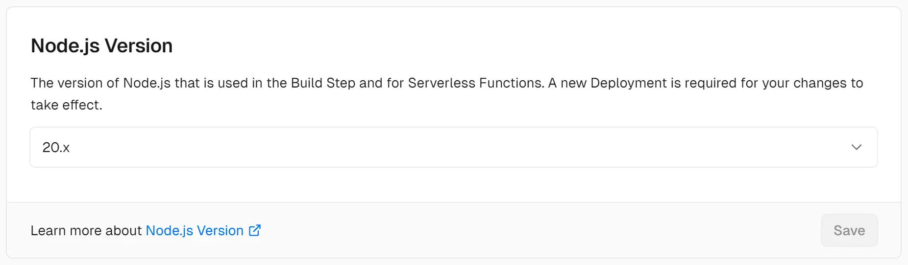
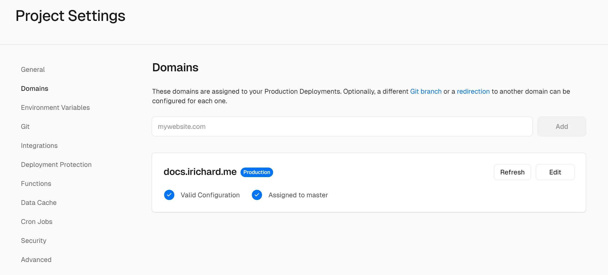
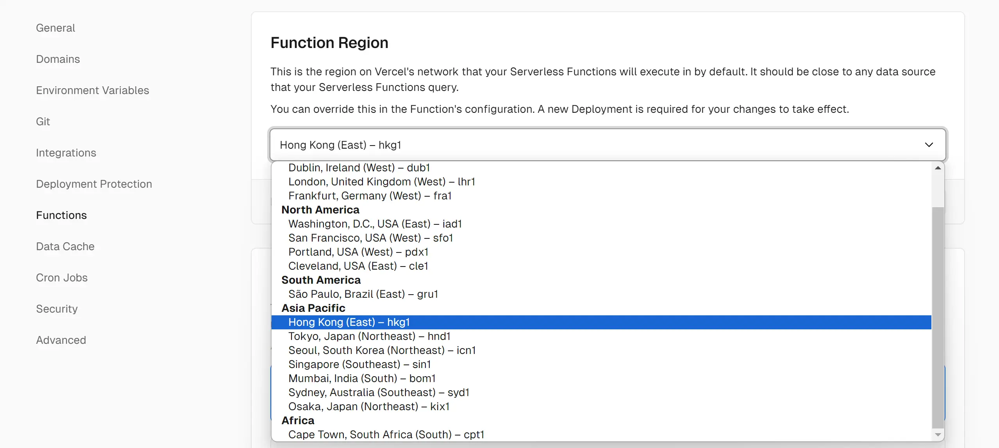
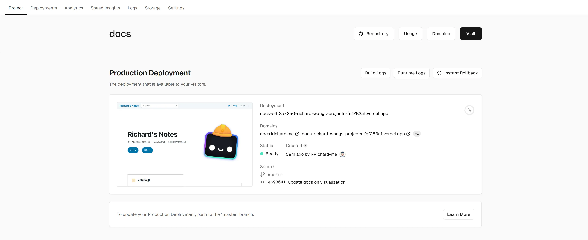

import { Steps } from '@astrojs/starlight/components';

当我们在本地完成测试好网站后，就需要将网站部署到互联网上，让更多人访问。Vercel
是一个比较流行的静态网站部署服务，提供了免费的静态网站部署服务，支持自动部署、自定义域名、SSL证书等功能。当然，选择 Vercel
最主要的原因还是国内访问速度较快。

<Steps>

1. 创建项目

    首先，我们需要将本次项目文件夹推送到 GitHub。在 Vercel 官网上注册账号并登录，在 `Add New Project` 中选择 `Import Git Repository`，然后选择 GitHub，授权 Vercel 访问 GitHub 账号，选择要部署的项目仓库。

    

2. 配置项目

    Vercel 会自动检测项目的框架和要求，因此大多情况下不需要手动配置，我们确认一下是否选择了正确的框架和Node版本即可。

    项目框架应为 `Astro`

    

    Node 版本应为 `18` 或更高

    

3. 自定义域名

    在 `Domain` 中可以添加自定义域名，通过 DNS 验证后，Vercel 会自动为你申请 SSL 证书。

    

4. 更改 Vercel 部署的网络地区

    选择 Vercel 的主要原因就是在国内可以顺畅访问，在 `Function Region` 中可以选择 Vercel 部署的网络地区，测试下来香港地区的速度较快。

    

5. 部署项目

    上述配置都完成后，我们在 GitHub 仓库中每一次提交代码，Vercel 就会自动重新部署项目。

    

</Steps>