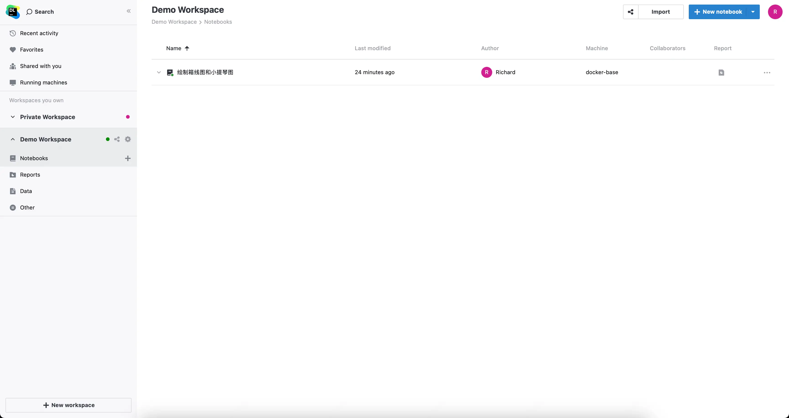
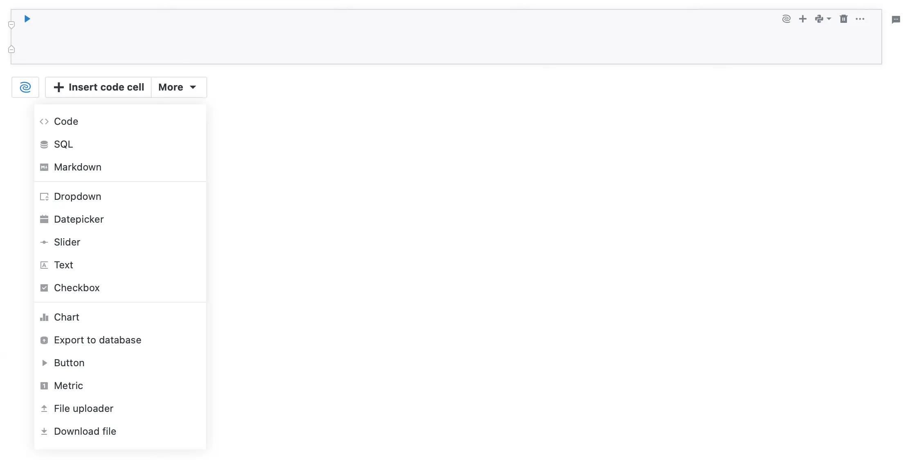
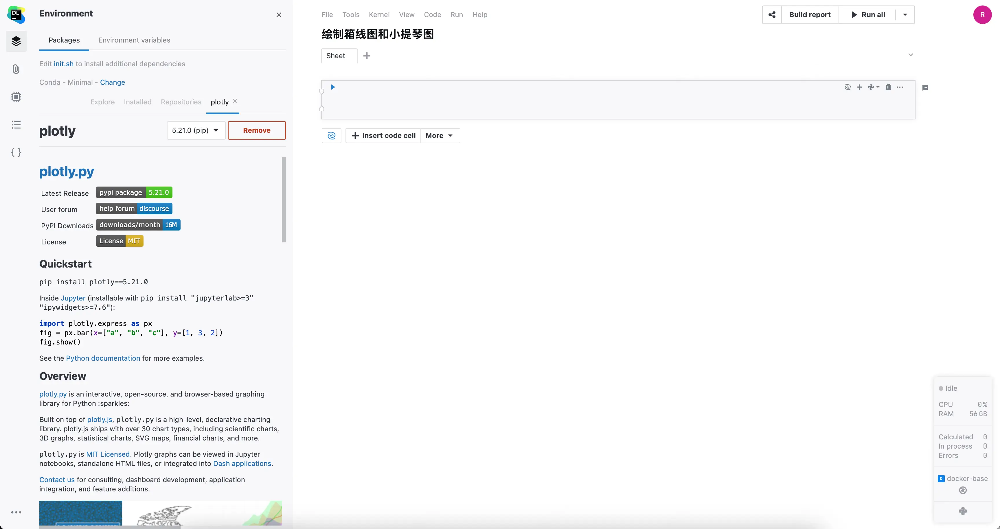
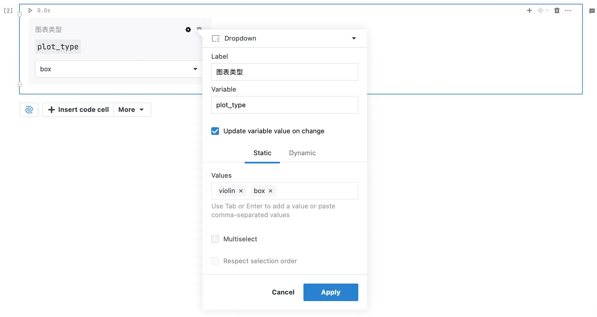
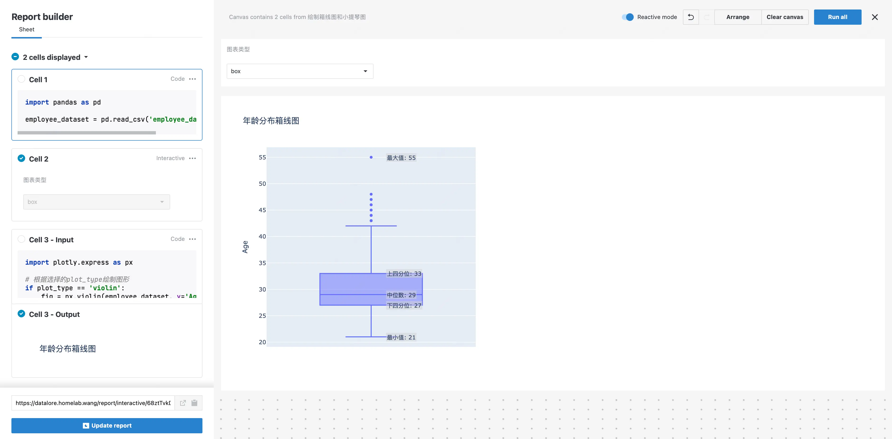
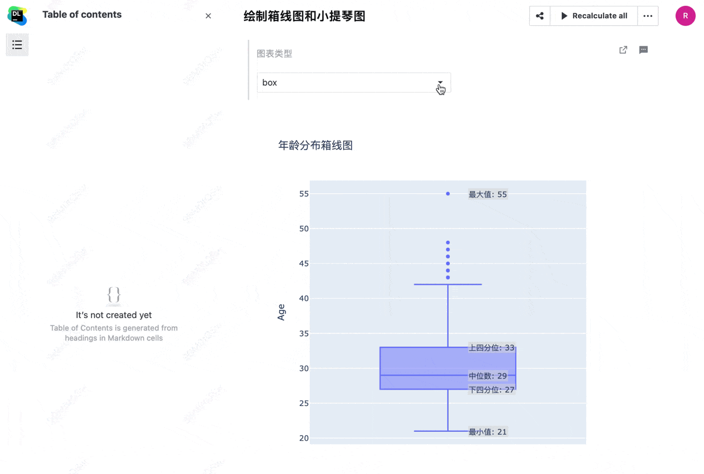

Datalore 是一个在线的 Jupyter Notebook 服务，由 JetBrains 开发，提供了自部署的选项，10 个用户以内免费，作为 notebook 分享和可视化工具比较实用。

## 安装部署

Datalore 提供了比较简单的容器化部署方式，可以使用 Docker Compose 快速部署，版本号可修改为最新的版本。

```bash
version: "3.9"
services:
  datalore:
    image: jetbrains/datalore-server:2023.2 # 替换为最新的版本
    ports:
      - "8080:8080"
    expose: [ "8081", "5050", "4060" ]
    networks:
      - datalore-agents-network
      - datalore-backend-network
    volumes:
      - "datalore-storage:/opt/data"
      - "/var/run/docker.sock:/var/run/docker.sock"
    environment:
      #DATALORE_PUBLIC_URL: "https://datalore.example.com"
      DB_PASSWORD: "changeme"
  postgresql:
    image: jetbrains/datalore-postgres:2023.2 # 替换为最新的版本
    expose: [ "5432" ]
    networks:
      - datalore-backend-network
    volumes:
      - "postgresql-data:/var/lib/postgresql/data"
    environment:
      POSTGRES_PASSWORD: "changeme"
volumes:
  postgresql-data: { }
  datalore-storage: { }
networks:
  datalore-agents-network:
    name: datalore-agents-network
  datalore-backend-network:
    name: datalore-backend-network
```

## 使用演示

我们以在可视化笔记中介绍的[绘制箱线图和小提琴图](../../analysis/charts/plotly-box-violin)案例为例，演示 Datalore 的使用。

1. Datalore 主界面
    
    在主界面中，我们可以创建新的 workspace 以及 notebook。
    
    

2. Notebook 交互式元素

   Datalore 增强了原生 Jupyter Notebook，添加了交互式元素，如下拉框、滑块、日期选择器等。
    
    

3. 环境配置

   Datalore 支持低代码甚至无代码的方式配置环境，可以直接在 `Environment` 选项卡中安装需要的库。

   本案例中，我们需要安装 `plotly` 库。

   

4. 绘制箱线图和小提琴图

   首先我们导入数据集，然后创建一个下拉框，用于选择箱线图或小提琴图，最后根据选择的图表类型绘制图表。
   
   

5. 发布分享

   在  Datalore中，我们可以将 notebook 发布为一个分享链接，方便他人查看，同时可以选择发布的内容。

   例如这里我们去掉了代码部分，只保留了下拉框和图表。

   

   可以看到效果如下，就变成了一个交互式的图表展示页面。

   