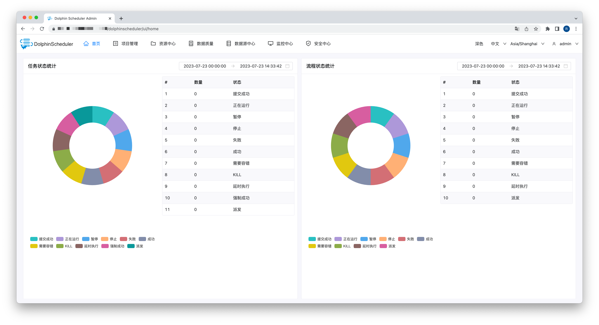

## 环境准备

### 配置用户及免密登录

1. 创建用户

    ```bash
    useradd dolphinscheduler
    ```

2. 添加密码

    ```bash
    echo "dolphinscheduler" | passwd --stdin dolphinscheduler
    ```

3. 添加 sudo 权限

    ```bash
    sed -i '$adolphinscheduler  ALL=(ALL)  NOPASSWD: NOPASSWD: ALL' /etc/sudoers
    sed -i 's/Defaults    requirett/#Defaults    requirett/g' /etc/sudoers
    ```

4. 修改目录权限

    ```bash
    chown -R dolphinscheduler:dolphinscheduler /opt
    ```

### 配置SSH免密登陆

1. 切换到 dolphinscheduler 用户

    ```bash
    su dolphinscheduler
    ```
2. 生成密钥

    ```bash
    ssh-keygen -t rsa -P '' -f ~/.ssh/id_rsa
    ```

3. 将公钥添加到 authorized_keys

    ```bash
    cat ~/.ssh/id_rsa.pub >> ~/.ssh/authorized_keys
    ```

4. 修改 authorized_keys 权限

    ```bash
    chmod 600 ~/.ssh/authorized_keys
    ```

### 创建目录

```bash
mkdir -p /opt/bigdata # 用于存放大数据组件
mkdir -p /opt/software # 用于存放安装包
mkdir -p /opt/zkdata # 用于存放 zookeeper 数据
```

### 安装 JDK

1. 上传 JDK 到 `/opt/software` 目录下

2. 解压到 `/opt/bigdata` 目录下

    ```bash
    tar -zxvf /opt/software/jdk-8u381-linux-x64.tar.gz -C /opt/bigdata
    ```

2. 创建软链接

    ```bash
    ln -s /opt/bigdata/jdk1.8.0_381 /opt/bigdata/jdk
    ```

3. 配置环境变量

    ```bash
    sudo vim /etc/profile.d/bigdata.sh
    ```

    ```bash
    export JAVA_HOME=/opt/bigdata/jdk
    export PATH=$JAVA_HOME/bin:$PATH
    ```
4. 使环境变量生效

    ```bash
    source /etc/profile.d/bigdata.sh
    ```

### 安装 zookeeper

1. 下载 zookeeper 并解压到 `/opt/bigdata` 目录下

    ```bash
    wget https://dlcdn.apache.org/zookeeper/zookeeper-3.8.2/apache-zookeeper-3.8.2-bin.tar.gz -O /opt/software/apache-zookeeper-3.8.2-bin.tar.gz
    ```
    
    ```bash
    tar -zxvf /opt/software/apache-zookeeper-3.8.2-bin.tar.gz -C /opt/bigdata
    ```

2. 创建软链接

    ```bash
    ln -s /opt/bigdata/apache-zookeeper-3.8.2-bin /opt/bigdata/zookeeper
    ```

3. 修改配置文件

    ```bash
    mv /opt/bigdata/zookeeper/conf/zoo_sample.cfg /opt/bigdata/zookeeper/conf/zoo.cfg
    vim /opt/bigdata/zookeeper/conf/zoo.cfg
    ```

    ```bash
    dataDir=/opt/zkdata
    ```

4. 启动 zookeeper

    ```bash
    /opt/bigdata/zookeeper/bin/zkServer.sh start
    ```

## 安装部署

### 安装包准备

1. 下载安装包并解压到当前目录

    ```bash
    wget https://dlcdn.apache.org/dolphinscheduler/3.1.7/apache-dolphinscheduler-3.1.7-bin.tar.gz -O /opt/software/apache-dolphinscheduler-3.1.7-bin.tar.gz
    ```
    
    ```bash
    tar -zxvf /opt/software/apache-dolphinscheduler-3.1.7-bin.tar.gz -C /opt/software
    ```


2. 上传 mysql 驱动

    :::note
    由于 Apache License 2.0 的限制，DolphinScheduler 的安装包中不包含 mysql 驱动，需要自行上传。
    :::

    我这里首先下载 mysql 驱动到 `/opt/software` 目录，然后拷贝到所需驱动的各个服务的 libs 目录下。

    ```bash
    wget https://downloads.mysql.com/archives/get/p/3/file/mysql-connector-java-8.0.16.tar.gz -O /opt/software/mysql-connector-java-8.0.16.tar.gz
    ```
    
    ```bash
    tar -zxvf /opt/software/mysql-connector-java-8.0.16.tar.gz -C /opt/software
    ```

    ```bash
    cp /opt/software/mysql-connector-java-8.0.16/mysql-connector-java-8.0.16.jar /opt/software/apache-dolphinscheduler-3.1.7-bin/alert-server/libs
    cp /opt/software/mysql-connector-java-8.0.16/mysql-connector-java-8.0.16.jar /opt/software/apache-dolphinscheduler-3.1.7-bin/api-server/libs
    cp /opt/software/mysql-connector-java-8.0.16/mysql-connector-java-8.0.16.jar /opt/software/apache-dolphinscheduler-3.1.7-bin/master-server/libs
    cp /opt/software/mysql-connector-java-8.0.16/mysql-connector-java-8.0.16.jar /opt/software/apache-dolphinscheduler-3.1.7-bin/worker-server/libs
    cp /opt/software/mysql-connector-java-8.0.16/mysql-connector-java-8.0.16.jar /opt/software/apache-dolphinscheduler-3.1.7-bin/tools/libs
    ```
    :::caution
    - 官方文档说明，若使用 mysql 作为元数据库，则添加的驱动版本必须为 8.0.16。
    - 官方文档中只提及了前四个服务，但实际上 tools 也需要 mysql 驱动，否则在初始化元数据库时会报缺少驱动。部署时这里卡了很久，后来才发现 tools 下也有 libs 目录。
    :::

### 初始化元数据库

此处使用 mysql 作为元数据库。

1. 创建元数据库

    ```bash
    mysql -uroot -p

    mysql> CREATE DATABASE dolphinscheduler DEFAULT CHARACTER SET utf8 DEFAULT COLLATE utf8_general_ci;

    # 修改 {user} 和 {password} 为你希望的用户名和密码
    mysql> CREATE USER 'homelabscheduler'@'%' IDENTIFIED BY 'yourpassword';
    mysql> GRANT ALL PRIVILEGES ON dolphinscheduler.* TO 'homelabscheduler'@'%';
    mysql> CREATE USER 'homelabscheduler'@'localhost' IDENTIFIED BY 'yourpassword';
    mysql> GRANT ALL PRIVILEGES ON dolphinscheduler.* TO 'homelabscheduler'@'localhost';
    mysql> FLUSH PRIVILEGES;
    ```

2. 修改 dolphinscheduler_env.sh 配置文件

    ```bash
    vim /opt/software/apache-dolphinscheduler-3.1.7-bin/bin/env/dolphinscheduler_env.sh
    ```

    ```bash
    export JAVA_HOME=${JAVA_HOME:-/opt/bigdata/jdk}
    ...
    export DATABASE=${DATABASE:-mysql}
    export SPRING_PROFILES_ACTIVE=${DATABASE}
    export SPRING_DATASOURCE_URL="jdbc:mysql://127.0.0.1:3306/dolphinscheduler?useUnicode=true&characterEncoding=UTF-8&useSSL=false&allowPublicKeyRetrieval=true"
    export SPRING_DATASOURCE_USERNAME={user}
    export SPRING_DATASOURCE_PASSWORD={password}
    ```

    :::caution
    在 SPRING_DATASOURCE_URL 中，需要补充  `&allowPublicKeyRetrieval=true`，否则初始化过程会报错，这一点在官方模板中没有写到。
    :::

3. 初始化数据库

    ```bash
    bash /opt/software/apache-dolphinscheduler-3.1.7-bin/tools/bin/upgrade-schema.sh
    ```

### 部署 DolphinScheduler

1. 修改 install_env.sh 配置文件

    ```bash
    vim /opt/software/apache-dolphinscheduler-3.1.7-bin/bin/env/install_env.sh
    ```

    ```bash
    ips="localhost"
    sshPort="22"
    masters="localhost"
    workers="localhost:default"
    alertServer="localhost"
    apiServers="localhost"
    installPath="/opt/bigdata/dolphinscheduler"
    deployUser="dolphinscheduler" # 这里填写之前创建的用户
    ```

2. 修改 dolphinscheduler_env.sh 配置文件

    :::info
    如后续调度任务中使用到以下组件，则需要在此处配置对应的环境变量。
    :::

    ```bash
    export HADOOP_HOME=${HADOOP_HOME:-/opt/soft/hadoop}
    export HADOOP_CONF_DIR=${HADOOP_CONF_DIR:-/opt/soft/hadoop/etc/hadoop}
    export SPARK_HOME1=${SPARK_HOME1:-/opt/soft/spark1}
    export SPARK_HOME2=${SPARK_HOME2:-/opt/soft/spark2}
    export PYTHON_HOME=${PYTHON_HOME:-/opt/soft/python}
    export HIVE_HOME=${HIVE_HOME:-/opt/soft/hive}
    export FLINK_HOME=${FLINK_HOME:-/opt/soft/flink}
    export DATAX_HOME=${DATAX_HOME:-/opt/soft/datax}

    export PATH=$HADOOP_HOME/bin:$SPARK_HOME1/bin:$SPARK_HOME2/bin:$PYTHON_HOME/bin:$JAVA_HOME/bin:$HIVE_HOME/bin:$FLINK_HOME/bin:$DATAX_HOME/bin:$PATH
    ```

3. 一键部署

    首先确保当前用户为 dolphinscheduler 用户，且 zookeeper 已启动。

    ```bash
    bash /opt/software/apache-dolphinscheduler-3.1.7-bin/bin/install.sh
    ```

4. 启停命令

    ```bash
    # 停止全部
    bash /opt/software/apache-dolphinscheduler-3.1.7-bin/bin/stop-all.sh

    # 启动全部
    bash /opt/software/apache-dolphinscheduler-3.1.7-bin/bin/start-all.sh
    ```

5. 开放 12345 端口或关闭防火墙

    - 开放 12345 端口

        ```bash
        sudo firewall-cmd --zone=public --add-port=12345/tcp --permanent
        sudo firewall-cmd --reload
        ```

    - 关闭防火墙

        ```bash
        sudo systemctl stop firewalld.service
        sudo systemctl disable firewalld.service
        ```

6. Web UI 访问

    访问地址：http://localhost:12345/dolphinscheduler/ui
    
    :::note
    默认的用户名和密码为：admin / dolphinscheduler123
    :::

    :::caution
    访问地址中的 `/dolphinscheduler/ui` 不能省略，否则无法进入登录页面。
    :::

