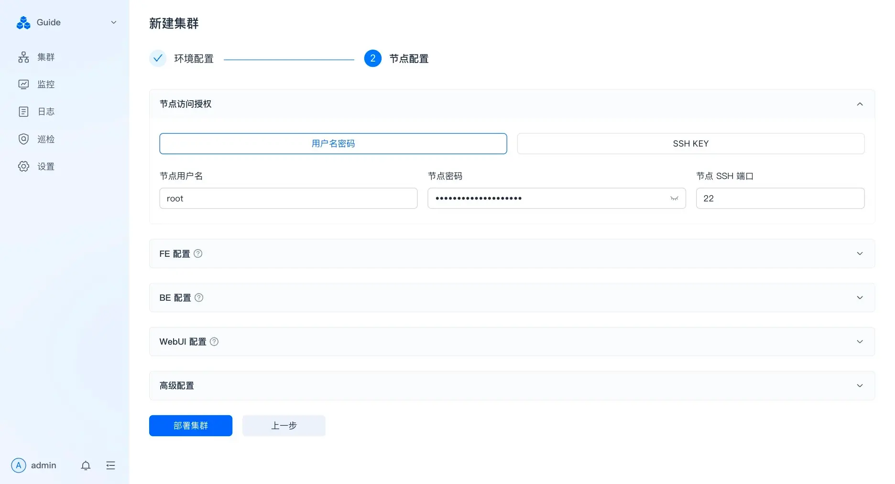

:::note
这里原本记录了在家里的服务器上初次尝试 Doris 数据库时的部署步骤。但后来 Doris 的云平台和商业版本 SelectDB 提供了 Doris Manager 工具，能够实现可视化前端的集群部署和监控管理，因此不再推荐手动部署 Doris 集群。

官方文档对于部署步骤介绍的非常详尽，每个步骤均有截图说明，看文档效果更佳。
:::

import {LinkCard} from '@astrojs/starlight/components';

## 官方文档

<LinkCard title="Cluster Manager for Apache Doris 安装手册" href="https://docs.selectdb.com/docs/enterprise/cluster-manager-guide/deployment-guide/deployment-guide-23.x"/>

## Doris Manager 的前端演示

