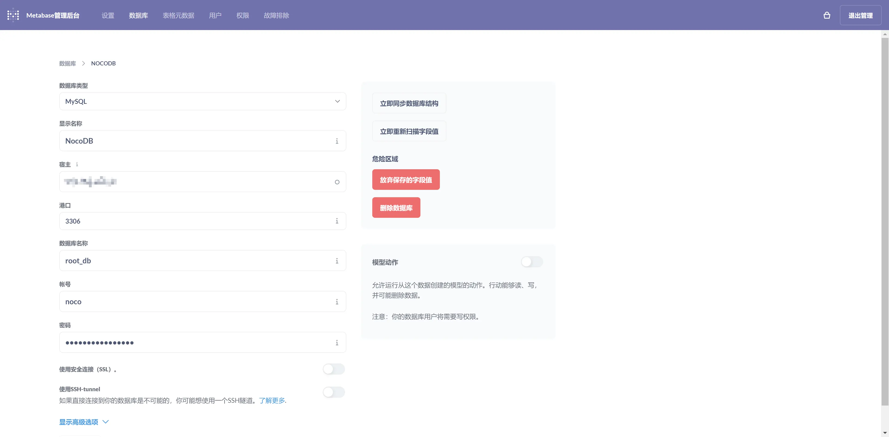
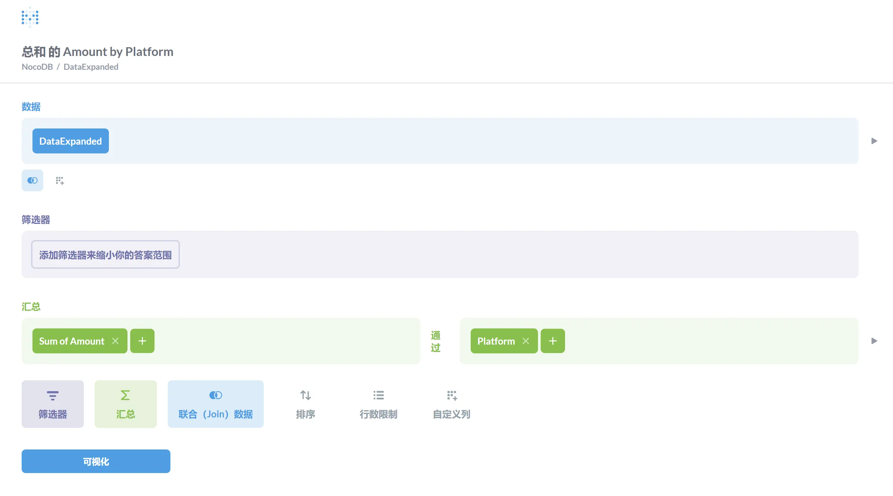
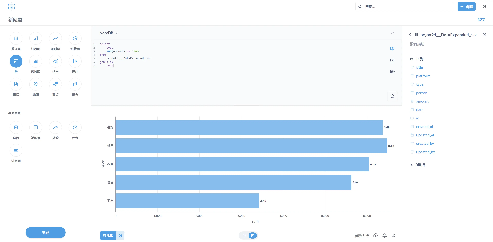
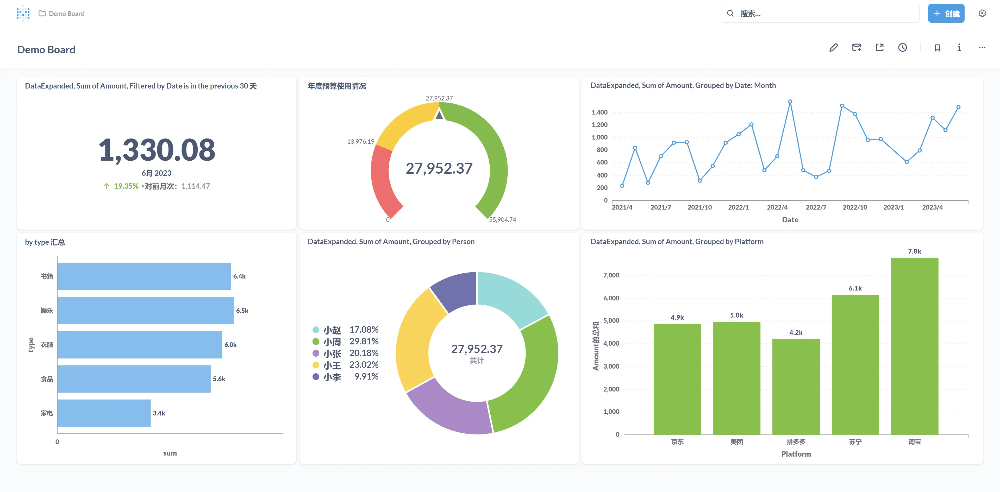

:::note
Metabase 是一个开源的 BI 工具，它可以方便地连接数据库，并通过低代码或 SQL 的方式进行数据分析和可视化。
:::

本文介绍 Metabase 的安装部署，并展示如何使用之前部署的 NocoDB 记录的消费数据进行可视化。

## 安装部署

`docker-compose.yml` 文件如下：

```yaml
version: '3'
services:
  metabase:
    image: metabase/metabase:latest
    container_name: metabase
    ports:
      - "3000:3000"
    volumes:
      - ./metabase-data:/metabase-data
    environment:
      MB_DB_FILE: /metabase-data/metabase.db
    restart: always

```

## 应用演示

1. 数据库连接

    在 Metabase 管理界面中配置数据库连接，这里链接到 NocoDB 服务的 MySQL 数据库。

    

2. 低代码方式创建问题

    :::note
    Metabase 的基本使用由问题（Question）和仪表板（Dashboard）组成，类似于 Tableau 的工作簿和工作表。问题可以通过 SQL 或者低代码的方式创建，并以图表的形式展示。仪表板可以将多个问题组合在一起，形成一个完整的数据看板。
    :::

    

3. SQL方式创建问题

    当然，我们也可以直接使用 SQL 语句创建问题。

    

4. 仪表板

    最后，将创建的问题添加到仪表板中，以便集中展示所有相关的数据视图。

    


