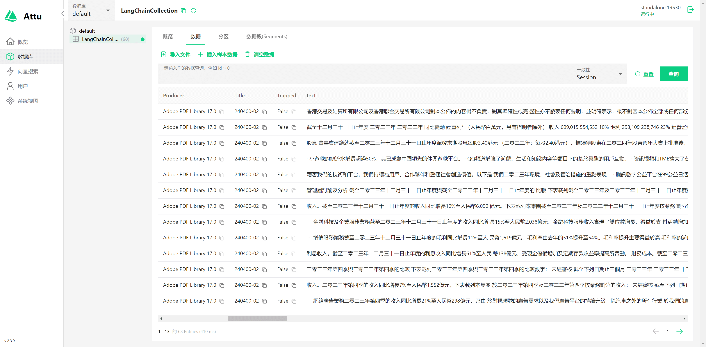

Milvus 是一个企业级的开源向量数据库，旨在为AI应用提供高效、灵活的向量检索能力。不同于 Faiss 仅支持向量数据的存储，Milvus 还支持与向量相关的元数据存储，这在处理复杂数据时尤为重要。

本文记录一下部署 Milvus 的 docker-compose 配置和简单的使用演示。

## 安装部署

```yaml
version: '3.5'

services:
  etcd:
    container_name: milvus-etcd
    image: quay.io/coreos/etcd:v3.5.5
    environment:
      - ETCD_AUTO_COMPACTION_MODE=revision
      - ETCD_AUTO_COMPACTION_RETENTION=1000
      - ETCD_QUOTA_BACKEND_BYTES=4294967296
      - ETCD_SNAPSHOT_COUNT=50000
    volumes:
      - ${DOCKER_VOLUME_DIRECTORY:-.}/volumes/etcd:/etcd
    command: etcd -advertise-client-urls=http://127.0.0.1:2379 -listen-client-urls http://0.0.0.0:2379 --data-dir /etcd
    healthcheck:
      test: ["CMD", "etcdctl", "endpoint", "health"]
      interval: 30s
      timeout: 20s
      retries: 3

  minio:
    container_name: milvus-minio
    image: minio/minio:RELEASE.2023-03-20T20-16-18Z
    environment:
      MINIO_ACCESS_KEY: minioadmin
      MINIO_SECRET_KEY: minioadmin
    ports:
      - "9001:9001"
      - "9000:9000"
    volumes:
      - ${DOCKER_VOLUME_DIRECTORY:-.}/volumes/minio:/minio_data
    command: minio server /minio_data --console-address ":9001"
    healthcheck:
      test: ["CMD", "curl", "-f", "http://localhost:9000/minio/health/live"]
      interval: 30s
      timeout: 20s
      retries: 3

  standalone:
    container_name: milvus-standalone
    image: milvusdb/milvus:v2.4.0-rc.1
    command: ["milvus", "run", "standalone"]
    security_opt:
      - seccomp:unconfined
    environment:
      ETCD_ENDPOINTS: etcd:2379
      MINIO_ADDRESS: minio:9000
    volumes:
      - ${DOCKER_VOLUME_DIRECTORY:-.}/volumes/milvus:/var/lib/milvus
    healthcheck:
      test: ["CMD", "curl", "-f", "http://localhost:9091/healthz"]
      interval: 30s
      start_period: 90s
      timeout: 20s
      retries: 3
    ports:
      - "19530:19530"
      - "9091:9091"
    depends_on:
      - "etcd"
      - "minio"

  attu:
    container_name: attu
    image: zilliz/attu:v2.3.9
    environment:
      - MILVUS_URL=standalone:19530
    ports:
      - "8000:3000"

networks:
  default:
    name: milvus
```

这个配置文件定义了 Milvus 需要的所有服务，包括 `etcd` 作为配置存储、`minio` 作为对象存储以及 Milvus 服务本身。此外，还配置了 Attu 服务作为 Milvus 的可视化管理界面。

## 远程连接 Milvus 服务并导入数据

以下是如何使用 Python 脚本连接 Milvus 并导入数据的示例。本例中使用了大模型应用案例中的腾讯财报PDF文档：

```python
from langchain_community.vectorstores import Milvus
from langchain_community.document_loaders import PDFPlumberLoader
from langchain_text_splitters import RecursiveCharacterTextSplitter

loader = PDFPlumberLoader("data/腾讯2023年第四季度及全年业绩.pdf")
data = loader.load()

text_splitter = RecursiveCharacterTextSplitter(chunk_size=1000, chunk_overlap=200)
splits = text_splitter.split_documents(data)

connection_args={"host": "example.com", "port": "19530"}

vectorstore = Milvus.from_documents(documents=splits, embedding=embeddings, connection_args=connection_args)
```

在这个脚本中，首先使用 `PDFPlumberLoader` 加载 PDF 文档内容，然后通过 `RecursiveCharacterTextSplitter` 将文档内容分割成更小的文本块。最后，将这些文本块导入到 Milvus 数据库中。

## Attu 可视化管理界面

Attu 提供了一个用户友好的可视化界面，通过 `http://ip:8000` 即可访问。在 Attu 中，可以轻松管理 Milvus 实例，包括数据的查询、索引的创建和删除等操作。

通过 Attu 来查看一下刚才导入的数据：



以及可以在线进行向量搜索

