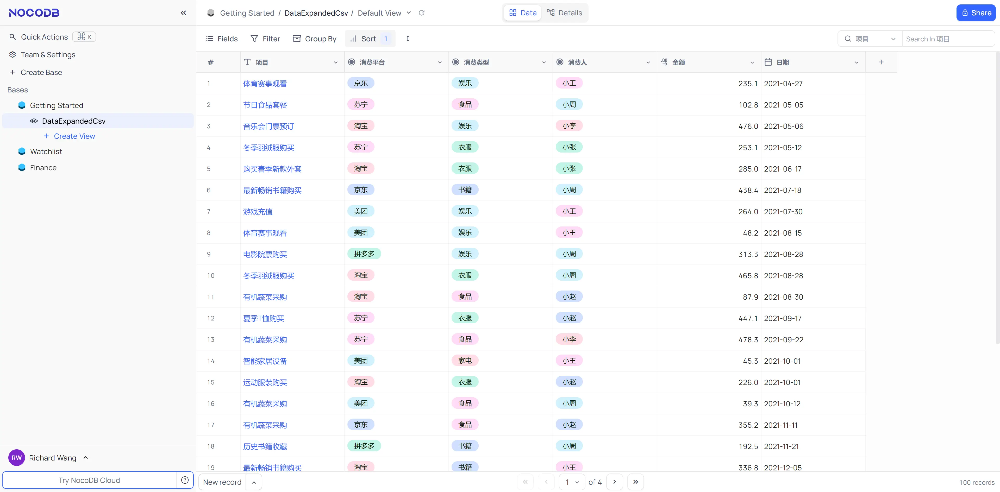

import { Steps } from '@astrojs/starlight/components';

:::note
NocoDB 是一个开源的在线表格服务，支持多用户协作编辑，类似于 Airtable 和 Google Sheets。其核心特点是作为数据库前端，可以直接连接到 MySQL、PostgreSQL、MongoDB 等数据库，实现在线数据库管理。
:::

我一般用来记录日常消费、影视书籍、服务订阅等信息，方便随时查看和更新。

本文记录如何使用 Docker 部署 NocoDB 服务，并在后续 Metabase 文章中使用 NocoDB 作为数据库源，搭建实时看板。

<Steps>
1. 准备配置文件 (`docker-compose.yml`)

    ```yaml
    version: "3"
    services: 
      nocodb: 
        depends_on: 
          root_db: 
            condition: service_healthy
        environment: 
          NC_DB: "mysql2://root_db:3306?u=noco&p=changeme&d=root_db"
        image: "nocodb/nocodb:latest"
        ports: 
          - "8080:8080"
        restart: always
        volumes: 
          - "./nc_data:/usr/app/data"
      root_db: 
        environment: 
          MYSQL_DATABASE: root_db
          MYSQL_PASSWORD: changeme
          MYSQL_ROOT_PASSWORD: changeme
          MYSQL_USER: noco
        healthcheck: 
          retries: 10
          test: 
            - CMD
            - mysqladmin
            - ping
            - "-h"
            - localhost
          timeout: 20s
        image: "mysql:8.1.0"
        ports: 
          - "3306:3306"
        restart: always
        volumes: 
          - "./db_data:/var/lib/mysql"
    #    below line shows how to change charset and collation
        command: --character-set-server=utf8mb4 --collation-server=utf8mb4_unicode_ci
    ```

2. 启动服务

    ```bash
    docker-compose up -d
    ```

3. 访问 NocoDB

    浏览器访问 `http://ip:8080`，初次登录注册的账号和密码将作为全局管理员账号，可以在后台管理所有数据库连接和用户权限。

4. 效果演示

   
</Steps>