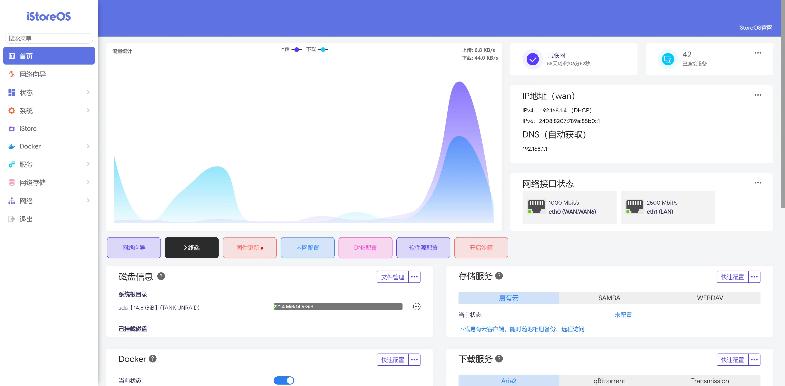
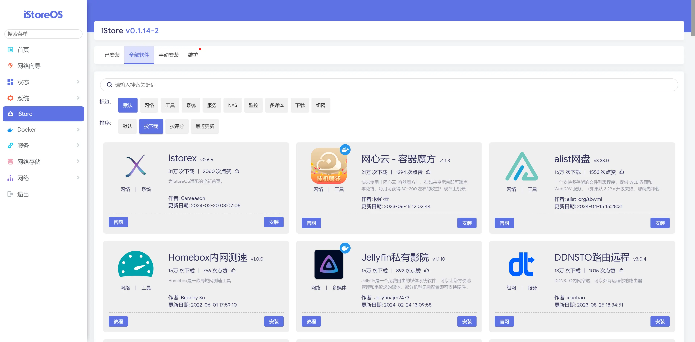

iStoreOS 来源于 OpenWRT，做了很多很多交互优化和功能完善，目前是软路由和轻NAS的首选系统之一。本文记录一下在 Proxmox VE 上安装 iStoreOS 的方法。

import { Steps } from '@astrojs/starlight/components';

## 系统安装

<Steps>

1. 固件下载

    [iStoreOS X86_64 固件](https://fw.koolcenter.com/iStoreOS/x86_64/)

2. 新建虚拟机

    - 操作系统：选择 `不使用任何介质`
    - BIOS：如果下载的是 `EFI` 版本的固件，选择 `OVMF (UEFI)`，否则选择 `SeaBIOS`
    - 硬盘：不需要创建，删除默认带出的硬盘
    - 其他配置根据实际需求选择，如果使用插件较多，可以分配更多的内存和 CPU

3. 方式一：虚拟磁盘安装

    把下载好的固件和img2kvm工具放入root目录下

    ```bash
    chmod 777 ./img2kvm

    ./img2kvm istoreos-21.02.3-2022092019-x86-64-squashfs-combined-efi.img.gz 101
    ```

    > 101 是虚拟机的 ID，根据实际情况修改

    然后看PVE虚拟机101的硬件界面，会出现一个未添加的硬盘，双击添加。

4. 方式二：U盘安装

    1. 下载 iStoreOS 固件，解压后使用 Rufus 制作 U 盘启动盘
    2. 在虚拟机的硬盘中添加 U 盘

5. 配置引导顺序

    - 若采用虚拟磁盘安装，将刚添加的硬盘设置为第一启动项
    - 若采用 U 盘安装，将 U 盘设置为第一启动项

6. 启动虚拟机

</Steps>

## 系统配置

<Steps>

    1. 启动虚拟机后，在命令行输入 `quickstart`
    2. 修改 `LAN IP`，掩码(mask)填 `255.255.255.0`
    3. reboot 重启
    4. 在浏览器中输入 `LAN IP` 设置的地址，进入 iStoreOS 系统

        > 默认用户名 `root`，密码 `password`

</Steps>

---



## iStore 软件中心

iStoreOS 提供了可视化的前端的软件中心，可以方便的安装插件，减少了小白用户识别插件版本和安装各类依赖的复杂度。



