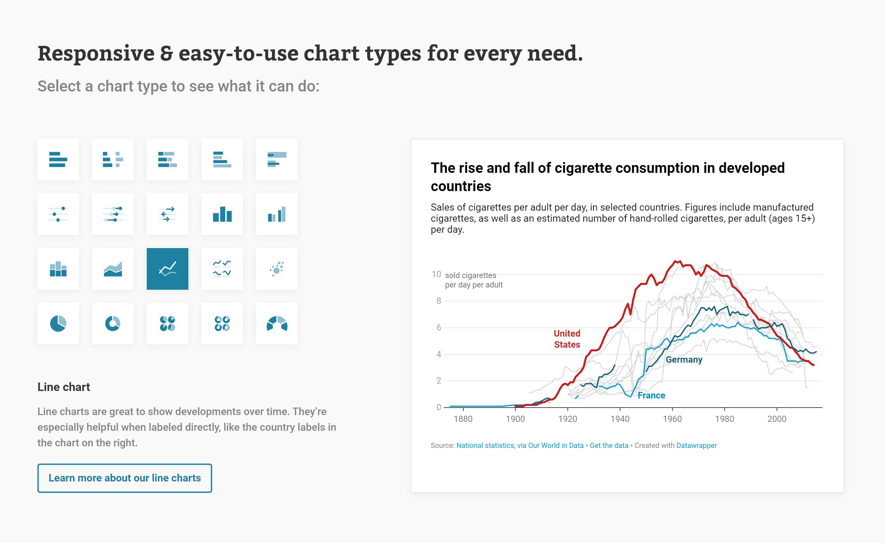
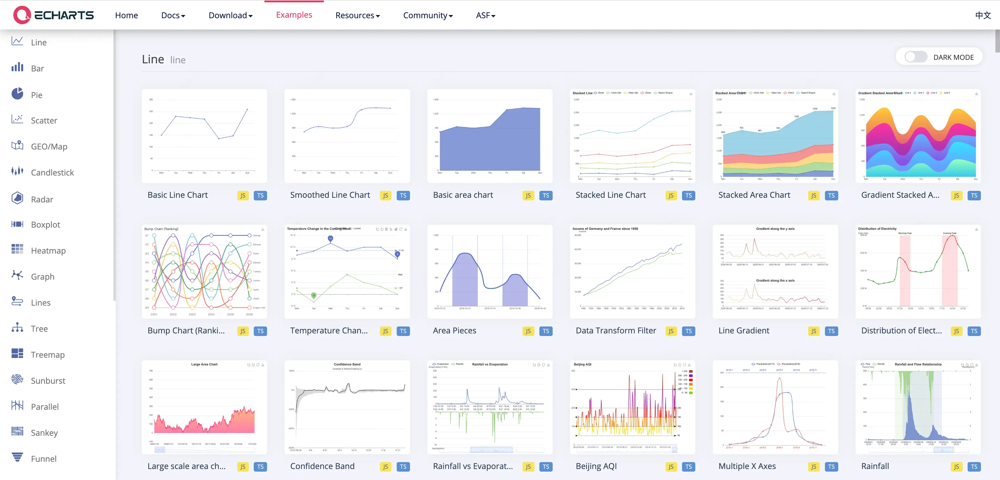
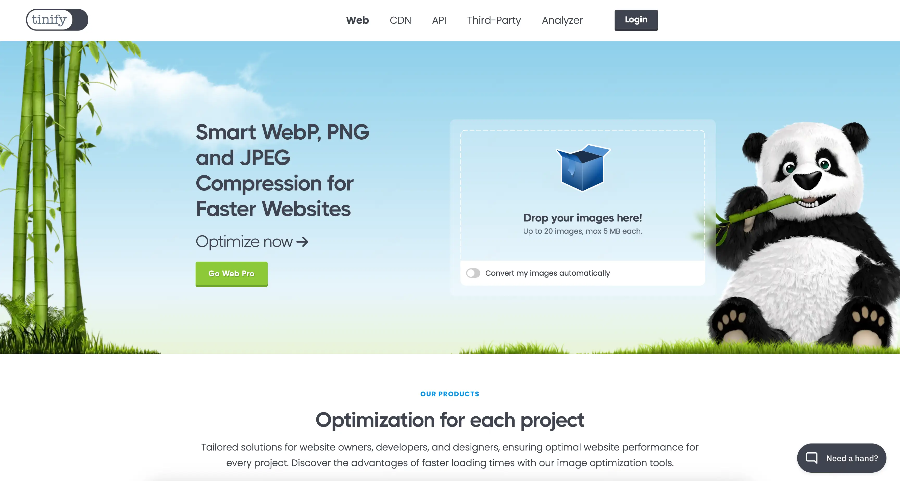

import { LinkCard, CardGrid } from '@astrojs/starlight/components';

## 数据处理

1. **Datawrapper**

    <LinkCard
      title="Datawrapper"
      description="Datawrapper Create beautiful interactive charts for free."
      href="https://www.datawrapper.de/charts"
    />

    

2. **ECharts**

    <LinkCard
      title="ECharts"
      description="An Open Source JavaScript Visualization Library."
      href="https://echarts.apache.org/examples/en/index.html"
    />

    

## 图像处理

1. **TinyPNG**

    <LinkCard
      title="TinyPNG"
      description="Smart WebP, PNG and JPEG Compression for Faster Websites."
      href="https://tinypng.com/"
    />

    