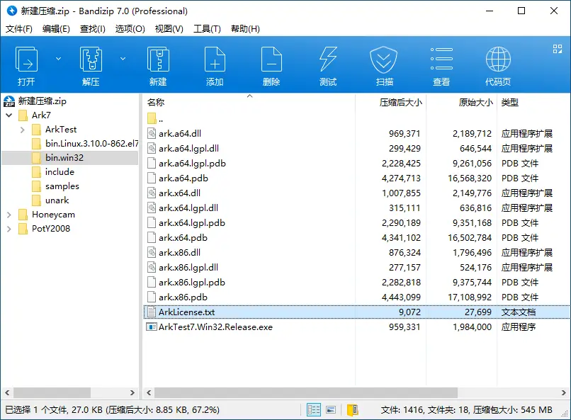
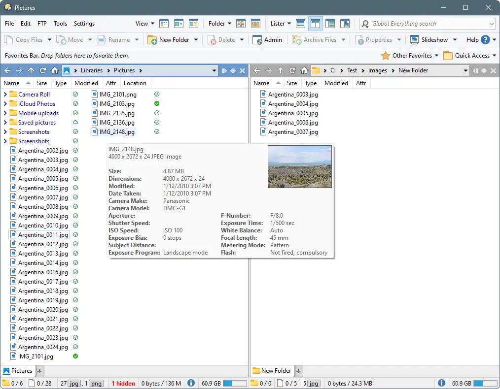
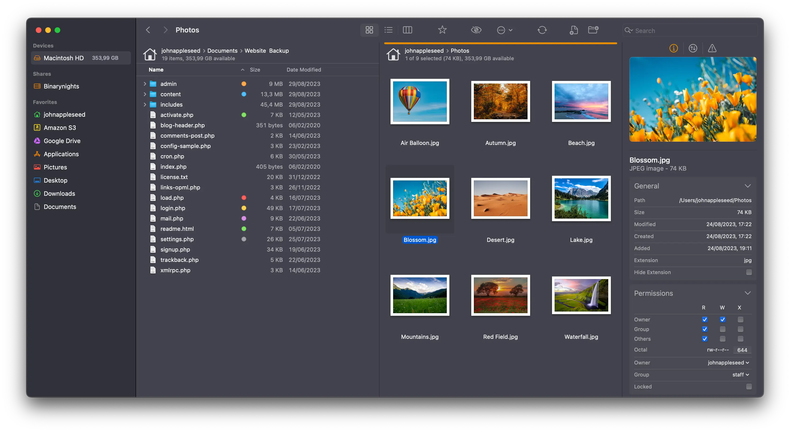

import { LinkCard, CardGrid } from '@astrojs/starlight/components';
import {Tabs, TabItem} from '@astrojs/starlight/components';

## 1. 截图工具

---

<Tabs>
    <TabItem label="Windows">
        <LinkCard
          title="Snipaste"
          description="simple but powerful snipping tool"
          href="https://www.snipaste.com/"
        />

        
    </TabItem>
    <TabItem label="MacOS">
        <LinkCard
          title="Cleanshot X"
          description="Capture your Mac’s screen like a pro."
          href="https://cleanshot.com/"
        />

        
    </TabItem>
</Tabs>

## 2. 启动器

---

<Tabs>
    <TabItem label="Windows">
        <LinkCard
          title="Listary"
          description="Effortlessly find what you need."
          href="https://www.listary.com/"
        />

        
    </TabItem>
    <TabItem label="MacOS">
        <LinkCard
          title="Raycast"
          description="Raycast is a blazingly fast, totally extendable launcher."
          href="https://www.raycast.com/"
        />

        
    </TabItem>
</Tabs>

## 3. 搜索工具

---

<Tabs>
    <TabItem label="Windows">
        <LinkCard
          title="Everything"
          description="Locate files and folders by name instantly."
          href="https://www.voidtools.com/en-us/"
        />

        
    </TabItem>
    <TabItem label="MacOS">
        <LinkCard
          title="HoudahSpot"
          description="Powerful File Search for Mac."
          href="https://www.houdah.com/houdahSpot/"
        />

        
    </TabItem>
</Tabs>

## 4. 压缩与解压

---

<LinkCard
    title="Bandizip"
    description="Bandizip is a powerful archiver that provides an ultrafast processing speed and convenient features."
    href="https://www.bandisoft.com/bandizip/"
/>

## 5. 资源管理器

---

<Tabs>
    <TabItem label="Windows">
        <LinkCard
            title="Directory Opus"
            description="Directory Opus is a complete replacement for Explorer, with far more functionality than any other file manager available today."
            href="https://www.gpsoft.com.au/"
        />

        
    </TabItem>
    <TabItem label="MacOS">
        <LinkCard
            title="Forklift"
            description="The most advanced dual pane file manager and file transfer client for macOS."
            href="https://binarynights.com"
        />

        
    </TabItem>
</Tabs>