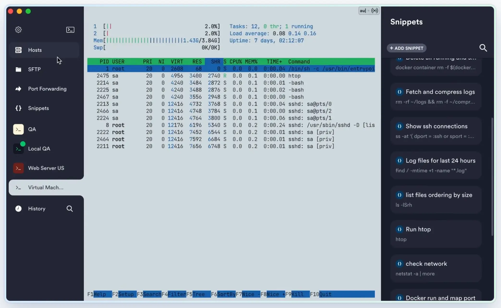

import { LinkCard, CardGrid } from '@astrojs/starlight/components';

## 链接

1. **Surfshark IP地址及WebRTC泄漏检测**

    <LinkCard
      title="Surfshark IP地址及WebRTC泄漏检测"
      description="IP地址检查器，DNS泄露检查器，WebRTC泄露检查器"
      href="https://surfshark.com/zh/what-is-my-ip"
    />

## 工具

1. **Termius**

    <LinkCard
        title="Termius"
        description="Connect with one click from any mobile and desktop device. No re-entering IP addresses, ports, and passwords."
        href="https://termius.com/"
    />

    